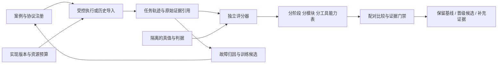

# Agent 系统能力评测：分层、可归因、可比较的 Eval 体系


> 发布说明：本文的原始实验记录、模型响应、传感器数据和本地回滚备份不随 Git 分发；表格与结论性图表保留。标为“本地证据”的路径需在自行复现实验或取得原始归档后查看。历史统计不代表当前版本重新实测。

日期：2026-09-21。状态：**系统设计 + 可运行的离线统一评测底座**；真实执行适配器、故障编排服务与发布自动化尚未完成。本文件描述目标体系，并在 §12 区分已经实现和后续建设。当前命令不会调用模型、仿真器或机器人。

要回答的问题是：**在明确任务分布、资源预算和风险约束下，哪个实现更可靠，改善发生在哪里，证据是否足够，换一个场景是否仍成立？** 输出应是能力分项、成本、风险、覆盖与证据强度，而不是一个可被平均值掩盖的“Agent 总分”。

这也是上下文表达研究的上层框架：JSON、结构化自然语言、提示词、模型、规划器、工具实现、验证器、恢复策略，都作为可替换组件接受同一种实验协议。已有 [上下文表达实验](../experiments/2026-09-21-agent-context-evaluation.md)、[物理接地实验](../experiments/2026-09-21-grounded-verification.md)、[自然语言评测](../development/natural-language-evaluation.md)继续保留各自的案例、评分器和原始证据。

## 1. 增量审计与架构取舍

| 已有基础 | 复用方式 | 仍缺什么 |
|---|---|---|
| `orchestration/eval`：自然语言到计划的语义断言 | 作为目标理解、规划的局部评测器 | 与执行成功、成本和故障恢复分开，并输出统一 run |
| `orchestration/eval/context_eval`：分阶段表达、因子实验与归档 | 导入既有单轮结果；保留原实验协议 | 不能自动代表对应生产 Agent 模块已经测过 |
| `core/harness`、`core/closedloop`、机器人侧 GVF | 复用独立物理后置条件与三值状态 | 需要单独测量验证器误报、漏报、UNKNOWN 及真值自身的有效性 |
| `core/trace`、`agentruntime/trail.go`、任务存储 | 接入事件因果、动作、判断、验证与恢复链 | 统一执行身份、评测版本、可回放证据引用 |
| `core/robotcontract`、`core/agentcontract`、权限守卫 | 能力、工具契约、单位、坐标系、权限的测试边界 | 合约符合不等于在真实环境中成功，需要逐层证据 |
| 已有 SLAM、探索、导航、抓放及监督实验 | 后续增加适配器导入 | 场景、分母、真值不同，不能直接拼接成功率 |
| [后训练流水线](post-training-pipeline.md)、[编排后训练](orchestration-post-training.md) | 复用数据导出和版本晋级思想 | 独立留出集、真值来源、训练污染检查及明确拒绝样本 |

新增 `orchestration/eval/system_eval/` 的原因是现有评测器各自负责一种问题，尚无共同的 run 契约、跨实现配对检查与覆盖视图。新模块只负责统一测量与比较，不重写旧评测器，也不接管机器人控制；以独立 CLI 显式调用，不改变生产默认行为。



真值与评分器处于 Agent 决策链之外。LLM 能提出诊断和修复方案，不能把自身的“我已完成”用作物理成功标签。

## 2. 七层评测与适用边界

同一能力沿下列层级逐步验证；层级高不意味着可以删除低层测试。

| 层 | 评测单元 | 能证明什么 | 不能代替什么 |
|---|---|---|---|
| contract | 一次契约检查或状态转换 | schema、单位、前后置条件、权限和不变量符合性 | 模型决策、真实物理成功 |
| component | 一个算法/验证器/工具适配器 | 固定输入上的功能、误差、鲁棒性 | 多步任务成功 |
| decision | 一次 LLM/策略决策 | 给定观察和上下文能否作正确判断 | 感知真实性与动作执行效果 |
| workflow | 多步工具链，带可控服务响应 | 调用顺序、资源竞争、错误处理、终止逻辑 | 真实动力学与传感器误差 |
| simulation | 可复位世界中的完整闭环 episode | 任务成功、碰撞、恢复、预算与长程误差累积 | 实机可靠性 |
| hardware | 受控实体机器人 episode | 指定机器人、环境、标定和工况下的结果 | 未测场景及长期普适保证 |
| shadow | 生产输入上的影子决策和现场观测 | 分布漂移、性能与告警、候选建议差异 | 未实际执行的候选动作会产生何种物理结果 |

影子模式没有候选动作的反事实物理结果，不能把建议“看起来合理”计作候选任务成功。离线回放只适合固定输入决策；候选改变动作后，环境轨迹会变化，必须在可复位仿真或新的受控任务中分支执行。

## 3. 二十项能力与独立判据

能力是评测的语义分类，模块是代码位置，两者不是一一对应。一个任务可能覆盖多个能力，一个模块也可能承载多项能力。OpsAgent、RecoveryAgent 以实际接口接入；reflection、opti 等名称仅作为能力角色，不据名称假定仓库已存在完整独立 Agent。

| 能力 | 核心测试与独立真值 | 主要指标 | 必测失败切片 |
|---|---|---|---|
| goal 目标理解 | 用户目标、约束、歧义与允许澄清集合 | 目标/禁止项准确率、正确澄清率、错误拒绝率 | 指代、否定、多目标、冲突约束、不可执行请求 |
| grounding 实体绑定 | 可独立定位的实体 ID、区域、对象关系 | 身份绑定准确率、错物率、关系正确率 | 同名/同色、遮挡、实体移动、旧 ID |
| perception 感知标定 | 独立标注或仿真真值；标定留出点 | 检出率、姿态/深度误差、校准误差 | 光照、反光、视角、遮挡、外参漂移 |
| state 世界状态 | 事件序列、版本、时间域和世界快照 | 陈旧事实采纳率、状态一致性、更新延迟 | 乱序、重复、丢包、时钟偏差、重启 |
| planning 规划 | 可满足的目标、依赖与资源约束 | 可执行率、目标覆盖率、无环率、计划成本 | 不可达目标、跨层依赖、动态插入、约束矛盾 |
| scheduling 编排 | 资源租约与偏序合法执行集 | 死锁/饥饿率、吞吐、P95 等待、租约冲突 | 并发、取消、抢占、租约过期、节点掉线 |
| context 上下文表达 | 同一规范事实包、来源与信息可用性 | 决策正确率、证据保真、缺失显式性、tokens | JSON/CNL、顺序、长度、截断、错误摘要 |
| tool_selection 工具选择 | 多个可接受工具/参数集合 | 工具与参数联合正确率、冗余调用数 | 相似工具、单位、坐标系、越界、前置条件 |
| tool_result 结果判读 | 回执、物理状态、错误语义分别标注 | 伪成功识别率、UNKNOWN 正确保留率 | SUCCESS 但失败、部分执行、超时未决 |
| tool_execution 工具执行 | 指定初态到独立后置条件 | 执行成功率、误差、幂等、取消响应 | 重发、断连、超时、负载、重复副作用 |
| verification 验证 | 与被测验证器分离的物理/记录真值 | 三值混淆矩阵、假确认率、漏检、证据覆盖 | 错身份、旧证据、少帧、缺传感器、矛盾证据 |
| ops 运维诊断 | 已注入根因及可恢复观测轨迹 | 检出率、误报/小时、定位 Top-1/Top-k、检测时间 | 感知、网络、资源、模型、设备多故障 |
| reflection 反思 | 已知首个错误决策与受影响子图 | 原因/影响范围准确率、无依据断言、修复有效性 | 症状误当根因、多因一果、合理拒答 |
| recovery 恢复 | 可恢复故障集和恢复后独立验证 | 恢复成功率、恢复耗时、二次损伤、重复失败 | UNKNOWN、滑落、错物、部分完成、重启 |
| handoff 交接续跑 | 交接前后任务/动作/权限/预算身份 | 一致性、重复动作率、恢复进度、丢任务率 | 交接时未决动作、版本变化、撤权 |
| memory 记忆 | 独立检索相关性与时效标注 | 正确检索、过期记忆采纳率、跨任务串扰 | 同名任务、失效经验、摘要失真、注入 |
| human 人机协作 | 应澄清/应批准/可自主的预定义策略 | 澄清精确/召回、干预负担、撤回落实时间 | 模糊授权、意图修改、取消、恢复许可 |
| security 权限隔离 | 允许/禁止操作及污点来源 | 越权执行、越权建议、注入服从、隔离失败 | 工具输出注入、跨租户、范围重放、权限过期 |
| runtime 运行可靠性 | 事件日志和可重建状态机 | 可用性、崩溃恢复、背压、资源泄漏、时限 | 进程崩溃、网络分区、重复投递、磁盘不足 |
| learning 学习晋级 | 未污染的留出集及独立评价 | 能力增益、遗忘/退化、数据有效率、成本 | 奖励投机、训练污染、罕见安全案例丢失 |

每项能力至少有四组案例：正常成功、应拒绝/应观察、可恢复失败、不可恢复/必须止损。增加边界、对抗和分布外切片。**“会做”与“知道不能做”都要测量**，同时报告完成覆盖，防止通过一律拒绝获得很低的事故率。

## 4. 工具层：逐个实现比较，而不止按工具类别打分

当前 `tools.json` 的 29 个公开工具划分为 12 类，注册表为 [catalog.json](../../orchestration/eval/system_eval/catalog.json)。工具清单漂移会使覆盖命令报错，要求先登记新增/删除工具。

| 工具类 | 当前公开工具 | 关键质量判据与扰动 |
|---|---|---|
| 感知 | capture_image、detect_object、get_object_pose、scan_environment | 图像时间戳、身份、姿态误差；丢帧、遮挡、同步误差 |
| 状态查询 | get_arm_state、get_current_pose、get_gripper_state、get_robot_status | 读一致性、新鲜度；重启、旧快照、时间域错配 |
| 建图 | build_map | 轨迹/地图几何误差、连通与可通行性；回环错误、动态障碍 |
| 语义解析/记忆 | resolve_location、recall_object | 语义到可执行实体绑定；别名、多义、过期位置 |
| 探索 | explore_for | 找到目标率、覆盖/信息增益、预算；不可达区、拒绝执行 |
| 导航 | navigate_to、navigate_to_work_area、stop_navigation | 到达、朝向、净空、路径成本、停止距离；窄门、阻挡、定位丢失 |
| 作业区规划 | plan_work_area | 安全可达、可观测、可操作；底盘可达但机械臂不可达 |
| 手臂运动 | home_arm、move_arm_relative、move_arm_to_pose | 位姿误差、轨迹与限位；坐标/单位错、碰撞、故障中断 |
| 夹爪 | set_gripper_width、grasp、release | 宽度/力、接触、释放；空抓、过载、卡滞 |
| 抓放 | pick_object、place_object | 独立 Holding/In/Stable 判据；错物、滑落、容器满 |
| 组合任务 | fetch_object | 完整取物语义和子步骤闭环；跨房间、部分完成、返回失败 |
| 安全 | check_collision、emergency_stop、reset_safety_stop、set_speed_limit | 漏检/误报、停止时延/距离、复位前置条件；禁止盲复位 |

每个具体工具至少拆成三个互不替代的结果：**选对工具和参数 → 实现正确执行 → 结果被正确验证**。再测重复、取消、截止时间、权限、单位/坐标系、可观测性和恢复。组合工具另测整体成功与子动作轨迹，不能把多个原语成功率相乘后宣称组合任务已实测。

`navigation.navigate` 等 canonical action 与 `navigate_to` 等公开工具有关联，但不自动互认覆盖；只有记录明确证明经过该包装器、该版本和该路径才能计入其评测。每个工具卡应有实现版本、输入/输出 schema、前后置条件、权限、幂等身份、时间窗口、独立真值、允许误差、适用机器人及基准案例。

## 5. 案例、执行、证据与评分的数据契约

### 5.1 六个对象与职责

| 对象 | 必需信息 | 为什么需要 |
|---|---|---|
| Case | case_id、family_id、split、能力/阶段、输入、初态、适用性、允许行为集合、私有真值、故障、难度、场景种子、独立簇 | 区分模板变体和独立问题，防止答案泄漏 |
| Suite | Case 哈希清单、抽样分布、关键切片、主/次指标、场景权重、停止规则 | 测试分母事先固定，不删除失败案例 |
| Experiment | 候选/基线、变更组件、固定条件、随机化/配对、预算、假设、样本量、检验族、门禁版本 | 结果出现前决定如何比较 |
| Run | 版本、环境、预算、计划单元、所有成功/错误/跳过结果、来源哈希 | 使每次比较可重现、可审计 |
| Trace | 任务/动作/尝试/机器人/启动身份，因果父节点，时钟域，输入、输出和证据引用 | 支持定位首个差异、恢复与训练导出 |
| Assessment | 单元级指标、适用性、grader 版本、分项统计、CI、门禁、理由、支持/不支持的结论 | 让结果不仅有分数，还有证据边界 |

本次实现 Run JSON Schema、指标/能力注册、导入、Assessment 与覆盖报告。Case/Suite/Experiment 服务、完整 Trace 汇聚及执行调度是后续集成设计，不应把表中的全部对象理解为已运行的新服务。

### 5.2 已实现的 Run 字段

精确定义以 [run.schema.json](../../orchestration/eval/system_eval/run.schema.json) 为准。

| 字段 | 内容与约束 |
|---|---|
| schema_version、run_id | 版本化格式与执行身份 |
| benchmark | id、version、dataset_sha256、grader_sha256、split、primary_metric、risk_metric |
| components | 组件名 → 不可变版本/摘要；模型、renderer、policy、planner、工具等分别登记 |
| controls | environment_id、budget、semantic_contract_id、source_mode；比较时全部相同 |
| provenance | 原始文件路径与 SHA-256、claim_scope；附适配器摘要、来源限制 |
| planned_units | 预先计划单元全集；与 units 恰好一一对应 |
| unit_id / case_id / repeat_id | 评测单元、案例、重复序号；重复身份拒绝 |
| family_id / cluster_id | 语义案例族与统计独立簇；两者按实验设计可不同 |
| draw_id / fresh_draw | 唯一新执行身份；历史导入为 false，重复回放不增加可靠性样本 |
| execution_status | completed / error / timeout / skipped；不能丢掉失败行 |
| dimensions | stage、module、tool、tool_family、fault、backend、tier、truth、risk |
| measurements | 注册指标 → 数值或 null；二元指标仅 0/1，拒绝 NaN、无穷大、字符串和布尔隐式转数值 |
| not_applicable | 明确不适用的指标集合；与“适用但未测量”分开，不允许同时给实测数值 |
| evidence_refs | 原始记录定位和证据引用；引用存在不代表已核验内容 |
| failure | 错误类别、阶段、细节与关联引用；无执行错误为 null |

本次 CLI 支持按一个维度生成 scorecard；门禁切片支持多个维度联合选择，例如 `{"stage":"recovery","fault":"grasp_slip"}`。交互式多维查询、任务标签的多对多关系不是当前实现。后续扩展 schema 时增加 scene/robot/language/difficulty/context_length 等字段并版本化迁移，不能静默改变历史含义。

### 5.3 完整执行适配器应补充的字段

Run 的 `provenance` 可存放环境 manifest 引用，避免把海量数据塞进 LLM 上下文。新执行需要登记：代码 commit + dirty diff 摘要，模型供应商及响应模型版本，prompt/schema/tokenizer 摘要，解码参数，工具/验证器/地图/机器人 profile/标定/固件版本，OS/依赖/CPU/GPU，仿真步长与动力学种子，环境复位凭据，时钟同步情况，起止时间，预算与重试政策。

Trace 每个事件至少记录：trace/task/episode/plan_revision/step/action/attempt/idempotency_key/robot_id/edge_boot_id；父事件/因果关联；事件序号与 source sequence；墙钟和 monotonic 时钟域；动作请求、接受回执、开始/结束、取消、未知/部分完成；观察在动作前后的位置；证据 hash/source/采样时间/有效期；权限与租约 scope/fencing；判据版本和 verdict；候选诊断与最终获准动作。原始图像、点云、音频留在证据存储，只交换 URI、内容哈希和必要摘要。

这些字段优先映射到已有 `core/trace`、Observation Envelope、StateReport、任务图与 trail。记录不足时写明 unknown，不事后猜测初始状态、预算或成功。

## 6. 指标：先定分母，再讨论分数

注册表已含 **34 个基础指标**，每项有类型、方向、单位、含义、分母及失败政策。它们是统一命名底座；尚未安装相应采集器的指标保持未测量。

### 6.1 任务与决策

完整任务成功必须同时满足用户终态目标、禁止项、过程不变量和独立验证。以事先计划的适用 episode 为分母：

\[
\widehat{SR}=\frac{\sum_{i=1}^{N}\mathbf1[\text{目标、约束和独立验证全部通过}]}{N}.
\]

超时、错误、跳过不能从分母删除。套件定义执行基础设施失效时，可依预注册规则将整块实验判无效后重跑，但要保留原始块及排除理由，不允许只重跑失败候选直到通过。

另报阶段 exact correctness、字段级正确率和目标覆盖；严格 exact 失败能定位联合决策瓶颈，字段级分数用于分析，不能悄悄替换主指标。例如规划的直接依赖和所有祖先依赖不是同一个契约，必须在测试前明确，不可根据输出改答案。

三类标记必须分开：**正确拒答/先观察、错误拒答、无依据执行**。报告选择性风险与回答覆盖：`P(错误 | 实际作答)`、`P(作答 | 可回答)`。有效率提升不能靠忽略难例或一律不执行。

### 6.2 风险与物理验证

验证器报告 VERIFIED/FALSIFIED/UNKNOWN 的完整混淆矩阵。`false_verified` 的分母是**独立真值不为 VERIFIED 的适用动作**；`unknown_preserved` 只在真值 UNKNOWN 时适用。正常成功动作不能稀释负例上的假确认率。

`unsafe_proposal`、`unsafe_execution` 和 `false_completion` 分别表示建议、实际执行、错误宣称完成，不能互相代替。UNKNOWN 不是物理失败或成功；真值缺失、审查缺失分别保留。错误/超时造成的风险未测不能写成 0；已观测到风险事件即使随后超时也保留为 1。

“严重风险事件数为 0”与“风险概率足够小”不同。碰撞等稀有事件需按暴露时间/距离/动作或 episode 的实际风险模型定分母；不同单位不合并。当前门禁用的是**每簇是否至少一次发生指定风险**，不是每小时事故率。人类干预有时是正确行为，不能默认把所有干预当安全失败。

### 6.3 效率、恢复与一致性

| 指标组 | 计算与边界 |
|---|---|
| 成本 | 每计划任务与每成功任务分别报告 tokens、工具调用、费用、能量；记录缓存/重试/预处理开销 |
| 延迟 | 端到端、模型、排队、工具、验证分开；P50/P95 和超时率并报；超时不能填 0 ms |
| 恢复 | `独立验证恢复成功 / 预先定义的可恢复故障`；另报全任务成功，防止只挑容易恢复的故障 |
| 诊断 | 检出、误报、根因准确性、检测时间、修复后是否解除故障；文字解释好不等于修复有效 |
| 重复可靠性 | 同一初始案例多次独立执行，统计全部成功的概率；与“重试到成功”分开 |
| 状态/分布式 | 丢失、重复副作用、顺序违规、租约冲突、恢复时延与残留状态 |
| 可观测性 | 应记录事件/证据的完整度、可定位比例、因果链断裂；完整日志不是任务成功 |

若某案例独立执行 n 次，成功 c 次，则全部 k 次成功概率的无偏组合估计为：

\[
\widehat{\mathrm{all}\text{-}k}=\frac{\binom{c}{k}}{\binom{n}{k}},\qquad n\ge k,
\]

而 pass@k 是至少一次成功，估计为 `1 - C(n-c,k)/C(n,k)`，二者不能混用。该估计要求同案例独立同分布重复；共享缓存/连续不复位场景不满足条件。此处借鉴 [τ-bench 原论文](https://arxiv.org/abs/2406.12045)用终态判据和重复运行区分平均表现与一致性的思路，不把其任务集当成本仓库机器人评测。

当前 CLI 会输出 micro mean 与等簇权重 macro mean；n<20 不展示 P95，仅避免很小样本的尾部数值误导，n≥20 本身也不保证 P95 稳定。更严格的尾延迟推断、超时生存分析、费用和能量采集需另行实现。

## 7. 如何比较每个具体实现

### 7.1 基本对照：只改变已声明组件

例如比較规划器 A/B，固定案例、输入观察、工具目录、模型、上下文格式、环境复位、风险规则和预算，只替换规划器。比較工具 A/B，固定目标动作与初态，再分别比较执行后状态。比较 JSON/CNL，固定规范事实及可用字段，并额外报告 token 成本；若格式改变了长度，观测到的是含长度变化的总效应，不能声称“纯语法效应”。

| 实验 | 固定 | 改变 | 主要回答 |
|---|---|---|---|
| 单轮决策 | 状态快照、真值、预算 | 模型 / prompt / 表达中的一个 | 判断是否更准确 |
| 单工具 | 初态、目标、传感器、验证器 | 工具具体实现 | 执行是否更可靠 |
| 模块工作流 | 输入任务和故障流 | 规划器 / scheduler / 恢复器中的一个 | 状态机和工具链是否改善 |
| 全闭环 | 同分布配对场景、预算、停止条件 | 单组件或声明的整组配置 | 系统实际成功是否改善 |
| 外推确认 | 冻结候选 | 新房间/物体/任务族/模型供应商 | 结论边界与泛化 |

匹配要求：benchmark（含数据和 grader 哈希）与 controls 完全一致；组件清单一致，实际改动集合必须等于声明集合；评测单元一一匹配，案例/重复/簇/切片/适用性不变。**不取成功结果的交集来比较**。多个组件同时改变可以评估整套配置，但不能将增益归因到其中某一项。

控制相同预算上限不代表使用相同成本。配置需要分别报告预算与实际消耗；不能让候选多思考三倍还把增益全归给表达方式。超时/错误纳入意向评测分母；重试协议与并发限额固定并归档。

### 7.2 模块交互与系统贡献

局部改进不保证全局改进。规划器更激进可能提高可执行计划覆盖，同时增加感知需求和恢复成本。至少对可疑交互做 2×2 设计，例如 renderer × model、planner × verifier、verifier × recovery：

\[
I_{AB}=(S_{11}-S_{01})-(S_{10}-S_{00}).
\]

`I_AB` 是给定任务分布和终点下的交互对比，不自动表示普适机理。预算允许时做完整因子实验；筛选实验可用分数因子，但要登记混杂关系，不能把混杂项解释成独立因果效应。开发集搜索，锁定后独立确认；下一轮继续用开发集，避免反复利用同一测试集挑赢家。

### 7.3 因果定位，而不是只看第一个报错

保存首个偏离期望的事件、最后一个确定正确的状态、其证据链与所有后续影响。日志中最早出现 ERROR 的模块可能只是最先发现问题的模块。

针对失败轨迹做受控诊断：固定其它组件，用 oracle 感知替代观测、oracle 计划替代规划、独立验证器替代状态判断，或者从同一可复位状态执行修复。若干预解除失败，形成该案例下的因果支持；多个模块替换都有用，报告联合原因或冗余原因，不强行分配唯一责任。

建议失败标签：输入/任务不可满足、感知/绑定、陈旧状态、规划/依赖、资源/编排、工具参数、物理执行、验证误判、错误恢复、权限、基础设施、grader 错误、证据不足。每个标签附置信等级和可反驳证据；“未知”是合法归因结果。oracle 具有特权信息，其提升只用于定位瓶颈，不与可部署系统公平竞争。

## 8. 统计推导与三态门禁

### 8.1 为什么不能证明普适最优

设系统配置为 θ，任务/环境分布为 D，损失函数为 L，风险与成本约束分别为 r、c。可定义：

\[
\theta^*_{D,L,B}=\arg\min_{\theta\in\Theta}\mathbb E_D[L(\theta)]
\quad\text{s.t.}\quad \mathbb E_D[r(\theta)]\le\epsilon,\quad C(\theta)\le B.
\]

这个最优依赖 D、L、预算 B 和候选集 Θ。只需构造两个任务：实现 A 在任务 1 优于 B，B 在任务 2 优于 A；将分布集中在不同任务上，最优实现就改变。除非证明 A 在所有允许任务上支配 B，否则有限数据不能推出普适优胜。实践目标是指定范围内的最优候选或 Pareto 前沿，并不断通过新分布证伪和扩展边界。

质量更好但更贵、平均更强但尾部更危险时，不应随意加权抵消。先过风险、质量和覆盖约束，再在成功/成本/延迟之间找不被支配的配置。业务若确需一个综合目标，权重须在看结果前确定，并保留全部分项。当前 MVP 没有自动 Pareto 搜索器。

### 8.2 独立单位与配对效应

每个场景内的多个动作、同模板换名字、反事实双胞胎及缓存回放通常相关。推断按预先指定的独立簇 g 聚合：

\[
d_g=\frac1{n_g}\sum_i (Y^{B}_{gi}-Y^{A}_{gi}),\quad
\widehat\Delta=\frac1G\sum_g d_g.
\]

该量是**等簇权重目标**，与每动作等权或生产分布加权目标不同；不等大小簇时同时报告，业务权重另行预注册。当前实现 bootstrap 的重采样单位是簇，5000 次固定随机种子，仅作近似描述区间。

如各簇独立，`d_g∈[-1,1]`，Hoeffding 给出一侧下界：

\[
\Delta\ge \widehat\Delta-\sqrt{\frac{2\log(1/\alpha')}{G}}
\]

以至少 `1-α'` 的覆盖成立，目标为该抽样设计的平均期望效应。质量 `q_g∈[0,1]` 的下界为：

\[
Q\ge\bar q-\sqrt{\frac{\log(1/\alpha')}{2G}}.
\]

推导来自对独立有界变量应用 `P(mean-Emean≥t)≤exp(-2Gt²/(b-a)²)` 并解 t。不能据此从非随机手选案例推断真实部署分布，也不能把估计的“独立簇”声明当作独立性已经证明。

当前 `compare` 对整体和每个关键切片各使用质量、非劣效、风险三个界，令 `α'=α/(3×切片数)`，通过 union bound 同时控制这些界的总不覆盖概率。切片可重叠；这个修正不包含反复尝试多个候选或多次偷看测试集，后者必须额外校正或独立确认。

### 8.3 零事故为何不等于充分安全证据

对独立同分布的簇级事件指示变量，n 簇发生 k 次事件时，一侧 Clopper–Pearson 上界为 `BetaQuantile(1-α'; k+1, n-k)`，k=n 时为 1。零事件时简化为：

\[
p_{upper}=1-(\alpha')^{1/n}.
\]

若无多重比较，α=0.05，要将上界压到 1% 至少需要 299 个独立同分布单位；要到 0.1% 至少 2995 个。五个种子即使全无事故，上界仍约 45.1%。多重比较还会提高样本要求。这里的事件是按给定暴露协议定义的簇级事件，不能转译成实机每动作事故率。

风险二项式界额外要求同分布；分层固定案例、不同暴露长度、连续相关任务不自动满足。可在同质抽样层分别构造界并按预定权重合成，或采用合适的有界风险/时间序列方法；当前 MVP 不替实验设计证明这些前提。

### 8.4 门禁逻辑

| 结果 | 含义 |
|---|---|
| FAIL | 违反固定策略，例如观测到禁用风险事件或质量点估计低于绝对底线；这是工程验收失败，不等于统计证明候选一定劣于基线 |
| INCONCLUSIVE | 没有触犯上述规则，但缺数据、缺关键切片、独立簇不足、界未达到阈值，或只有探索/历史数据 |
| PASS | 在登记的测试/确认范围与统计假设下，全部必需门槛满足；不自动批准部署或物理执行 |

必须同时满足绝对质量底线、相对非劣效 `Δ≥-δ`、风险上界、关键切片和测量覆盖。基线很差时，与基线持平不能晋级。已观察到禁止风险直接失败；当前示例 profile 将指定风险事件均视为禁止事件，其他可容忍风险需单独设计政策。

[research-gate.example.json](../../orchestration/eval/system_eval/research-gate.example.json) 只是研究示例：质量 90%、非劣效容差 2 个百分点、簇风险上限 1%、至少 30 簇。30 是最低数目要求，**远非足以让所有界通过**。Hoeffding 下界很保守，2pp 的非劣效确认可能需要很大样本；正式实验应依开发集方差/配对不一致率做预先功效分析，选用满足假设的配对方法，不能为了通过而事后放宽界。

本版门禁只实现一个二元主指标和一个二元风险指标，不支持多风险、延迟/成本硬门槛、顺序检验、层级模型或自动发布。完整版本应将这些列为额外必需规则；仅当前 PASS 不能声称完整产品发布检查已经通过。

### 8.5 新实验的抽样与功效计划

先确定希望检测的最小实际增益、非劣效容差、错误率和功效；用独立开发数据估计簇级差值标准差 `s_d`，正态近似下检测差值 Δ 的规划量级为 `G≈((z_(1-α/2)+z_(1-β))s_d/Δ)²`。它是规划近似，需考虑小样本、离散性、分层与多重比较，通过模拟核验功效，不能作为结果显著性的替代。

提前固定每层样本、重复次数、场景种子、难例比例、退出条件和测试时间窗口。配对场景用共同随机数降低方差，运行顺序随机化/交叉；生产 API 的供应商版本和时间漂移另做分块。模型 temperature=0 不等于输出必然确定。成本允许时跨模型、跨供应商和跨仿真后端确认，而不是重复相同缓存。

## 9. 故障矩阵与完整任务套件

初始主线采用本仓库的装修家庭场景：观察 → 导航 → 到达确认 → 再观察 → 实体解析 → 作业区/抓取规划 → 抓取 → 验证 → 放置 → 验证 → 返回。扩展任务以语义目标、场景对象和独立终态谓词组合，避免仅替换物体名字。

建议五套独立 suite：

1. **正常能力集**：单工具、抓放、跨房间、多目标、任务修改、不可满足目标。
2. **证据与判定集**：伪 SUCCESS、旧帧、错身份、时序边界、冲突传感器、部分执行、UNKNOWN。
3. **恢复与运行集**：滑落、阻挡、定位漂移、进程重启、网络分区、租约变化、并发和取消。
4. **泛化与对抗集**：新房间/物体/任务结构、不同语言、长上下文、工具结果注入、权限重放。
5. **资源与耐久集**：并发阶梯、长任务、长时间运行、token/时限约束、日志/内存增长。

故障注入必须登记注入位置、起止时间、强度、可观察性、独立注入回执、是否实际生效与解除条件。注入器不能通过文本直接泄漏故障标签给 Agent。注入未生效的案例按预注册规则判实验无效并留存，不伪装成系统检出失败。

长程家务任务可参考 [BEHAVIOR 官方任务体系](https://behavior.stanford.edu/)的任务多样性和终态目标组织方式；外部套件只提供方法和未来适配方向。本次没有导入或运行 BEHAVIOR，也不将不同机器人和任务分布的外部分数与本项目分数直接比较。

## 10. 评分器可信度与训练闭环

评分器本身也要评测。优先级为：可独立核验的物理/状态真值 → 确定性契约评分 → 盲审人工标注 → 经人工校准的 LLM 辅助评审。LLM judge 适合诊断解释、可读性、开放式建议；不能单独决定实物是否已拿起、是否碰撞或任务是否完成。

为评分器建立 gold set、错误边界、同义合法输出、故意作弊输出、多标注者分歧和复核机制。模型/供应商/提示版本冻结；盲化候选身份与展示顺序。更换 grader 时重评基线和候选；只改候选评分器会失去可比性。保留 raw output、解析错误与 per-field score，避免某个解析器偏好被误认为能力差异。

训练候选从可追溯轨迹中产生：输入快照、动作/回答、独立结果、错误类型、修复和证据、版本、适用范围、分区归属。按任务族/场景/时间划分 train/dev/test/confirmation，模板兄弟及同源片段不能跨分区泄漏。测试答案与 oracle 状态不进入 Agent 可读上下文。

正样本要求独立验证成功；可靠负样本要求可确定的失败标签；UNKNOWN 单独进入观察/澄清/不确定性数据，不能默认视为负样本。失败后恢复成功保留“失败决策”和“有效修复”两个关联片段，不能把整段无差别标为正例。偏好对需要相同输入、不同动作与可比较后果，不能根据反思文字更长就偏好它。

训练后的版本必须重新经过基础能力、安全、长尾、OOD 与成本评测，并记录遗忘。reward model、生成训练标签的 LLM 和最终评分器尽量独立，审计共享模型偏差。数据导出和部署沿用现有流水线；本次未新建自动训练作业。

## 11. 开发、实验和发布工作流

| 触发 | 运行范围 | 输出 | 晋级依据 |
|---|---|---|---|
| PR 修改 | 改动组件的契约、确定性回归、关联故障切片 | 快速差异与失败证据 | 已有测试 + 无契约退化 |
| 候选开发 | 开发集配对实验、预算比较、局部因子实验 | 效果/成本/交互，待确认候选 | 可以探索，不宣称正式通过 |
| 正式确认 | 冻结候选、协议、独立留出集 | 分项效应、同时界、缺口、门禁 | 全部关键切片及预注册门槛 |
| 发布前 | 仿真闭环 + 对应机器人受控验收 | 独立物理成功、恢复、安全与资源证据 | 现有发布流程及人工/硬件操作约束 |
| 运行期间 | 影子决策、分布/成本/故障漂移 | 可行动的新退化与根因线索 | 新案例入开发集；保持旧测试隔离 |

这里只定义工作流，不创建定时作业、不自动启动硬件。建议将评测 CLI 与现有 CI 集成：`compare` 返回 0=PASS、2=FAIL、3=INCONCLUSIVE；契约/输入错误会非零退出。`demo` 成功完成报告生成则返回 0，即使其中候选正确地被判 FAIL，因此 **demo 命令不能直接作为发布门禁**。

维护者需要看到三种页面：能力矩阵（阶段×层级×版本）、实现比较（效应/成本/风险/证据）、失败回放（事件→证据→独立判据→修复）。本次提供 Markdown/JSON 文件视图；Web 工作台集成为后续工作。

## 12. 本次已落地内容与离线演示

### 12.1 运行方式

使用已有 `.venv`。依赖复用项目中的 numpy、scipy、jsonschema；jsonschema 已列在 `context-research` extra 中。

```bash
make test-agent-system
make eval-agent-system-demo
```

`make test-agent-system` 可在干净检出中运行，使用人工构造的测试样本验证评测逻辑。`eval-agent-system-demo` 另需本地历史归档 `artifacts/agent-context-eval/factorial-v1/run-v3` 与 `artifacts/grounded-verification/validated-run`，这些原始数据不随源码发布。默认每次 demo 写到新的时间戳目录；固定输出目录可用：

```bash
make eval-agent-system-demo SYSTEM_EVAL_OUTPUT=artifacts/agent-system-eval/my-evaluation
```

可单独比较已登记的两个 run：

```bash
.venv/bin/python scripts/evaluate_agent_system.py compare \
  --baseline artifacts/agent-system-eval/design-v1/demo/baseline.run.json \
  --candidate artifacts/agent-system-eval/design-v1/demo/candidate.run.json \
  --changed-component representation \
  --profile orchestration/eval/system_eval/research-gate.example.json \
  --output artifacts/agent-system-eval/my-comparison.json
```

这个具体示例预期退出 2，因为结果为 FAIL。可用 `score --run ... --by tool --output ...`、`coverage --runs ... --output ...`、`reliability --run ... --k 3 --output ...`。`import-context` 和 `import-gvf` 是只读历史适配器；run 不允许被不同内容覆盖，同内容可幂等重跑。

### 12.2 接入演示结果，而非新的系统能力实验

完整产物见 离线演示（本地证据：`artifacts/agent-system-eval/design-v1/demo/README.md`）。导入旧归档中新选出的一个对照：同一个 `deepseek-v4-pro`，完整 JSON/source 输入，raw 与 derived annotation 两种表达，各 320 行、8 阶段、32 个案例族。此次比较是回顾性演示，原实验总体效应与统计结论仍以原报告为准。

| 历史上下文判定 | 基线 raw | 候选 derived | 解释 |
|---|---:|---:|---|
| 整体 exact correctness | 64.38% | 67.50% | 描述性提高 3.125 个百分点，不是正式确认的系统收益 |
| verification 阶段 | 77.50% | 100.00% | 只测这个上下文任务上的模型判定 |
| reflection 阶段 | 72.50% | 65.00% | 局部退化被整体均值掩盖 |
| recovery 阶段 exact | 2.50% | 2.50% | 候选没有解决此基准下的瓶颈 |
| recovery 风险建议 | 15.00% | 47.50% | 更高整体准确率伴随更差局部风险 |
| planning 阶段 exact | 0.00% | 0.00% | 基线和候选都差，不应“持平即通过” |

因此当前示例门禁得到 **FAIL**。若某阶段 40/40 正确，只有 4 个独立案例族且没有新确认试验，仍判为 INCONCLUSIVE，不视为已验证 100% 可靠。这里的风险是规则标注的建议风险，不能称为真实机器人事故。

GVF 另导入原始验证器的 210 条历史动作记录，按 5 个 seed 聚类；当前适配器对比归档 verdict 与归档独立 truth：

| 历史原始验证器 | 判定准确率 | 负例假确认率 |
|---|---:|---:|
| manipulation.pick | 55/80 = 68.75% | 0/40 = 0.00% |
| manipulation.place | 50/60 = 83.33% | 0/20 = 0.00% |
| navigation.navigate | 31/70 = 44.29% | 29/63 = 46.03% |
| 合计 | 136/210 = 64.76% | 29/123 = 23.58% |

这是归档中的 **original_report**，不是运行当前 verifier 代码的最新成绩，也不是原报告全部对照组的比较。此次没有重新执行物理 oracle、打开每个传感器原文件核验哈希或重新跑恢复。证据链接保留；引用存在性只算独立的小指标。不同真值分母、评分对象和执行层级不会合并成“系统 66% 成功率”。

本次覆盖视图导入 8 个阶段的 decision 证据及 verification 的 component 证据；29 个公开工具的精确执行路径均尚未接入此统一底座，不能用 3 个 canonical action 的验证记录填满工具覆盖。这里的“未接入”不表示仓库原有工具测试不存在。

新增模型调用 **0**，机器人动作 **0**。历史结果的 fresh_draw 均为 false，all-3 可靠性为未测量。该演示说明体系能暴露平均值背后的退化、分清证据层级并保留未知；它没有证明新系统本身已变强。

### 12.3 实现边界与下一步建设

| 内容 | 当前状态 |
|---|---|
| 20 能力、7 层、12 工具类/29 工具、34 指标注册 | 已实现，含工具清单漂移检测 |
| Run schema、计划单元完整性、有限数值、适用性校验 | 已实现 |
| 历史上下文与 GVF 导入、来源哈希、不可覆盖 run | 已实现；来源证明和真实执行完整性仍依赖原归档 |
| 分维度分项、缺测/不适用、配对一致性、簇级效应 | 已实现 |
| 单主指标/单风险的三态研究门禁、关键切片 | 已实现；门槛为示例，未承担完整发布许可 |
| all-k 可靠性、覆盖与机器可读报告 | 已实现；新执行身份和独立性须生产者审计 |
| 新模型/工具/workflow/仿真/实机 runner | 尚未统一接入 |
| 完整任务与故障矩阵、真值隔离、复位审计 | 已设计，需在现有仿真 harness 上逐项落地 |
| 自动归因、oracle 干预、训练导出、Pareto 搜索 | 已设计，尚未实现 |
| 连续成本门禁、多风险、顺序检验、线上监控 | 已设计，尚未实现 |

建议下一步先接**家庭取放完整闭环**，冻结正常/伪成功/UNKNOWN/滑落/重启五类场景，打通 task_verified_success、unsafe_execution、false_completion、recovery_verified 和 trace_complete。其后接公共工具适配器，最后再进行大规模模型或表达搜索。先使最终任务与风险可测，局部优化才有可靠的全局目标。

## 13. 新增一个评测器的最小流程

1. 定义它回答的能力问题、层级、评测单元和独立真值；列出至少一个不能支持的结论。
2. 登记案例家族、适用性、独立簇与关键切片，锁定分区、预算、错误与重试政策。
3. 将原始结果映射为 Run，保留全部 planned_units 和原始证据引用；不适用用 not_applicable，缺测用 null。
4. 写评分器边界/作弊测试，并用少量已知正负/未知样本确认分母与符号。
5. 先给基线出分项，再给候选出分项；用同一 grader 对两者成对比较。
6. 探索与确认分开。候选通过相关组件测试后，还必须回到对应闭环与风险套件验证系统效果。
7. 归档配置、数据/代码/门禁哈希、结果、未通过项、推断前提与外推边界；只有独立结果支持的轨迹进入训练标签。

评价体系的成功标准也应被量化：历史事故重现率、已知退化检出率、误阻断率、每次版本比较成本、定位问题耗时及发布后漏检。对评测器主动植入已知错误实现，检查能否稳定检出；否则再精致的分数也不足以指导系统优化。
