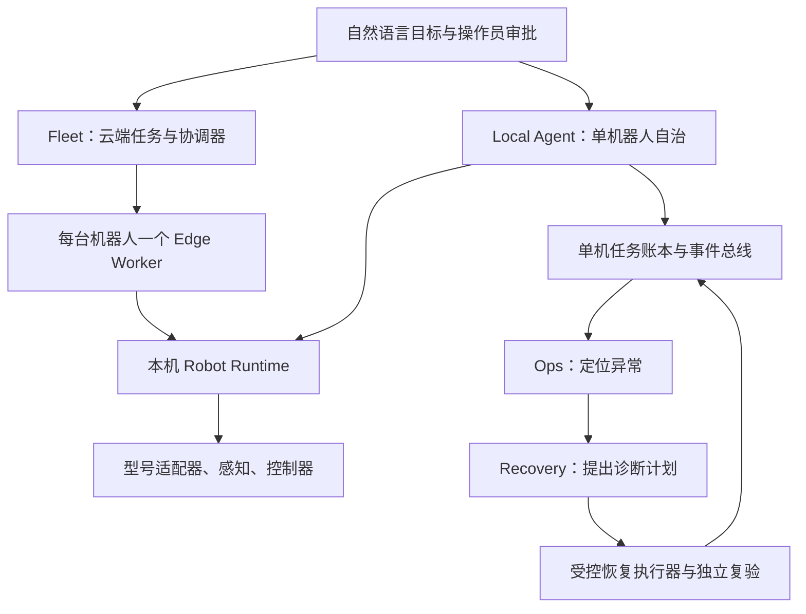
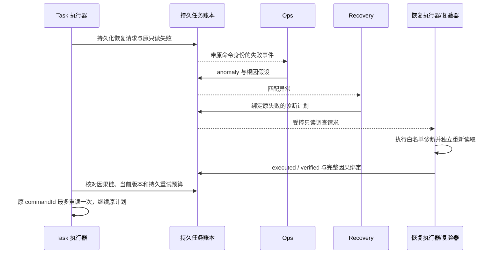

# 长程任务、多 Agent 通讯与异构机器人协作

核对日期：2026-10-11。实现基线为正式版本 v0.7.0，提交 `30df0602f3baaab6cb75644e9051b919248c53af`。本文说明当前实现如何工作；逐轮故障与修复见[长程验收报告](../experiments/2026-10-10-long-horizon-protocol.md)，发布身份与附件见[v0.7.0 发布记录](../releases/v0.7.0.md)。

系统把长目标拆成可审批、可验证、可回溯的步骤，用确定性状态和执行身份连接规划、监督、恢复与机器人控制。能够自动继续的条件是：授权仍有效、上下文一致、机器人具备对应能力，而且已有证据证明继续安全。条件不成立时系统停止并要求对账。当前已验证指定家庭场景的单机器人长程任务，以及独立的双机器人交接流程；尚未证明任意异构机群都能自主完成任意长任务。

## 1. 本版新增功能与实现位置

| 功能 | 实现方式 | 主要入口 |
| --- | --- | --- |
| 一个目标编排多个能力 | GOAL 规划器读取注册能力和结构化状态，产出经校验、冻结、审批的能力调用序列 | [能力规划器](../../internal/capabilityagent/planner.go)、[统一目标指南](../guides/unified-capability-goals.md) |
| Agent 消息有完整身份 | v1 信封、注册身份绑定的发布口、topic 权限、UUID、同 ID 内容冲突检测 | [事件契约](../../core/agentcontract/event.go)、[发布门禁](../../agentruntime/publisher_policy.go) |
| 只读故障自动诊断并续跑 | 原失败、Ops 异常、Recovery 计划、执行器独立复验组成持久因果链；满足条件后原命令最多重读一次 | [读取恢复](../../internal/capabilityagent/read_recovery.go)、[交互协议](../development/2026-10-10-agent-interaction-protocol.md) |
| 长历史仍可用于决策 | 从完整账本和不可变 revision 生成阶段记忆，热层保留硬约束与未决状态，完整历史按 SHA 外置并有界回查 | [任务上下文](../../tasks/context.go)、[命令记忆](../../tasks/context_memory.go)、[预算投影](../../core/agentcontext/managed.go) |
| 失败规划也能追溯 | 保留各轮实际模型请求、拒绝原因、原始请求哈希；未创建任务的失败另存规划尝试 | [失败规划留存](../../cmd/local-agent/planning_failure.go)、[HTTP 参考](../production/api-reference.md) |
| 云边交接不混用版本 | `execution.context.v1` 绑定批准内容、任务版本、机器人、目录、世界来源、claim 和 fence | [执行 Basis](../../core/contextcontract/basis.go)、[边缘检查点](../../edge/worker/context.go) |
| 完成响应丢失后可收尾 | v2 完成回执、completion outbox 与可重入 finalization；重传确认既有结果，不重新执行动作 | [回执](../../fleet/coordinator/completion.go)、[收尾](../../fleet/coordinator/finalization.go) |
| 家庭移动抓放更可靠 | 新鲜传感器准入、建图等待期间零速度、可见抓取路径筛选、持物越盘沿净空和同步收臂 | [Gazebo 后端](../../robot/gateway/tangying_robot_gateway/gazebo_backend.py)、[实测与修复](../experiments/2026-10-10-long-horizon-protocol.md) |

这些功能复用已有任务、Runtime 和持久存储。没有新增一份靠聊天内容维护的任务真相，也没有把工具 SUCCESS 直接当成物理完成。

## 2. 中心大脑、边缘与三个 Agent 如何分工

存在两种部署形态。同一 Runtime 的任务派发权只能交给其中一个控制端，切换前须停止旧派发并对账。



Local Agent 在一个进程中装配 `task / ops / recovery`。Task 推进获批任务；Ops 根据真实事件与摘要发现异常并生成根因假设；Recovery 从恢复动作目录产生计划。当前 Ops/Recovery 主要使用确定性规则和目录，并不代表三个独立大模型。实际长程任务的 GOAL 规划使用模型；各模型调用阶段可独立配置。

Fleet 是另一层：中心负责批准计划、意图顺序、设备分配、共享世界及资源归属；每台 Edge Worker 领取本机工作，准备本机步骤并调用 Runtime。Fleet Worker 与 Local Agent 的三个角色不能画成每台设备都天然拥有的同一套进程拓扑。云端只读模型 Assist 只提供推理结果，也不接管设备的动作授权。部署细节见[Fleet](fleet-cloud.md)和[角色 Harness](../production/agent-harness-docker-acceptance.md)。

电机控制、轨迹跟踪、传感器采集、短租约停止和急停在设备侧完成；中心不把网络或模型推理放进实时控制环。任务状态、资源所有权和物理证据分别由各自的确定性组件管理，任何 Agent 的文字建议都不能代替它们。

## 3. Agent 之间究竟通过什么通讯

### 三条通道承担不同职责

| 通道 | 内容 | 交付与权限边界 |
| --- | --- | --- |
| 同进程 EventBus | task/action/evidence/state/ops/agent 事件，按 topic 订阅 | 有界队列；慢订阅者可能丢事件。注册身份限制发布，不是跨主机身份认证 |
| 持久任务账本 | 原始执行事件、诊断、计划、回执、版本、规划上下文 | Local 使用 SQLite；Fleet 使用任务/事件/Outbox 存储。回放、恢复和放行以持久事实为依据 |
| 云边网络 | HTTP 数据面传递任务、claim、事件与 completion；FleetGateway mTLS gRPC 传递心跳和控制；本机 Runtime 使用 gRPC | 设备身份、凭据、claim、审批、租约与 fencing 都独立校验。队列仅唤醒 worker，不授予动作权限 |

`tasks.TaskEvent` 向总线投影执行事实；Agent 的诊断与计划也写回同一任务账本。原始事件和镜像共享事件身份，同内容去重，同 ID 不同身份或业务参数会拒绝并记录冲突。事件是事实、建议或回执，具体含义由 topic 和发布者权限确定。

EventBus 不能承诺无限重放或 exactly-once。当前发布路径可能先向实时队列投递再调用持久 sink，所以“某个 Agent 已收到”不能作为落盘确认。恢复执行器核对持久链，关键记录缺失就不放行。运行时级、没有 taskId 的广播也不等于任务持久记录。完整规则见[Agent 事件](agent-events.md)。

### 每条消息如何对应到唯一执行尝试

信封主要字段是 `protocolVersion / id / topic / agent / agentVersion / taskId / taskRevision / robotId / stepId / commandId / causationId / correlationId / occurredAt / priority / payload`。

`correlationId` 目前用于按任务检索；它不足以区分同任务的不同命令。恢复使用以下精确 binding，值从真实来源复制，模型不能补写：

```json
{
  "taskId": "task-example",
  "taskRevision": 1,
  "robotId": "robot-a",
  "stepId": "rev-1-cap-03",
  "commandId": "task-example/rev-1-cap-03",
  "sourceEventId": "task-example#34",
  "anomalyEventId": "evt-anomaly-uuid",
  "planEventId": "evt-plan-uuid"
}
```

这是一份示意恢复 binding，不是可直接发送的 Runtime 命令。`causationId` 连到直接原因，source/anomaly/plan ID 连起整段恢复历史。任务版本、机器人、步骤、命令或原因不匹配时，即使工具名字相同也不能解除另一条命令的等待。历史记录缺失的身份保持未知，不能用“当前最新值”倒填。

Orchestrator 注入绑定注册身份的发布口；观察者不能发布动作执行或任务终态，Recovery 不能声称已执行恢复。`ops.recovery_executed` 只由实际 executor/verifier 的受信任接线发布。该机制约束同一受信任进程内的组件，不隔离恶意插件；远程通讯使用独立的传输鉴权。

## 4. 一个意外如何被多个 Agent 定位、处理并继续

以下是已实现、并在家庭长程任务中实测的瞬时只读故障路径：



只读调查和独立复验是不同读取。复验不能只相信先前工具回执，冷归档回查也不替代真实诊断复验。恢复等待有期限，重试预算持久化；ESCALATE、执行失败、未复验、超时、取消或绑定缺失都不会放行。

物理动作仍遵守原闭环和审批：自动恢复只执行目录允许的 `read_only` 步骤，`bounded_write` 需要批准，`never_automatic` 禁止自动执行。未知结果的抓取、放置、导航不能按“网络超时”重放。关键物理动作在途时，恢复建议由 Orchestrator 延迟到安全点，不抢占正在执行的动作。另见[恢复 Agent](recovery-agent.md)。

规划阶段也有终止预算：当前 GOAL 循环最多 10 轮、6 次 provider 状态读取、3 次提案，单份能力提案最多 16 个 calls。归档回查计入总轮数，不作为额外机器人工具执行。失败规划保留 trace，但不因此创建可执行任务。系统用这些条件避免无限推理、无限调查和无限重试；更长目标需要明确的阶段与批准版本，当前没有自动生成无限阶段的调度器。

## 5. 长上下文如何保持一致并跨域传递

### 权威状态与模型视图分开

| 内容 | 权威来源 | Agent 可以做什么 |
| --- | --- | --- |
| 目标、硬约束、批准计划 | 持久 Task 与不可变 TaskRevision | 阅读、提出新版本；不能直接覆写当前批准内容 |
| 已派发/未决/结果未知命令 | 执行账本、Runtime journal、边缘 checkpoint | 诊断与提出对账；摘要不能将 unknown 改为完成 |
| 当前物体、位姿和地图 | 带来源、采集时间、坐标/标定版本的观测与世界投影 | 引用证据；历史“曾完成”不证明当前世界仍满足 |
| 资源归属与执行权 | coordinator、有效 claim、租约与 fence | 读取或请求；模型不生成有效授权 |
| 模型所见上下文 | 从以上来源确定性生成的 managed projection | 在预算内做决策，不成为第二个任务状态源 |

热层保存目标、硬约束、当前阶段、精确参数和 verdict，以及按 `(revision, robot, step, command, tool)` 归约的未决/冲突 guard。完整历史和冗长工具结果保存在冷归档中，以源记录 ID、SHA-256 和回查索引引用。新投影从完整账本重新生成，不对上一轮摘要反复总结。缺少身份的状态不会与另一条“看起来相同”的记录合并。

`context_read` 只能访问当前循环捕获的同 task/robot/revision 归档，按 SHA、可选 item_id 和 UTF-8 偏移分页。它是内部只读工具，不会进入待审批的物理调用序列；任务版本或机器人作用域变化时结束旧循环。任务创建前的 GOAL 规划尚无 taskId，其 trace 保留当时真实 robot scope，不用后来创建的任务身份倒填。

| 默认预算 | 数值 | 实际含义 |
| --- | ---: | --- |
| `TANGYING_CONTEXT_MAX_BYTES` | 32768 | 模型上下文正文的 UTF-8 字节数 |
| `TANGYING_MODEL_REQUEST_MAX_BYTES` | 65536 | 含系统提示、工具 schema 和协议字段的 HTTP JSON 字节数 |
| `TANGYING_MODEL_OUTPUT_TOKENS` | 4096 | 请求的模型输出 token 上限 |
| 归档单页 | 最多 4096 字节 | 还会按剩余输入预算缩小 |

输入字节不等于供应商实际 token 数。必保留状态仍放不下时，模型调用前拒绝，需要缩小阶段或工具集；不会删硬约束或提高预算来宣称支持无限长任务。实际模型 HTTP 请求原文和 SHA 随决策保存，HTTP Authorization 凭据不进入 trace。详见[分层上下文](../development/2026-10-09-long-horizon-context.md)与[真实长历史预算修复](../development/2026-10-10-context-budget-recovery.md)。

### 不一致如何处理

| 不一致 | 处理 |
| --- | --- |
| 同事件 ID 不同参数、机器人或版本 | 拒绝冲突投递，保留冲突 guard；后续普通成功事件不能覆盖冲突 |
| 另一机器人或旧 revision 的成功回执 | 不清除原命令的 pending/unknown，不把旧证据重绑 |
| 任务快照与 claim 不属于同一批准内容 | 比对 execution digest、revision 和 Basis；拒绝执行 |
| 新提案提高 aggregate 版本，但 active 执行内容没变 | 允许经校验的同一 active revision；待审批提案不自动获得执行权 |
| 目录、Runtime 身份或标定变化 | 执行前拒绝；更新配置、重新登记和批准，不能热换身份 |
| 世界来源、采集时间或坐标不符合要求 | 等待合格新证据或停止，不用轮询时间替换采集时间 |
| 已执行，中心已收尾，但 completion 响应丢失 | 按精确不可变回执确认旧结果；不改新版本，不重放动作 |
| 状态仍矛盾、落盘失败或物理结果未知 | 失败关闭、停止/对账，保留全部来源供定位 |

跨域传递同步的是版本化执行依据和证据引用。各 Agent 可以有不同长度的模型视图，但必须引用同一作用域的权威事实；不要求把所有聊天、图像和点云复制到所有节点。

## 6. 为什么能接入不同结构的机器人

任务端使用能力语义，设备差异在 `RobotProfile → Backend → RobotRuntimeService` 边界内转换。固定单臂、双臂、移动底盘、移动操作机器人、传感器平台或 custom 结构都能由 Profile 表达；该表达能力不等于这些型号都已有驱动或通过实机认证。

新型号需要交付四部分：

1. **真实设备 Profile**：唯一 robotId、驱动/型号版本、原生关节及 SI 限位、末端、传感器来源、标定版本、允许动作键和已实现工具。
2. **本地 Backend**：把 canonical tool 转为本机 SDK/ROS 2/控制器调用，提供 observation、stop、反馈和 readiness；构造适配器不得顺便使能或移动。
3. **规范观测与验证器**：`scene.reconstruction.v1` 使用 world/m、`[x,y,z,qw,qx,qy,qz]`、真实 source/frame/sequence/采集时间，给导航或抓放提供动作后证据。驱动负责标定、重建与语义关联，schema 校验不替它实现感知算法。
4. **型号现场验收**：控制、碰撞、负载、停止距离、传感器质量及目标技能必须分别验证。无导航底盘不声明导航，无夹具不声明抓取；目录 `available` 反映当前可用性。

[PluginBackend](../../robot/gateway/tangying_robot_gateway/plugin_backend.py) 在 handler 缺失或 physical_ready 不成立时报告物理能力不可用；Go 客户端再次核对 Profile、Runtime 身份和规范重建。协议保持 ROS/SDK 类型在本地。具体字段、factory 与例子见[适配器手册](../development/robot-adapters.md)及[实机集成指南](../guides/hardware-agent-integration.md)。

**异构接入与异构调度是两层能力。** 当前已有不同关节、传感器和能力子集经真实 Python gRPC 服务与 Go 客户端的[契约测试](../../tests/contract/test_heterogeneous_runtime_boundary.py)，测试的感知和动作 handler 是夹具，不是实体硬件。

Fleet 当前按显式 robotId 或未绑定意图顺序认领；它没有通用的能力竞价、负载/电量优化、自动换机和任意 DAG 并行调度。一个 capability plan 绑定一个 robotId 和 catalog revision，不能直接混装多台机器人目录。Task 还携带单一 Adapter，worker 会拒绝实际驱动不匹配；`auto` 在任务入口会归一为 `mujoco`，不能把它当任意驱动的通配符。跨不同 adapter 的统一任务还需扩展每节点执行契约、兼容性检查与端到端验收。

## 7. 多台机器人怎样合作完成长目标

### 当前已实现的是按序意图和物理交接

以已有双机器人共享红方块为例：A 放到交接区，B 从交接区取走并放到目标区。两台机器人各有 worker 和 Runtime，中心协调意图顺序、世界证据与共享资源。

1. 操作员批准任务；中心保存不可变 revision 和带机器人绑定的意图。
2. A 被队列唤醒，向 coordinator 领取有效 claim；前序意图未成功时下一意图不可领取。队列重复通知不会授予重复动作权限。
3. A 的 worker 核对目录、批准内容、机器人与资源 fence，持久化 ACCEPTED 后执行，并获取动作后证据。
4. 中心在共享交接路径用 Harness 核对 `EntityInside / EntityStable / RobotHeld(empty) / SourceFresh`、命令后来源序号和世界 basis。工具 SUCCESS 只触发验证。
5. 证据满足后保存成功与资源转换信息，推进更高 fence，并通过 ready outbox 唤醒 B。B 按自己的目录、grounding 和 Runtime 执行下一意图。
6. 最后一个意图及其物理后置条件完成、持久收尾关闭后，任务才到达成功终态。

同一实体必须在各机器人观测中具有可核对身份、共同坐标系与有效标定；资源监护权不能只靠“我已经交给它了”的消息传递。Harness 的稳定样本要求因场景而定，不能把同一旧帧重复上报当作多个独立样本。入口和版本范围见[分布式 AgentOS](distributed-agentos.md)、[RoboCasa 交接](../operations/robocasa-handoff.md)与[Harness 实现](../../core/harness/evaluator.go)。

资源 fence 防止旧所有者继续写，leader 租约限制中心单写；本版生产启动要求 Redis 等共享领导权存储，并用进程 incarnation 区分重启。它们不构成跨主机共识或覆盖所有存储的原子事务。MySQL、Redis、世界投影和物理动作之间仍有需对账的崩溃窗口。

### 长程执行依靠阶段闭环与持久检查点

云端发出的 `execution.context.v1` 包含任务/aggregate/claim 版本、intentIndex、step/command、robot/adapter、批准内容摘要、目录修订、resource/fence 和世界来源基线。摘要检测混合内容，不是签名、审批或实时观测。边缘在动作前，包括慢策略推理之后，再核对当前任务、claim 和 Runtime。

fence 和来源序号使用 typed uint64 及精确 JSON 留存，不能经通用 float64 投影后校验，否则大整数可能被舍入。动态业务参数另做可移植数值检查，超出安全范围的业务 ID 使用字符串。这让跨语言和跨存储的命令身份保持原值。

| 边缘持久阶段 | 重启或重传时的行为 |
| --- | --- |
| 无记录 | 校验通过后，以 CAS 提交 ACCEPTED，落盘失败不派发 |
| ACCEPTED | 动作可能已经发生，停止并要求对账，不自动重跑图 |
| EXECUTED | 原完成结果及 outbox 已提交，只重发原 completion |
| COMPLETED | 不执行动作，必要时补发 outbox ACK |

云端 v2 回执与成功意图、pendingCompletion、finalization outbox 在同一事件存储事务中提交。收尾可重入地释放原租约、更新共享归属、激活已批准待切换版本并关闭记账；不会重新调用 Runtime，也不会释放后来取得的新 fence。pending 未关闭时不发下一条命令。协议详见[云边完成回执](../development/2026-10-10-cloud-edge-protocol.md)。

同一机器人并发 worker 要共享执行数据库，CAS 决定唯一接收者；不同数据库不会自动形成分布式锁。断网后不能无限离线执行，通信校验或短 lease 失效会停止。租约过期仅证明授权失效，不证明机器人没有动作；不能把未知结果自动回收给另一台机器人重做。

### “保证完成”的实际条件

这些机制保证的是执行身份、权限、资源与证据约束下的可继续性。已经验证的自动续跑包括特定只读瞬时故障、持久 completion 重传和部分记账崩溃收尾。持续感知失效、硬件故障、无有效路径、未知抓放结果、未批准改版和未闭合资源转移都可能使任务停止。

“移动底盘运输、固定机械臂抓放、传感器平台复验”的异构分工可沿这些边界扩展，但当前尚无这三类实机组成一个长程任务的验收。要交付该能力，还需每节点机器人/adapter/目录绑定、匹配与重规划策略、跨机物料 ID 和坐标标定、实际交接区验证器，以及全过程的丢包、重启、持物和换机测试。

## 8. 哪些结论已有证据

| 证据层 | 已验证内容 | 不能据此推导 |
| --- | --- | --- |
| 2026-10-10 单机器人 Gazebo 长程任务 | 同一自然语言目标 7 个能力阶段、23 个子步骤、6 次抵达，约 19 分 19 秒；建图启用、巡检、同杯抓放和返回完成；一次只读故障自动恢复 | 多机器人长程物理协作、任意家庭或实体硬件可靠性 |
| 同次上下文与事件审计 | 11 个 managed 上下文、7 个实际模型请求、4 次压缩、41 个 v1 事件无身份冲突 | 本次实际使用了冷归档分页；实测分页次数为 0 |
| 独立 Fleet 回归与双机交接证据 | 意图顺序、共享世界/资源、检查点、版本切换、重连及 completion 丢响应等特定边界 | 异构机群自主匹配、生产 MySQL/Redis HA 或跨地域容灾 |
| 异构协议契约测试 | 单臂与移动传感器形态、不同关节/传感器/能力子集走共同 Python/Go 边界 | 相应真实型号已经完成控制、标定和安全认证 |

Gazebo 原末尾导航读取 `ready=false`，因为定位年龄 1078ms 超过 1000ms 门槛；后续交接读取为 ready=true，两份事实分别保留。最后阶段要求读取并报告状态，任务成功不意味着可以跳过下一次物理动作的就绪检查。暂停由操作员发起，不能计作自动物理恢复。原始失败任务和修复前证据不会改判成功。[验收索引](../experiments/2026-10-10-long-horizon-acceptance.json)关联原始制品 SHA；大体积原图、数据库和私密配置不随源码克隆交付。

本次文档修订只核对实现、运行记录和文档合同，没有重新执行 Gazebo 或实机验收。发布版本的 CI 结果见[v0.7.0](../releases/v0.7.0.md)，不能把它当新硬件的现场放行。

## 9. 扩展时保持哪些接口稳定

- **新增 Agent**：实现既有 Agent 接口，声明订阅和权限，通过注册身份发布；新增 topic/payload 要补词表、投影与权限检查，不另外维护任务终态。见[新增 Agent](../development/adding-an-agent.md)。
- **新增机器人**：交付实际 Profile、Backend、规范观测、停止与验证器，先完成单机闭环；接 Fleet 时另验证设备身份、目录、世界坐标、资源和 claim。
- **新增协作流程**：明确前后置条件、每阶段机器人和资源归属；扩展当前意图/执行契约及协调器，测试旧 claim、重复通知、完成响应丢失和持物中断，不能只新增一段规划提示。
- **扩展上下文存储**：冷归档可迁移到内容寻址对象库，但作用域、原始请求、完整来源、SHA 和 guard 语义要保持；预算超限仍失败关闭。
- **部署多中心**：排除不理解 v2 pending gate 的旧 coordinator，验证共享领导权和各存储恢复；现有实现没有自动拦截旧二进制混跑的版本联锁。

排障时先取得 taskId/revision/robot/step/command，再沿原失败→异常→计划→执行/复验查账本，核对同一 Runtime journal、观测来源与采集时间、Context SHA、claim/fence 和 checkpoint。这样可以分辨规划错误、上下文冲突、工具暂时失效、持久化失败及物理未知结果，而不是从一条聊天解释猜测发生了什么。
