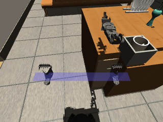

# 装修家庭场景验收记录

本轮目标是用同一台移动 XLeRobot 跑通日常家庭任务。环境为人工布置的暖木、米灰瓷砖家庭，包含客厅、走廊、厨房、卧室、卫生间及 MIT-0 家具素材。最终家庭工位使用陶瓷杯、收纳盘、盘碟与花瓶；不加载旧红、蓝、绿杯具。

## 数据与环境身份

- 旧 `artifacts/sim-stack/workflow` 运行目录停机后移入 `artifacts/acceptance/furnished-home/archive/workflow-before-new-home`，归档记录为同目录的 `reset-record.json`。
- 新演示入口为 `http://127.0.0.1:8897`，机器人端口为 `50161`；任务、地图、标定分别使用 `artifacts/sim-stack/furnished-home`、`artifacts/maps/furnished-home`、`artifacts/calibration/furnished-home`。
- 启动后的 `/v1/tasks` 为 `[]`，`/v1/maps` 为零地图，原始响应保存在 `artifacts/acceptance/furnished-home/initial-empty-data.json`。
- 原先另一套 8787/50051 服务与其地图保留。这里的“清空”是当前家庭演示不再加载历史任务与地图，并保留可恢复归档。
- 上游模型固定提交 `ff9631ca6d1db9c1ba656498151464b5ab74aafe`。生成资源和原始材质有 SHA-256 清单，资产留在本机忽略目录，通过准备脚本重建。

## 注册服务全流程

通过 `/v1/robot/services` 调用 `calibration.run` 成功，机器人和两个机载相机参数已应用，版本为 `c93b4e4d6b052a230c6631e7cde661a683917035e7c149ae119d08984851c7ec`。结果保存在 `artifacts/acceptance/furnished-home/calibration.json`。服务驱动自身派生参考参数；这并非实机重新测量的标定结果。

建图使用 `mapping.start` 的巡检模式，底盘执行 24 个移动/转向目标，机载 RGB-D 实时配准融合。房间内加入有限转向后恢复行进方向。SLAM 与操作不读取外部总览相机或家具真值。

首轮扫描保存地图 `scan-467ebff766b1`，采集 210 帧，配准 208 次、109 个回环约束，累计行驶 27.2496 m，生成 62,970 个 RGB 点。首次巡检在第一段导航前以 `NO_KNOWN_PATH` 停止，只有观测步骤确认；失败任务 `task-9ccf00fab8a9b8b7684f1940` 和原始证据保存在 `artifacts/acceptance/furnished-household-fresh`。

原因是规划器把 EDT 的保守充分条件当成节点可通行的必要条件。0.05 m 栅格中真实间距为 0.325 m 的节点可以容纳 0.32 m 底盘，却被半对角线近似剔除。修复仅对不确定窄带使用精确圆盘/AABB 检查，保持安全半径、未知格、占据格和完整路径段检查不变。47 项栅格规划测试通过；独立离线加载该地图的物理仿真已走通卧室、卫生间、客厅、厨房并返回客厅。后续在线验收采用新版本及带关键帧预览的地图。

## 关键帧地图与交互验收

最终采集地图 `scan-6f2feb8d93b2`（名称「现代家庭关键帧地图」），内容哈希 `a90d2178bb752618f66b9852f9a4588ac82d5eb1bed630b46329a22c42236ae0`。行驶 27.1583 m，205 个关键帧、203 次配准、104 个已接受回环，生成 63,083 个 RGB 点，0.05 m 栅格覆盖率 46%。地图保存和启用均通过注册服务完成，扫描记录保存在 `artifacts/acceptance/furnished-home/keyframe-scan`。

205 个关键帧全部保存 RGB JPEG 与深度 PNG 预览，压缩图像合计 2,060,773 字节，图像包 `slam-keyframes.json` 为 2,843,140 字节，SHA-256 为 `eee77ab2b4bd70b5ce879456e40d18b0f579acdeaf6504d90db26e8ebfee17f6`。统计、相机信息、位姿及配准数据来自同帧采集和保存的 SLAM session。

真实浏览器验证通过：从三维标记点击打开第 9 帧；新地图第 1、2 帧的图像、时间、观测 ID 和位姿同步切换；「在地图中定位」关闭弹窗并聚焦；切回未保存图像的第一轮地图时显示明确缺失提示，无新地图图像残留。新旧地图互换不会改变活动导航地图。详情提供完整版本信息及配准/回环质量，说明见[关键帧检查指南](../guides/slam-keyframe-inspection.md)。

## 家庭任务在线验收

关键帧地图上的首次巡检 `task-26b313516576aef49c3bd3d5` 已确认到达卧室与卫生间，但返回客厅调用超过 60 秒 RPC 限制，任务保守记录为 `RECOVERABLE_FAILURE`。后续遥测显示底盘已到客厅；没有据此把未确认步骤改成成功，也没有自动重试。失败任务与后续遥测保存在 `artifacts/acceptance/furnished-household-final`，故障根因是本地执行忽略注册能力的 `defaultTimeout`，且驱动只在入口检查截止时间，未响应 gRPC 连接取消。

修复使本地 Runner 在首次派发时使用注册服务的执行预算，最多 10 分钟；调用方明确设置的更早截止时间继续生效。参考驱动按已配置空间边界、支持的单段路线长度与低速移动预算声明导航时间，并拒绝超出路线长度上限的请求。绝对截止时间和租约在接收时固定，控制脉冲、排队结束与最终回执均检查到期；仅拥有执行权的连接能够取消动作，重复读取连接不能误停原命令。队列 Fleet 的任务占用协议仍保留原有期限，本轮未扩大其单工具预算，以免越过当前不续租的任务占用期限。

本地执行修复后，`artifacts/acceptance/furnished-household-release` 中的整屋巡检、厨房检查与返回客厅三个任务均已成功，所有导航回执均带匹配的活动地图及标定身份。杯子任务 `task-9c5469823f623eb6ab7efda6` 则在规划登记阶段发现三只杯子匹配而停止，没有派发任何工具。实际 RGB-D 已识别新工位，问题在语义服务仍发布旧颜色杯具目录。

修复将已配置物品目录注入驱动的通用语义服务，新家庭只登记支持操作的 `ceramic-mug` 与 `kitchen-tray`，不发布物品真值坐标，也不把陈设盘碟/花瓶声明成可抓取物。地图和变换身份校验继续先于目录发布。验收脚本新增创建任务前的唯一对象/工作区检查，四种旧目录与歧义回归均通过。此前失败记录保留；修复后的杯子任务在显式重启后的初始物品状态运行，导航结果不重复采集。

首次新目录搬运任务 `task-19895a1d8e246d2ebe160b78` 已确认抓取、抓取验证及放置，但随后 `verify_placement` 因 `PLACEMENT_NOT_OBSERVED` 停止，没有执行返回。放置回执显示杯子在盘内；下一次验证已看不到托盘实体。失败后通过只读 `Observe(rgbd_raw)` 保存了原始深度、RGB、相机参数和同帧机器人遮罩，位于 `artifacts/acceptance/furnished-household-transfer-release/post-placement-observation.pb`。原图可见杯子与托盘，原因是杯子遮挡使完整托盘形状检测失败，短时边缘追踪超过 1.8 秒后过期。未根据这一画面把任务手动改成成功，也未自动重放抓放动作。

托盘检测随后改为逐帧测量：从当前 RGB-D 提取近水平边缘，以已配置的尺寸拟合两条相对平行边与第三条正交边。位置和高度来自当前深度，不保留托盘历史位置/TTL；当前桌面或边缘不足、多候选、实心平面均拒绝。冻结原始深度、内参与同帧机器人遮罩被压缩为测试 fixture，附来源和 SHA-256；三次相隔 2.5 秒的重建、位移、遮挡、空数据、旧帧和多托盘反例共 16 项通过。此参考检测假设托盘与工位坐标轴对齐，并不宣称处理任意姿态或不可见边缘。

三边检测首轮在线任务 `task-8769c4af2cd62a2789bfb03d` 同样完成前 9 步并在放置验证停止。它产生了不同的杯子遮挡视角，放置回执已不含托盘。失败任务、22 张按哈希校验的 RGB/深度图以及失败后的只读原始采集保存在 `artifacts/acceptance/furnished-household-rim-release`。新帧仍能观测三边，检测器却把孤立远端角点造成的间隙作为整条候选边失效的依据。修复按原 4 cm 间隔划分连续边段，只让达到原 5 点、2 cm 长度的连续段支持边缘；孤立点不能否定已有边，也不能把多个过短片段拼接成边。三边、尺寸、周边占比和多候选拒绝规则保持不变。该失败也保留为感知回归输入，不覆盖为成功记录。

修复经 27 项感知回归及独立窄审通过，全部相关感知/家庭模型测试 44 项通过，空托盘定位仍保持约 1.53 mm 的配置目标误差。随后显式重启机器人，重新应用同版本标定并启用同一保存地图，仅运行新的杯子任务。`task-2145cb98bf8c141f041134ee` 于 `2026-09-13T09:16:02.560865Z` 成功结束，12 步均有命令回执和对应采集，耗时 161.148 秒。证据位于 `artifacts/acceptance/furnished-household-segment-release`，该次脚本返回 `passed: true`、零物理重试、零运行中场景重置。

本轮最终通过的任务如下。前三项来自一次导航验收，最后一项来自感知修复后显式重启的搬运验收；这是多个运行批次的成功证据汇总，不是一次不中断的全场景套件。之前整体 `passed: false` 的日志保持原样。

| 任务 | 任务 ID | 确认步骤 | 已校验图像 | 耗时 |
| --- | --- | ---: | ---: | ---: |
| 卧室、卫生间巡检并回客厅 | `task-93e475c89c59e82d773d39e7` | 7 | 16 | 79.094 s |
| 客厅出发检查厨房 | `task-70285acd4763a996b4e8a0b6` | 5 | 12 | 28.131 s |
| 厨房返回客厅 | `task-b927dd43338a2b8690642c9f` | 5 | 12 | 28.582 s |
| 厨房拿杯、放入收纳盘并回客厅 | `task-2145cb98bf8c141f041134ee` | 12 | 26 | 161.148 s |

四项共 29 个确认步骤、66 张 RGB/深度图，汇总索引为 `artifacts/acceptance/furnished-home/final-task-evidence.json`。全部导航回执与活动地图 ID、内容哈希、标定版本一致。最终放置验证的 3 次独立采集覆盖 0.902 秒，关系均为 `inside:kitchen-tray`。返回确认的底盘位置为 `(0, -1.25, 0.035) m`，朝向误差 0.010 rad，在到达容差内。真实浏览器回放显示「任务成功 · 12 个工具步骤 · 12 次确认 · 13 份采集」，一致性检查未发现问题。

下图是成功放置验证绑定的原始机载 RGB 图，来源与 SHA-256 记录在 `docs/images/furnished-home/captures.json`，没有用外部展示视角代替命令证据。

## 验证范围与限制

- 地图浏览从保存的 manifest、RGB 点云、轨迹和房间标注加载。厨房点击聚焦重复五次保持稳定；本机点云标记保存、切换地图隔离、刷新恢复及删除已通过浏览器验收。
- 家庭全景和厨房操作区使用独立注册相机。切换外部视角不会覆盖主遥测的机器人标定、连接和抓取状态。
- 混入不支持的操作，以及“杯子放在托盘下面/旁边/上面”等不支持关系，会澄清，不能丢弃子句后执行部分任务。
- 当前识别为受限工位的 RGB-D 几何方法，只有单个陶瓷杯支持抓取。盘碟与花瓶是陈设；杯子可见空腔与把手的碰撞采用保守近似。
- 当前成果是装修家庭仿真中的完整任务验收，不是学习算法训练成果、真实住宅扫描或实机迁移保证。未采集和被遮挡的地图区域仍为未知；房间标注是保存的已配置工作区，不是全屋自动物体识别。

启动与重现步骤见 [装修家庭演示指南](../guides/furnished-home-demo.md)。

## 自动检查

已完成的相关检查包括 Go 全包、前端全套、RGB-D 运行时与相机/物品感知、资产转换与碰撞布局、启动监管及命名空间恢复。导航修复额外检查闭区间接触、圆角障碍、未知格、窄通路和每段连续扫掠间距；家庭任务脚本校验活动地图身份、每步采集 ID、RGB/深度 SHA-256 与三帧稳定放置证据。Go 全包及最终二进制构建通过；前端 368 项通过。地图关键帧/清单/转换相关 60 项、栅格导航 47 项、资产转换相关 23 项通过。受影响的 Python 执行端/导航/相机运行时整套 124 项通过，随后最终 server 23 项及新增实际控制器到期的 3 项通过。监管脚本 36 项通过、1 项跳过。物品登记修复另通过语义服务/家庭模型 26 项及运行时/家庭场景 67 项，验收脚本 13 项通过。最终托盘感知 27 项独立回归、44 项关联测试和 Ruff 通过。独立审查已通过；这些测试集存在重叠，不合并成一个累计数量。
