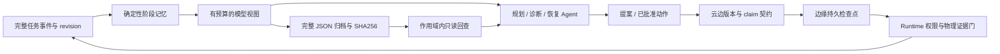

# 长程任务：云边上下文、确定性压缩与恢复检查点

历史范围说明：本页保留 2026-10-09 的验证与当时限制。下文“完成响应丢失且切换 revision 后等待对账”的旧限制，已由 v0.7.0 的[精确完成回执与 v2 收尾](2026-10-10-cloud-edge-protocol.md)在明确条件内修复；其他崩溃窗口与旧节点仍按新协议边界处理。当前总览见[长程协作实现导读](../architecture/long-horizon-collaboration.md)。

日期：2026-10-09。实施计划见 [任务规划](2026-10-09-long-horizon-context-plan.md)。基线提交 `2206050e4e8580eca27f147cd08ca3f61a65497e`，延续 PR #21。

## 本轮行为变化

过去恢复上下文只保留末 64 条任务事件，工具结果在 8192 字节处截断；早期约束、未决动作及完整结果可能无法恢复。现在从完整持久账本和不可变 revision 记录生成阶段状态，再在模型输入边界做确定性外置。原文、快照和模型实际 HTTP 请求保留在决策记录中。

中心管理任务目标、计划和批准；边缘持有执行检查点与回执；物理成功仍需要相应验证器。任何摘要或模型文字都不能更新这些权威状态。方案 B 的分层状态与方案 D 的检查点均接入现有流程，没有新增第二套任务真相库。

## 完整历史与状态一致性

- `tasks.ContextFor` 不再截断到 64 条事件。`ContextForRevisions` / `DecisionContextForRevisions` 同时读取不可变版本请求、约束、步骤与计划。Local Agent 恢复观察器已接入 `Service.ListRevisions`；读取失败直接停止该轮。
- 阶段记忆按 revision、robot、step、command 绑定。同一步骤另一尝试、另一机器人、旧 revision 或没有绑定的完成回执，均不能清除原命令的 pending/unknown。
- 完成事件保留为“记录过完成”，不能宣称当前世界仍满足条件。事件记录时间不冒充传感器采集时间。历史缺少身份、时效、版本或账本序号时明确保留缺失。
- 能力执行器的新事件补齐 `commandId/taskRevision/robotId/tool/mutatesWorld`；已有旧事件保持原样，不能补造绑定。
- 每轮恢复的原始 verdict、failure code/class、dispatch/observation time 是不可外置 guard，避免把 `UNSATISFIED + UNKNOWN_OUTCOME` 的语义随长详情压掉。
- 相同事件 ID 仅在内容和身份一致时去重；冲突变体保留为独立冲突状态，不能关闭已有命令。已知原始事件与镜像事件允许仅增加桥接字段，双方明确声明但不同的字段仍属于冲突。

## 模型预算与归档

生产 `actionloop` 默认使用 `ProjectManaged` 的确定性 JSON 视图，包括未配置 `TANGYING_AGENT_CONTEXT` 的部署。已有 `Project/Render` 及研究格式继续保留；研究格式开关不再绕过生产 actionloop 的预算边界。

| 配置 | 默认值 | 含义 |
| --- | ---: | --- |
| `TANGYING_CONTEXT_MAX_BYTES` | 32768 | 模型上下文正文上限 |
| `TANGYING_MODEL_REQUEST_MAX_BYTES` | 65536 | 包含 system、工具 Schema 和协议字段的 HTTP JSON 请求上限 |
| `TANGYING_MODEL_OUTPUT_TOKENS` | 4096 | 请求中 `max_tokens` 输出上限；部署时须在模型窗口中预留 |

输入计量是 UTF-8 字节，**不是模型供应商的实际 token 数**。部署者须按照具体模型设置输入上限和输出余量。目标解析、传统规划和 actionloop 的最终 HTTP 请求均受预算检查；关键状态放不下或工具目录过大时，在 HTTP/物理执行之前拒绝，要求缩小任务阶段或工具目录。不会截断用户硬约束来凑长度。

目标、约束、问题、步骤、guard、当前观测，以及各轮身份、精确参数和 verdict 保留。普通历史记录与冗长工具详情可外置成完整 JSON；`Compaction` 记录源 SHA256、源记录数量、外置数量、输入字节数和预算。每次从源数据重建，不对旧压缩结果反复总结。

`context_read` 只访问该循环捕获的同 task/robot/revision 归档，支持 SHA256、可选 `item_id` 和 UTF-8 分页。分页最多 4096 字节，并按上下文预算收缩；返回实际偏移、总长度及完整标记。最新回查结果保留到下一轮，旧 SHA 在新增事件后仍可继续读取。作用域变化时终止旧循环，禁止把旧历史重绑到新机器人或新版本。

模型归档、Round 和 JSON 回放保留精确整数。动态工具参数在模型入口和云边任务摘要入口检查数值可移植性；超过安全范围的业务数字拒绝执行，长 ID 应使用字符串。协议中的 typed uint64 fencing token/sequence 保留精度，不套用动态参数限制。

实际模型请求保存为 `Projection.ModelRequest` 与 `ModelRequestSHA256`，不含 HTTP Authorization 凭据。外置内容随 `Projection.Artifacts` 保存，可从任务决策回放追溯。只读回查不计作机器人工具调用，恢复独立复验会跳过回查，重新执行原白名单诊断读取。

## 云边交接与持久恢复

`execution.context.v1` 绑定 task/revision/aggregate/claim、intent index、step/command、robot、adapter、执行定义摘要、catalog、world 来源及 resource/fence。中心在现有 `INTENT_CLAIMED` 事务、事件与 checkpoint 中原子保存契约；边缘不接受混合版本或无契约的旧 RUNNING 任务。

执行定义摘要只覆盖批准的执行内容。新增待审批提案可以提升 aggregate 版本，但不能偷偷改变当前执行内容。物理动作前再次读取任务、验证当前 claim/lease、Runtime 身份/目录和物理就绪条件。

边缘复用 `ExecutionStore` 的事件库 CAS、checkpoint 和 outbox：

| 持久阶段 | 重启后的行为 |
| --- | --- |
| 无记录 | 通过任务、claim 和 Runtime 校验后，先持久化接收，再允许执行 |
| `ACCEPTED` | 不知道中断发生在动作前还是后；禁止重放，要求对账 |
| `EXECUTED` | 已确认执行完成；仅重传中心 completion，不重新执行动作 |
| `COMPLETED` | 幂等返回；若 outbox ACK 丢失可补 ACK |

同一 SQLite 执行库中的并发 worker 由 CAS 决定唯一接收者。持久化错误、旧 claim、错误机器人/版本、冲突或乱序交接均停止。更新部署时，旧 RUNNING 且没有契约的任务必须先对账；新 READY/claim 自动生成契约。

## 故障定位与修复记录

1. 基线 CI `37338356490`：部署测试仍断言旧 calibration fallback 与旧 commissioning 计数器。修正契约测试，并增加四种真实 shell 参数展开回归。
2. 独立验收发现深拷贝及 Round JSON 回放对超过 2⁵³ 的整数舍入；改用精确数字解码，并补模型参数入口的拒绝策略。
3. 发现 task/robot/revision 切换后旧历史可能重绑；循环现在立即停止，三种切换都有反例测试。
4. 发现归档读取会干扰恢复独立复验、错误归类为物理未知，以及小预算下新分页再次被外置；分别修正复验选择、错误分类、分页和保留策略。
5. 首次完整 Python 回归暴露 typed fencing token 被通用数值限制误拒，两个跨进程任务无法 claim。保留失败日志，拆分协议整数与动态参数校验；修复后双机器人交接及断线重连三个跨进程用例通过。
6. 检查事件重传时发现只按事件 ID 去重会丢掉不同内容的冲突；改为全量识别冲突、隔离归并，并保留正常原始/镜像发布的兼容性。

## 验证结果

最终命令、结果和源码哈希记录于 [验证清单](2026-10-09-long-horizon-context-validation.json)，原始日志位于本地 `artifacts/acceptance/hierarchical-context-20261009/`。

本地验证：全量 `go test ./...`、8 个相关包 race、lint/build、Web 501 项通过；`make test-python` 两阶段合计 **2594 passed、40 skipped**，完整后半段耗时 909.47 秒。跳过不计成功；环境存在已导入 pytest 插件及 NumPy matrix 的既有警告。最后补充的事件冲突兼容由 tasks race 和全量 Go 再次验证。远程 CI 状态以 PR 当前 head 的检查为准。

核心验收包括：

- 千条源事件、早期约束、错误/缺失绑定和 SQLite 关闭重开后的精确阶段恢复。
- 不可变并发快照、中文/emoji 分页、哈希及作用域拒绝、完整大型工具 JSON 往返、HTTP 输入与 trace 一致。
- 超预算或不可序列化结果后不执行后续物理工具；真实模型响应中的不精确数值参数拒绝。
- 同库 worker 并发、各 checkpoint 崩溃、数据库失败、乱序交接、执行后 completion 重传及 ACK 丢失。
- 恢复原始只读诊断→历史回查→独立重读验证，含复验失败分支。

## 当前边界与后续工作

- 本轮证明软件及仿真边界；未连接真实机器人，也未将历史 19 分钟 Gazebo 结果算成本轮代码的重新验收。真实设备仍需完成感知、控制、验证器、停止和现场持续运行验证。
- 断网不提供无限离线物理权限；中心无法即时通知离线边缘的新约束，执行前通信校验失败就停止。
- 中心完成后同时切换 revision、边缘又丢失 completion 响应的极端情况，旧 outbox 会保守等待对账。现有接口没有查询旧 claim 完成状态的契约，不推断成功。
- 同机器人多进程须共享执行数据库；不同数据库之间仍依赖 Runtime 的命令幂等与 fencing。
- 输入预算不限制持久 trace 体积。当前归档随快照内联，默认有界 24 轮内存在重复存储；后续可迁移到内容寻址对象库去重。已完成动作极多导致必保留状态超预算时，需要显式切换任务阶段，当前不会自动把精确状态变成有损摘要。
- 并发快照测试基于不可变源副本。调用者不得同时原地修改同一 Go slice/map；新事件追加后读取新持久快照。
- 自动恢复仍限既有获批、可复验动作。结果未知的物理动作必须对账，不能以“自主完成长任务”为由盲目重试。
