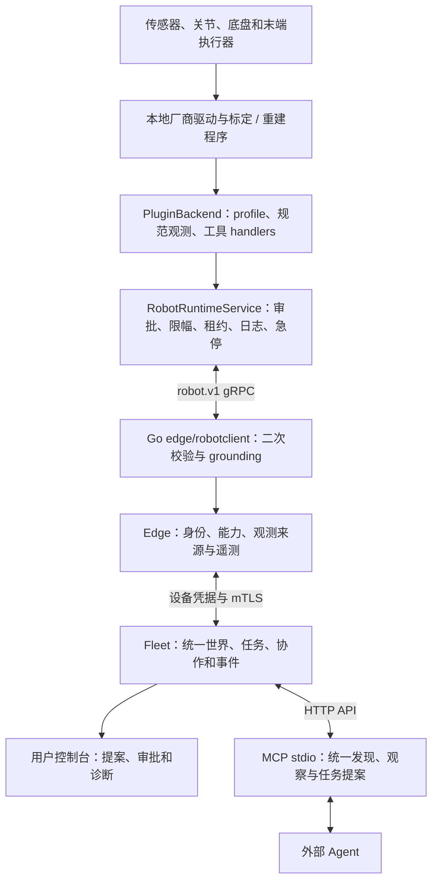

# 接入不同结构和传感器的机器人

本指南面向开发新机器人驱动、传感器适配和策略的工程师。接入目标是让机械臂、移动平台、双臂或传感器平台共享同一套 Robot Runtime、感知格式、任务安全检查和 MCP 工具。新增型号通常在适配器后面接入厂商 SDK；上层 Agent 根据能力和规范观测工作。

当前已实现 profile 与规范重建校验、可信本地插件加载、统一工具参数、安全执行、Go/Python 传输和 MCP 接入。仓库中的异构示例是明确标记为 `SIMULATION` 的内存状态示例，用于学习协议；它们不模拟物理动力学，也不是 RGB-D、LiDAR、导航或厂商硬件驱动。已有 XLeRobot、MuJoCo、RoboCasa 路线继续保留，不能因新增插件协议就把旧适配器标记为完成严格 profile 认证。

## 从传感器到 Agent 的职责



驱动侧负责测量、时间戳、传感器内外参、坐标转换、机器人运动学和动作完成证据。平台负责验证格式与来源，将工具调用送入确定性安全边界，并保留任务和观测关联。声明了某个 `sourceType` 或把点写进数组，不代表完成了三维重建或标定。

实现入口与代码位置：

| 内容 | 代码 |
| --- | --- |
| Python profile、规范观测和工具 schema | [`contracts.py`](../../robot/gateway/tangying_robot_gateway/contracts.py) |
| 本地传感器与工具回调封装 | [`plugin_backend.py`](../../robot/gateway/tangying_robot_gateway/plugin_backend.py) |
| 插件检查、生命周期与运行入口 | [`run_plugin.py`](../../robot/gateway/tangying_robot_gateway/run_plugin.py) |
| 安全执行、命令去重与事件 | [`service.py`](../../robot/gateway/tangying_robot_gateway/service.py)、[`safety.py`](../../robot/gateway/tangying_robot_gateway/safety.py) |
| Go 对等 schema 与校验 | [`core/robotcontract`](../../core/robotcontract/contract.go) |
| Agent 侧传输、重建校验与物体定位 | [`edge/robotclient`](../../edge/robotclient/client.go)、[`reconstruction.go`](../../edge/robotclient/reconstruction.go) |
| Fleet 观测投影、关节和策略状态 | [`edge/worker/observation.go`](../../edge/worker/observation.go)、[`telemetry.go`](../../edge/worker/telemetry.go)、[`policy.go`](../../edge/worker/policy.go) |
| 两种机械结构的可运行示例 | [`examples/robots`](../../examples/robots/simulated.py) |

## 先运行无硬件示例

在仓库根目录、已安装 Go 与 Python 3.11 的环境执行：

```bash
make setup
.venv/bin/python -m tangying_robot_gateway.run_plugin schema > /tmp/tangying-robot-contracts.json
.venv/bin/python -m tangying_robot_gateway.run_plugin check --profile examples/robots/arm.profile.json
.venv/bin/python -m tangying_robot_gateway.run_plugin check --profile examples/robots/mobile_sensor.profile.json
.venv/bin/python -m tangying_robot_gateway.run_plugin check --factory examples.robots.simulated:arm
.venv/bin/python -m tangying_robot_gateway.run_plugin check --factory examples.robots.simulated:mobile_sensor
```

`schema` 导出 `robot.profile.v1`、`scene.reconstruction.v1` 和各个工具的 JSON Schema。`check --profile` 只检查静态文件；`check --factory` 会构造适配器、实际读取一帧、检查其来源和新鲜度，随后调用 stop 和 disconnect 清理。它不会调用动作 handler，但会执行你提供的 Python factory，所以只能使用经过审查的本地代码。

检查某一帧时可追加 `--observation /absolute/path/to/current-scene.json`，该参数必须与 `--profile` 一起使用。时间检查基于当前时刻，历史采集文件过期被拒绝是预期行为；不要更新旧数据的时间戳来绕过检查。

启动独立开发 Runtime：

```bash
.venv/bin/python -m tangying_robot_gateway.run_plugin serve \
  --factory examples.robots.simulated:mobile_sensor \
  --listen 127.0.0.1:50061 \
  --journal /tmp/tangying-mobile-example-journal.json \
  --allow-insecure
```

此命令仅在 loopback 开启开发用明文 gRPC，不会自动启动 Fleet 或配置设备登记。另开终端或使用下面的协议测试连接服务。`Ctrl+C` 会调用 stop、disconnect 并停止服务；同一个 journal 路径禁止两个 Runtime 同时占用。需要并行运行机械臂时更换 factory、端口和 journal，设备 ID 也必须唯一。

Go 客户端发现严格 profile 后，在没有显式安全配置时使用 `desktop_standard`；`--allow-insecure` 和 `EDGE_RUNTIME_INSECURE=1` 只改变开发传输配置，不能绕过 profile、审批和动作限幅。开发连接到上述端口时设置 `EDGE_RUNTIME_ADDR=127.0.0.1:50061`，其余 Fleet 身份和凭据仍按后面的登记步骤配置。

## 描述机械结构与能力

`robot.profile.v1` 是适配器声明，示例见 [`arm.profile.json`](../../examples/robots/arm.profile.json) 与 [`mobile_sensor.profile.json`](../../examples/robots/mobile_sensor.profile.json)。不要直接将示例中的型号、传感器类型或限值用于购买的实机。

| 字段 | 接入要求 |
| --- | --- |
| `schemaVersion` | 固定 `robot.profile.v1`。 |
| `robotId` | 此实例的唯一身份，须与 Runtime、Edge、Fleet roster 和客户端证书身份一致。使用 MCP 时须符合其最长 128 字符 ASCII 标识规则；设备显示名称与技术 ID 分开。 |
| `adapterId` / `adapterVersion` | 驱动实现标识和版本，必须与 Runtime 对外报告一致。Fleet 会将 adapter 转为小写并归一既有别名；新驱动使用独立的小写 ID（如 `acme_arm`），不要占用 `sim`、`direct`、`ros2` 等既有别名；MCP 标识长度规则同上。 |
| `modelId` | 真实型号／配置标识，供策略兼容性判断；不要用默认 XLeRobot 型号代替。 |
| `embodiment` | `arm`、`dual_arm`、`mobile_manipulator`、`mobile_base`、`sensor_rig` 或 `custom`。 |
| `joints` | 最多 128 个唯一关节名，声明 kind、unit、lower、upper；转动关节用 rad，移动关节用 m。 |
| `endEffectors` | 最多 32 个末端执行器，声明 id、kind 和已存在的 jointNames。 |
| `sensors` | 1～64 个唯一 sourceId，各自声明真实 sourceType、原始 frameId、transformRevision 和 maxAgeMs。 |
| `actionLimits` | 每个允许下发的动作键都有 min、max、unit；未登记键或越界值必须拒绝。 |
| `tools` | 只列当前型号支持的通用工具；至少有 `observe_scene` 和 `emergency_stop`，不能注册任意 shell 或厂商方法名。 |

`tools` 表示这个配置承诺实现的能力集合，`available` 表示目前能否使用。缺 handler 的声明工具会标为不可用；`physical_ready` 未提供、返回 False 或抛出异常时，物理动作不会自动变为可用。只有注册观察与急停的传感器平台可以接入系统，不需要伪装成可抓取的机械臂。

导航 profile 还须在 `actionLimits` 中提供 `navigation.x`、`navigation.y`、`navigation.z` 三个世界位置边界，单位为 m；`goalPose` 前三维必须在范围内。速度、障碍物、定位失效和驱动反馈的现场约束仍由底盘驱动和经过验证的导航程序负责，位置范围并不等价于碰撞规划。

profile 在一个 Runtime 生命周期内不可变。身份、工具集合、传感器标定或结构变化需要停机更新配置、重启并重新登记；Go 客户端会拒绝连接过程中 profile 消失、变化或身份不一致。

机载 RGB-D 可复用新增的 `RgbdFrame → PixelDetection → RgbdPerception`，详情见[单机器人闭环](single-robot-loop.md)。ROS 2 输入桥见[ROS RGB-D](ros2-rgbd.md)。Provider 返回 `ReconstructionCapture` 可把同次 RGB/depth 和重建原子交给 Runtime；仅返回 dict 的旧 provider 继续兼容，但不会凭空获得相机图像。请勿用独立两次采集的 RGB 与深度组成一帧。

## 交付规范三维观测

`observation_provider()` 必须返回 `scene.reconstruction.v1`。一帧绑定一个已在 profile 中登记的来源；多个摄像头或 LiDAR 可以由本地融合程序产出 `sensor_fusion` 来源，也可以按各自来源返回帧。登记来源不等于平台替你采集或融合了传感器。

| 字段 | 格式与校验 |
| --- | --- |
| `robotId` | 与 profile.robotId 一致。 |
| `observationId` / `sequence` | 一帧的唯一标识和递增序号。相同序号只能重复同一完整帧，不能替换内容或采集时间。 |
| `sourceId` / `sourceType` | 对应 profile 中的同一个来源，真实 RGB-D、LiDAR、立体相机或融合程序不能标为 `sim_ground_truth`。 |
| `sourceFrameId` | 与 sensor.frameId 一致，记录传感器测量来源坐标系。 |
| `frameId` / `units` | 固定为 `world` / `m`；所有实体位置和 points 已转换到这个坐标系。 |
| `transformRevision` | 与该来源登记的标定版本完全一致。 |
| `observedAtUnixMs` | 原始采集时间，不是 HTTP 到达或轮询时间。不得超出 maxAgeMs，未来时间容差最多 250 ms。 |
| `entities` | 最多 2048 个唯一 entityId；category、attributes、pose、confidence、relation 供语义定位与后置条件验证。 |
| `points` | 最多 4096 个 `[x, y, z]` 世界坐标点；所有数值有限。它是有界点集，不是无限流式点云或稠密网格传输。 |
| `pointColors` | 可选，与 `points` 同顺序的 `[r, g, b]` 整数数组，每通道 0–255；非空时点数必须一致。缺失或 `[]` 表示没有颜色，前端明确单色显示。`null`、错位长度、浮点或越界通道拒绝。 |

RGB-D provider 应从生成每个 XYZ 的同一个对齐像素提取 RGB；过滤、抽样、坐标变换和前端远近排序都必须保留这项对应关系。颜色是实际 RGB 通道，不是类别配色或深度伪彩色。无彩色来源的 LiDAR 等传感器可以省略 `pointColors`。同一采集身份不能改色；颜色随完整重建参与去重与历史哈希。

`pose` 的唯一顺序是 **`[x, y, z, qw, qx, qy, qz]`**，四元数使用 wxyz 并归一化；禁止混用 xyzw、角度制、毫米和 SDK 原生数组。实体置信度在 0～1 内，NaN、Infinity、不匹配的来源、错误标定、过期或倒退的帧都会被拒绝。

例如“把桌上的红杯放进右侧收纳盒”至少需要唯一红杯、桌子、右侧收纳盒，以及杯子的 `relation="on:桌子实体ID"` 或 `inside:来源实体ID`。只有一组三维位置不足以证明物体来自指定容器；只有点云也不能自动替代可执行任务所需的语义实体。空场景可以是合法采样，系统不会因此捏造物体或抓取目标。

Provider 可以返回已完成相机标定、SLAM、深度估计和语义实例关联的结果。**本项目的 schema 校验器不实现这些算法**，也不会将 RGB 图片或二维框自动变成可信的三维观测。需要稠密重建、长时间地图存储或大规模点云时，应另行实现感知服务与存储，再向本接口投影有界、带来源和采集时间的任务观测。

Runtime 会把规范实体投影到兼容字段；Go 再次验证重建，并以它作为坐标、身份和语义关系的权威来源。旧的重复 entities 字段不能覆盖规范重建。原始采集时间、点集与 sensor 标识会保留在 Runtime / 遥测契约中；不要据此推断所有前端视图已经具备稠密点云渲染。

## 回报本体状态时使用原生关节名和 SI 单位

`state_provider()` 返回可 JSON 序列化、有限数值的字典。规范 profile 的关节状态使用 profile 中的原始名称：

```python
{
    "joints": {"axis1": 0.25, "finger": 0.035},
    "base_pose": [0.0, 0.0, 0.0, 1.0, 0.0, 0.0, 0.0],
    "held": "",
    "placements": {}
}
```

`joints` 中的转轴值是 rad，直线轴值是 m。不要将角度值转换为看似兼容的 XLeRobot 关节别名。Edge 为已声明且实际存在的关节生成 `joint.<关节名>`；缺失状态保持缺失，不能用零填充来表示已经测量。`joint_positions` 可作为兼容输入，但新适配器优先使用 `joints`。

`base_pose` 是机器人部署局部坐标中的 `[x,y,z,qw,qx,qy,qz]`，Edge 可用 `EDGE_WORLD_POSE=x,y,z,yaw` 转成世界底盘位姿。如果 Provider 已回报世界底盘位姿，应将部署偏移设为零。**reconstruction 中的实体和点已经在 world 坐标，不再应用 EDGE_WORLD_POSE**；不要为了配合底盘显示再次偏移感知实体。

## 实现工具与可信 factory

工具参数采用导出 schema 的精确字段。常用语义如下；新增驱动应实现同样的含义，而不是仅复用同一个名字。

| 工具 | 输入要点 | handler 的职责 |
| --- | --- | --- |
| `observe_scene` | `streams`、`max_rate_hz` 可选 | 由 observation_provider 处理，返回已验证观测的 observation ID。 |
| `resolve_targets` / `plan_grasp` | `objectId`、`destinationId`，后者可带 `keepUpright` | 确认实体与生成适配此机器人结构的抓取准备。 |
| `manipulation.pick` / `manipulation.place` / `arm.move` / `recover_to_safe_pose` | 非空 `action_chunk`；键和值必须符合 actionLimits，可携带 schema 允许的策略证据 | 把规范命名动作转换为厂商指令，并依据真实执行反馈返回结果。 |
| `verify_grasp` / `verify_placement` | objectId，放置验证还需 destinationId | 根据当前观测或夹爪／执行器反馈判断后置条件，不得固定返回成功。 |
| `navigation.navigate` | `goalPose`，使用 world、m、wxyz | 检查工作空间并调用受控导航程序，失定位或危险时中止。 |
| `emergency_stop` | `reason` | 使用专用 stop 回调停止运动；不通过通用 handlers 字典替代。 |

普通 handler 接收 Runtime `Command`，返回 `Result(success, code, message, observation_id, confidence)`。Result 必须有布尔 success 和有限、合法的置信度；公共 Runtime 将字段校验后复制为独立不可变快照。失败、未知完成状态或后置条件不满足不能包装为成功。物理 handler 已进入后抛出异常或返回非法值，会产生 `EXECUTION_OUTCOME_UNKNOWN` 并停止、持久锁存，重启不会自动解除；明确返回的合法 `Result(False, ...)` 仍是已知失败。如果设备可能已执行、但驱动无法确认结果，应抛出异常进入未知结果路径，不能将它当作普通失败返回。

### 会改变世界的工具必须能被新鲜观测确认

适配器在能力声明里用 `mutates_world` 标记"这个工具改变了物理世界状态"。Agent 据此强制闭环：**返回成功不算完成**，必须附上一条命令派发之后采集、带观测标识的新鲜证据，否则该步骤保持未完成、任务进入可恢复失败，且不会用成功文案。当前标注为写工具的是 `manipulation.pick`、`manipulation.place`、`navigation.navigate`、`recover_to_safe_pose`、`arm.move`；`emergency_stop` 是物理工具但不是场景写（它的效果是锁存停止状态，由运行时直接报告）。

因此新驱动要满足两点：

1. **命令结果标注本次观测。** 在 `SkillEvent` 上填 `observation_id`，并让 `wall_time_unix_ms` 反映真实采集时刻。运行时会拒绝早于本次调用、或身份与结果不一致的证据。
2. **不要伪造完成。** 若动作已下发但无法确认结果，抛异常进入未知结果路径；让步骤保持未完成比返回一个没有证据的成功更安全。

只读工具（`observe_scene`、`resolve_targets`、`plan_grasp`、`verify_*`）不需要写门禁，但仍要保证来源与新鲜度可追溯。旧的真值调试运行时不为观测提供标识，因此它的写工具会稳定失败关闭；验收请在相机工作台或实机 profile 上进行。

`PluginBackend.execute()` 会在普通工具调用前重新检查重建，避免把之前的一帧健康状态当作传感器故障后的动作许可。若采样等待期间发生取消、急停或租约停止，SDK 不再进入 handler。动作开始后的安全停止仍要求驱动能在运动期间响应 stop；不能用阻塞的软件调用代替控制器的停机机制。

现有 Go 计划器会在 pick/place 参数中保留 `targetRef`，同时填入 Command.TargetRef；二者必须一致。`policy_execution` 使用实际策略证据，真实模型的 artifactSha256 必须是 64 位十六进制摘要。`deterministic:` 标识只用于 framework=deterministic 且全部来源为 sim_ground_truth 的明确仿真配置，不能复制到实机 profile 中。

下面展示真实适配器的 factory 形状，`deployment.local_driver` 是接入方需要实现的本地驱动模块，不是仓库内已有驱动：

```python
from tangying_robot_gateway.plugin_backend import PluginBackend
from deployment.local_driver import load_commissioned_driver


def build():
    # 接入方必须保证构造/连接不自动上电或解锁，动作解锁来自现场流程。
    driver = load_commissioned_driver()
    return PluginBackend(
        driver.profile,
        observation_provider=driver.canonical_observation,
        state_provider=driver.robot_state,
        handlers={
            "arm.move": driver.move,
            "verify_grasp": driver.verify_grasp,
        },
        stop=driver.stop,
        disconnect=driver.disconnect,
        physical_ready=lambda: (
            driver.commissioning_complete
            and driver.locally_armed
            and not driver.has_fault
        ),
    )
```

示意中 driver.profile.tools 必须与打算提供的通用工具一致；至少含观察、急停及上述 handler 对应的能力。注册真实抓取／放置时补充 handler、动作参数、策略和验证链，不能把示例中的伪动作当作实机实现。`physical_ready` 是读取状态的回调，禁止在回调里顺便执行 arm。初始 `locally_armed` 应为 False；省略 readiness 回调也会让物理能力保持不可用。

factory 接口是受信任的 `module:function`，必须返回 `RobotBackend` 并提供严格 profile。平台不会下载厂商代码或执行远端给出的模块名；MCP 输入不能选择 factory。任何模块导入和构造动作都需按本地驱动部署代码审查，尤其是上电、校准、连接和退出行为。

## 用 mTLS 接入 Fleet

实机启动前，先在设备上安装驱动、完成标定和现场验收，并为 Runtime 服务与 Edge 客户端准备互相信任的证书。下列证书路径和 factory 是部署示意，必须替换为已经签发和安装的文件：

```bash
.venv/bin/python -m tangying_robot_gateway.run_plugin serve \
  --factory deployment.my_robot:build \
  --listen 0.0.0.0:50051 \
  --journal /var/lib/tangying/my-robot/runtime.json \
  --server-key /etc/tangying/runtime/server.key \
  --server-cert /etc/tangying/runtime/server.crt \
  --client-ca /etc/tangying/runtime/client-ca.crt
```

运行用户必须可写 journal 目录；journal 是持久化安全状态，不应在每次启动时删除。mTLS 服务端会要求可信客户端证书；Runtime 服务证书应包含 Edge 使用的 server name，不能把只签发 clientAuth 的机器人证书当作 Runtime 服务证书。

然后配置 Edge。以下展示一个 **不声明 pick/place** 的观察或底盘适配器；`EDGE_POLICY_MODE=disabled` 适用于这个能力子集：

```bash
export EDGE_RUNTIME_ADDR=127.0.0.1:50051
export EDGE_RUNTIME_CA=/etc/tangying/runtime/server-ca.crt
export EDGE_RUNTIME_CERT=/etc/tangying/runtime/edge-client.crt
export EDGE_RUNTIME_KEY=/etc/tangying/runtime/edge-client.key
export EDGE_RUNTIME_SERVER_NAME=my-robot-runtime
export EDGE_FLEET_URL=https://fleet.example.com
export EDGE_FLEET_GRPC=fleet.example.com:8444
export EDGE_MTLS_CA=/etc/tangying/fleet/fleet-ca.crt
export EDGE_MTLS_CERT=/etc/tangying/fleet/my-robot.crt
export EDGE_MTLS_KEY=/etc/tangying/fleet/my-robot.key
export EDGE_MTLS_SERVER_NAME=fleet-control-plane
export EDGE_POLICY_MODE=disabled
read -rs EDGE_DEVICE_TOKEN
export EDGE_DEVICE_TOKEN
go run ./cmd/edge-worker
```

对于严格 profile，Edge 从 Runtime 自动取得 robotId、adapterId、modelId、adapterVersion；可以省略 `EDGE_ROBOT_ID`、`EDGE_ADAPTER`、`EDGE_ROBOT_MODEL`，显式设置时必须完全匹配，冲突会拒绝启动。这只是身份读取，**不会自动签发证书或给陌生设备授予 Fleet 权限**。

Fleet 的 `FLEET_ROBOTS`、`FLEET_DEVICE_CREDENTIALS` 及设备 mTLS 证书必须预先配置，token 对应 profile.robotId，客户端证书身份同样匹配该 ID。自签 HTTPS 入口还需设置 `EDGE_FLEET_CA` 和正确的 server name。具体签发与部署流程见 [Fleet 部署](../fleet-cloud.md) 和[配置与安全](../production/configuration-and-security.md)。`scripts/fleet-certs.sh` 生成 Fleet 侧证书，不能代替所有 Runtime、现场网络和设备授权配置。

设置 `EDGE_FLEET_GRPC` 后，Edge 在 Link 注册中携带真实 profile 工具目录及 sensor 的 sourceId、sourceType、原始 frame、标定版本和新鲜度预算；不再凭 adapter 名称猜测所有输入都是摄像头或仿真真值。该通道还承担心跳、租约和服务器下发的急停等控制消息。只启动本地 Runtime 或只有 HTTP 遥测，不等于这些通道已完成上线验收。

`EDGE_TELEMETRY_INTERVAL` 默认 2 秒；应根据各来源的 maxAgeMs、实际采样率及多源轮询周期设置，使新鲜采集能及时上报。不能修改旧帧采集时间来消除 stale。

如果 profile 声明了 `manipulation.pick/place` 且输入含 `action_chunk`，当前 Edge 启动会要求策略 provider；不能用上面的 disabled 配置跳过。需要 `EDGE_POLICY_MODE=http`、`EDGE_POLICY_ENDPOINT` 和与真实 modelId、adapter、标定、关节及动作限值相容的策略服务。仓库的 deterministic 策略只允许既有 MuJoCo/RoboCasa 仿真 adapter，不是任意新机器人或真实型号的通用动作生成器。策略契约见[策略与工具](../production/policy-tools.md)。

涉及 Fleet 物料资源的命令还需要独立可信的 owner/fencing token 同步。现有 `RobotRuntimeService.register_resource` 是本地方法，会将授权写入 Runtime journal；通用 `run_plugin serve` 没有资源授权 RPC 或自动同步器。未完成这部分集成时，带 resourceId 的命令会以 `RESOURCE_GRANT_REQUIRED` 拒绝。接入方需在自有 Runtime 宿主中，将经过认证的协调器授权送入该方法，验证 owner/token 单调性及撤销/重启行为；不能从收到的动作命令自行授予同一个 token。下面的七步协议测试不带共享资源授权，不等于 Fleet custody 全链路验收。

## 通过相同 MCP 提交任务

安装 `.[mcp]`，配置 Fleet HTTPS 地址和操作员 token，然后使用 stdio 客户端启动 `tangying-mcp`。完整命令、8 个通用工具和错误码见 [MCP 接入说明](../../robot/mcp/README.md)。外部 Agent 先执行 `list_robots`、`get_robot_capabilities` 和 `observe_world`，再提交 `create_task(request, adapter)`。

MCP 创建的是未审批任务提案，必须由人在用户控制台核对并审批。桥接没有批准、任意厂商 SDK 调用、关节解锁或急停复位工具。`cancel_task` 和 `emergency_stop` 分别报告取消请求与下发状态，不将它们描述为已经获得物理停止反馈。

统一能力注册、通用 Runtime 和 MCP 可以接纳新的机器人结构；自然语言理解与任务编排仍需相应技能。当前主要是 manipulation 链和既定双机器人定向交接，`navigation.navigate` 的 Runtime 工具存在不等于“去巡检整栋楼”等自然语言任务已经实现。跨来源感知、共享物料、任务恢复和导航计划需要各自的编排与验收，不能以协议通了替代业务验证。

## 三类自动测试与现场验收

先安装测试依赖：

```bash
.venv/bin/python -m pip install -e '.[dev,mcp]'
```

1. **适配器／安全单元测试**：验证 profile、传感器错误、工具限幅、实际 handler、审批、去重、急停和无隐式解锁。加入你自己的驱动 fixture 与故障测试。

```bash
.venv/bin/python -m pytest -q \
  robot/gateway/tests/test_plugin_contracts.py \
  robot/gateway/tests/test_plugin_backend.py \
  robot/gateway/tests/test_plugin_examples.py
```

2. **真实 Go/Python 边界测试**：不替换 Go Runtime 客户端，检查不同机械结构与传感器穿过实际 gRPC 后仍保持身份、world 坐标、来源、采集时间、起点关系及动作安全。另跑 Go 对应层测试验证注册和世界投影。

其中完整任务用真实 `manipulation.Plan` 和 `agent.CommandForStep` 生成七步命令，向明确的内存仿真注入 fixture 策略动作，验证持物和 inside:tray 关系确实改变。它证明现有规划器的真实参数能穿过严格 Runtime，不证明已接入通用学习策略或真实硬件。

```bash
.venv/bin/python -m pytest -q tests/contract/test_heterogeneous_runtime_boundary.py
go test ./core/robotcontract ./edge/robotclient ./edge/worker ./cmd/edge-worker
```

3. **MCP 协议与 Fleet 接口测试**：用官方客户端初始化真实 stdio 进程并调用工具，验证 schema、鉴权、草稿、错误脱敏、超时与急停路径。

```bash
.venv/bin/python -m pytest -q tests/mcp
```

合入前运行项目要求的完整 `make test`、`make lint`，记录当前提交、环境、命令、失败与跳过原因。本页不把固定测试数量作为长期保证，也不把 fixture 或模拟通过标记成实机验收。

现场验收至少包括：确认机构和关节映射、校准传感器到 world、验证单位与采集时钟、低速单步确认动作方向和限幅、验证无审批与过期目录不能执行、传感器掉线／陈旧数据阻断动作、急停与租约失效确实停止设备、断电和 Runtime 重启保留安全状态、动作完成证据与真实状态一致。需要物理急停和在场人员执行首次上电与运动；软件 `available=true`、`approved=true` 或 handler 返回成功均不能替代这些证据。

购机、阶段化接入与已有 XLeRobot 验收材料见 [Sim2Real 上手](../sim2real/README.md)。为新型号保留独立的驱动版本、型号配置、校准版本和验收记录，不复用另一台机器的通过结论。

## 新增型号通常需要修改哪些文件

新增本地适配器 Python 包／factory、该型号的 profile 配置、规范感知转换器、工具 handlers、驱动依赖及测试；如果动作需要策略，增加对应 policy manifest 与推理服务。部署时增加设备登记、凭据、证书、启动环境和现场验收材料。这些配置中的私钥、token、采集数据和安全 journal 不进入 Git。

在现有工具语义和 schema 能表达需求时，通常不需要修改 MCP 工具名、Fleet 任务接口、Go gRPC 客户端或给前端加入厂商 SDK。新传感器的原生字段留在本地驱动侧，转换后进入统一观测。新语义若超出现有 canonical tools，才需要同时设计 Python/Go 契约、计划器、策略、安全规则、测试和文档，不能只向 profile.tools 填一个新字符串。

前端可继续显示通用任务、设备状态、能力目录和规范世界；如果希望渲染新机器人的精确机构、摄像头视角或点云，需要额外提供展示资产与适当视图。UI 能显示一个设备，并不证明新的物理技能已经可执行。
