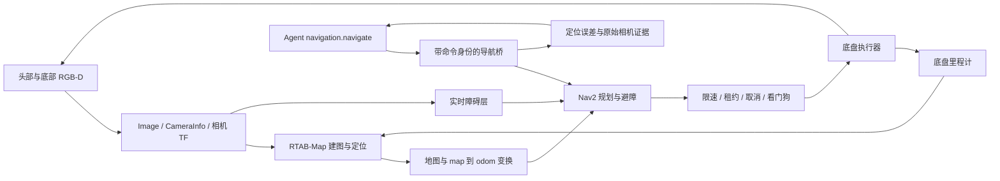

# RTAB-Map / Nav2 导航与双 RGB-D

躺营把导航接在现有 `navigation.navigate` 工具之后。RTAB-Map 根据机器人相机建立地图并估计 `map → odom`；Nav2 使用地图、底盘里程计和实时障碍观测规划路径。Agent 仍负责解释任务、选目标、审批、记录执行步骤和检查结果。MCP 不直接开放电机速度接口。

## 数据与控制链



## 家庭场景配置

家庭场景把同一导航合同扩展到客厅、走廊、厨房、卧室和卫生间。启动时必须显式传递 `scene:=home`（仓库入口为 `--scene home`）；脚本会同步选择家庭 MuJoCo 模型、ROS 参数和 `/data/maps/home/rtabmap.db`，避免运行时画面与导航配置错位。

```bash
make navigation-restart NAVIGATION_ARGS='--build --mode mapping --scene home'
make navigation-status
```

家庭路线的每个段落都先执行 `navigation.navigate`，再用底盘 RGB-D 与新鲜位姿执行 `verify_arrival`。家庭仿真不注册桌面物体，也不提供全知环境实体；它用于验证路线与恢复语义。实际房屋仍需在 `input_mode:=ros` 下接入双相机、里程计、TF 和实体急停，并按[家庭 Sim2Real 指南](../guides/home-sim2real.md)重新建图和验收。

仿真在 macOS 原生进程运行 MuJoCo，Linux 容器运行 ROS 2 Jazzy。相机图像由 MuJoCo 的真实 RGB-D 渲染产生，桥接器不读取仿真物体注册表。`base_pose` 来自仿真机器人的本体反馈，作为理想里程计输入；它不是 RTAB-Map 独立估计的定位。仿真的无漂移里程计、理想位置伺服、已调试工位和颜色识别器仍比真实设备简单，不能据此宣称实机精度已经验证。

## 新开发者从哪里读

| 文件 | 职责 |
| --- | --- |
| `proto/robot/v1/robot.proto` | `ObserveRequest.source_id`、显式请求的 `RGBDFrame` 原始传感器合同，以及命令原始观测 |
| `sim/mujoco/tangying_sim/rgbd_runtime.py` | 双相机、统一导航工具、任务安全检查、导航后再观测及动作验证 |
| `sim/mujoco/tangying_sim/rgbd_navigation.py` | 底部相机安装、有限速度控制与原地停止；参考单帧检查器不等于 SLAM |
| `sim/mujoco/tangying_sim/self_filter.py` | 独立机器人 CAD 与同次采集关节状态投影，只过滤匹配的机器人表面 |
| `sim/mujoco/tangying_sim/rgbd_workcell.py` | 部署前的桌面、桌腿、容器尺寸标定；感知只复用尺寸，不读取配置中的位置 |
| `sim/mujoco/tangying_sim/rtabmap_client.py` | HTTP 导航生命周期、速度新鲜度、定位误差复核、故障停止 |
| `robot/ros2_ws/src/tangying_navigation/` | ROS 输入、RTAB-Map / Nav2 launch、地图状态和导航 action 桥 |
| `deploy/navigation/` | 官方 ROS 镜像、容器入口、持久地图卷及运行参数 |
| `skills/manipulation/plugin.go` | 移动机器人插入导航和到位后重新观测；不让上层规划跳过这些步骤 |
| `edge/agent/runner.go` | 导航与操作统一执行日志、审批、恢复和观测归档 |

首条移动操作任务依次执行：观察 → 绑定物体与目的地 → 移动到已配置的操作位置 → 到位后重新观察 → 规划抓取 → 抓取 → 确认抓住 → 放置 → 确认稳定放置。只有声明 `navigation.navigate` 且提供经过配置的 `approach_goal_pose` 的移动机器人进入导航链；固定机械臂保持原本操作流程。该工位目标不是从一句话凭空推断出的通用可达导航位姿。

## 相机和坐标合同

`ObserveRequest.streams=["rgbd_raw"]` 才返回 `Observation.rgbd_frame`，普通用户预览与历史归档不附带大数组。`source_id` 必须是 profile 已声明的 RGB-D 来源；为空时保留默认头部相机，未知来源直接拒绝。

导航桥同时请求 `sensor_only` 优化标记：参考 Runtime 直接输出同帧 RGB、深度、K/TF、编码器及自身掩码，跳过物体识别、展示点云和 PNG 压缩。其规范 reconstruction 保留身份和采集信息，派生物体／点集为空，表示未生成这些结果；普通 Agent 和前端继续使用完整观测。已有适配器可以忽略此优化标记，仍按 `rgbd_raw` 返回完整观测，桥只消费原始传感器字段。没有降低图像分辨率、补写时间戳或改变像素。

| 字段 | 定义 |
| --- | --- |
| `width`, `height` | RGB 与已配准深度的相同分辨率 |
| `rgb` | 按行存储的 `uint8 RGB`，长度 `width × height × 3` |
| `depth_metres_f32` | 小端 `float32` 光学 Z 深度，单位米；0/NaN 表示未知 |
| `intrinsics` | 按行展开的 3×3 针孔 K |
| `base_from_camera` | 按行展开的 4×4 刚体变换，光学坐标到机器人底盘坐标 |
| `robot_self_mask`, `self_filter_model_revision` | 可选 `width × height` 个 uint8 0/1；1 表示与已知机器人 CAD 表面及同帧关节匹配，必须附本体模型版本 |
| 外层 Observation | 本次原始采集时间、来源、序列与本体状态；不得给旧图重新打时间戳 |

相机光学轴为右、下、前；机器人 `base_link` 为前、左、上。当前模型 home yaw 为 +90°，因此底盘前进对应世界 +Y。这个姿态已经包含在 `odom → base_link` 中，桥接时不能再交换一次轴。四元数在统一 API 中是 `wxyz`；ROS 消息字段按名称赋值。

底盘里程计坐标与全局地图坐标必须分开。仿真工具目标明确以 `frameId: odom` 提交；桥用 RTAB-Map 的当前 `map ← odom` 变换转成 Nav2 目标，并在接受时绑定到这个固定 map 目标。闭环校正可能改变该变换，不能把地图点直接当成底盘里程计坐标，也不能悄悄更新目标消除最终误差。Nav2 的 5 mm 控制容差给 Runtime 独立 15 mm 原始 odom 核对预留余量；更大的坐标分歧仍须拒绝。

底部相机负责近场地面，顶部相机补充桌面和较高障碍。未观测区域保持未知，历史地图也只能保存相机实际看过的区域。增加第二台相机不能自动消除近场盲区；安装高度、朝向、自身遮挡与导航时收臂后的包络都需要调试。

导航输入需要去除画面中的机器人自身。参考实现单独加载不含桌子、杯子或环境的机器人 CAD，使用采集瞬间的 17 个本体关节和相机标定逐像素预测机器人前表面。只有实测深度吻合的像素才被标记；机器人前方的物体、结构孔隙中的环境与深度未知处不因包围盒而被抹去。原始 RGB、深度和用户预览保持原样，ROS 导航副本将掩码深度置为 NaN，并从障碍点云移除，绝不能把自身遮挡区域当作空闲地面。实机须替换为对应 URDF/CAD、同步编码器反馈和经过验证的误差阈值。

`RobotSelfFilter` 使用独立机器人模型的逐像素射线，与实际相机的完整 K 和 optical TF 对齐；默认匹配误差为 2 mm。17 个编码器值包含双臂、头部和三轮，不包含用 `base_pose` 单独表达的三个虚拟底盘关节。关节采集时间必须与原始 RGB-D 时间一致；缺关节、旧帧、未来时间或错帧直接拒绝。共享控制器在渲染期间继续运动时，滤波仍使用已冻结的那份关节快照。实机误差阈值需要实测，不能通过任意扩大阈值掩盖标定误差。

## 参考工位标定与几何余量

当前版本为 `supported-navigation-workcell-v3`，公开在 `robot_state.perception.workcell_revision`。这是一份部署前工位配置：只在 RGB-D 模型加载时应用，执行动作期间不重新摆放物品，也不修改 legacy/pinned 场景文件。底盘接近目标仍是 world/odom `(0, .05, .035)`，姿态仍为 +90°；默认固定工位直接从这个站位开始。

| 部件 | 标定值（米） |
| --- | --- |
| 桌面 | X `[-.42,.42]`，Y `[.35,.95]`，上表面 Z `.73` |
| 四根桌腿 | X 中心 `±.32`，Y 中心 `.385/.915`，完整落在桌面范围内并连接地面与桌面 |
| 左右容器 | 中心 `(±.32,.40,.75)`，平面尺寸 `.15×.10`，底面 Z `.73` |
| 前托盘 | 中心 `(0,.415,.75)`，平面尺寸 `.36×.13`，底面 Z `.73` |
| 初始红杯 / 蓝瓶 | `( .29,.49,.80)` / `(-.24,.49,.82)`，容器外的桌面源位置 |
| 收臂后的完整足迹 | FLU 顶点 `(-.24,-.23),(.22,-.23),(.22,.21),(-.24,.21)`；高度包络 `[-.06,1.20]` |
| 底部相机 | chassis 局部 `(.185,0,.50)`，向前下倾 45°，垂直 FOV 100°；TF 版本 `base-front-down45-v2` |

原工位桌沿在 Y `.26`，前托盘还伸到 `.245`；目标站位加完整足迹会与二维障碍投影重叠。新工位把桌面和所有容器前沿移到至少 `.35`，完整足迹在目标处前沿为 `.27`，得到 80 mm 几何余量；计入 Nav2 默认 10 mm 足迹 padding 后仍有 70 mm。实际规划还受 25 mm 地图网格、膨胀代价、传感器遮挡和未知格影响，这些尺寸不构成 Nav2 已成功规划的证据。导航配置没有缩足迹、删除桌面点或放宽未知区域。

桌腿随桌面缩短同步内移；容器底面实际接触桌面，没有靠静态模型悬空支撑。感知中的已知容器尺寸同步更新，中心和目标关系仍由当次彩色/深度估计。换真实桌子、容器、源位置或相机后，需要重新标定并验收抓取、释放、稳定支撑和导航；不能只修改版本字符串。

## 建图与使用已有地图

本地开发先完成 `make setup` 并启动 Docker Desktop。第一次构建导航镜像需要下载 ROS、RTAB-Map 与 Nav2 的官方依赖；有现成镜像时不必重复构建：

```bash
make navigation-start NAVIGATION_ARGS='--build --mode mapping'
make navigation-status
make navigation-logs
```

已有固定工位 Runtime 时，`start` 不会静默把它当作导航 Runtime。结束当前任务后显式切换，仿真场景会重新初始化，历史任务和地图数据库继续保留：

```bash
make navigation-restart NAVIGATION_ARGS='--mode mapping'
# 完成建图并保存数据库后，下次以定位模式加载：
make navigation-restart NAVIGATION_ARGS='--mode localization'
make navigation-stop
```

脚本仅操作 `tangying-navigation` Compose 项目和确认属于当前配置的仿真栈。随机导航凭据写入 `artifacts/sim-stack/navigation.env`，文件权限 600，普通输出不展示凭据；不要提交该文件。`navigation-status` 会检查实际 API 的 ready 状态，进程存在不代表可以移动。

Local 工作台显示上下相机选择和可展开的“导航地图”。白色是已观测地面，深色是障碍，浅蓝灰是未知；绿色箭头只显示新鲜 RTAB-Map 定位。地图不会从仿真场景模型补全，也没有点击地图直接驱动电机的入口。维护人员可展开查看地图版本和定位来源。

**建图不要求先有地图。** 第一次在新房间使用 `mapping` 模式，通过受控探索采集实际观测，形成并保存 RTAB-Map 数据库。开始移动前仍需要当前位置和下一段路径的有效观测；不能用“正在建图”绕过未知区域检查。

**正式反复执行任务建议使用保存地图的 `localization` 模式。** 启动时加载相应房间数据库，等待定位成功，再允许任务导航。物体、人员或椅子变化仍由实时障碍层处理，不能因为旧地图标为可走就忽略当前相机。大幅改造环境、相机重新安装或地图失配时，重新建图并更新部署记录。

地图数据库保存在专用持久卷。普通重启不删除数据库；不要用 RTAB-Map 的删除数据库参数作为默认启动选项。地图与导航命令日志应分别备份，不能通过清空它们绕过未完成任务的核对。

出现深度地图还不代表视觉建图可用。桥同时检查当前帧特征、词典、RTAB 输入、定位 TF、里程计与上下相机的原始时间。当前 320×240 参考输入将 `Kp/MaxFeatures` 配为 250，保留 `BadSignRatio=0.5` 与最少 20 个内点；坏签名不入图，等待好签名开始新图。该参数不能不经评估就照搬到不同分辨率的实机。数据库曾因早期无有效特征记录而无法重启的问题已通过保留原图、人工维护和实际保存／重载验证处理，过程见 [部署说明](../../deploy/navigation/README.md)。

底部 RGB-D 是当前 RTAB-Map 视觉建图输入，两路相机都参与实时障碍观测。每路原始快照请求独立限制为最高 5 Hz，不追赶式突发请求；重复或倒序帧丢弃，不重新打时间戳，也不因重复快照额外制造断流。

视觉可观测性需要在最终导航姿态验收。收臂和自身掩码移除机器人本体特征后，底部相机若只看见无纹理地面，可能仍有有效深度却没有足够视觉词。`Current_frame/words=0` 表示当前签名没有可用视觉词，不能因为同时存在 `Small_movement=1` 就当成正常跳帧而放行。0.2 参考场景使用物理地板表面的非重复渲染纹理；它通过正常相机成像进入 SLAM，没有向感知注入地图或物体真值。实机需要检查材质、光照、相机安装和里程计配置，保留坏签名与特征数量门槛。

完整自然语言链路可通过 `scripts/run_navigation_acceptance.py` 复现；脚本仅连接本机 MuJoCo 工作台，要求从距离工位至少 0.60 m 的就绪状态开始。运行入口、历史图哈希、放置稳定性和 `--pause-seconds` 验收说明见 [部署验证](../../deploy/navigation/README.md#验证与可追溯边界)。它会实际新建并批准任务，输出失败或成功的原始记录；是否通过需以本次输出和[版本验收记录](../releases/v0.2.0.md)为准。

## 成功、故障和恢复怎样判定

需要底盘运动时，导航返回成功要求 Nav2 action 成功、新鲜的 RTAB-Map TF 定位、地图版本，以及实际姿态满足目标误差。 Nav2 与 DWB 的位置到位／转向阈值同步为 5 mm，连续评分的线速度半采样误差约 3.125 mm。当前受限仿真工位采用位置误差不超过 15 mm、朝向误差不超过 0.04 rad；这是验收门槛，不能解释成真实设备已达到该精度。Runtime 再对同帧本体里程计核对原目标，保存导航相机证据。 `odom` 输入按 Nav2 标准在接受时转换并固定为 map 世界目标，不是要求目标持续跟随 odom；不通过反复更新 action 或未知的目标广播修正它。5 mm 控制精度为 map/odom 的小幅差异留出余量，两路最终核对仍各自执行；地图校正或里程计分歧过大时返回失败并保留当时证据。

派发前最多等待 3 秒就绪，并受原命令截止时间和取消约束；等待期间不提交导航目标。持续缺源、HTTP 超时、非法响应、机器人身份或执行通道不匹配具有不同错误码。原始回执的 `readiness` 保存检查次数、实际等待时间、最后状态和最近未就绪原因；`readinessBlockers`、`inputAgeMs` 与原采集时间可用于区分观测断流和通信问题。不会延长 1 秒相机／定位预算或 250 ms 速度租约。

0.2 起，新发生的导航失败在 HTTP goal journal 的同一状态事务中冻结 `failureObservation`：检查时间、阻断原因、各输入年龄、相机与定位原时间戳及地图版本。观测丢失和状态查询中的速度过期直接保存触发决策的同一份状态；Nav2 失败回调等其他路径在失败转移边界采集一次。首次终态响应与 SQLite 使用同一份诊断。250 ms 速度租约可以先于 1 秒相机门槛失效，因此 `NAV2_VELOCITY_STALE` 可能记录 `ready=true`；这反映真实发生顺序，不代表当时仍有可执行速度。Native 回执以 `failure_observation` 保存诊断；之后相机恢复、延迟回调或导航服务重启都不会替换失败原因。SQLite 升级会新增诊断列；旧目标没有当时诊断时返回空对象，不补造历史；诊断获取异常也不能阻止失败状态落盘。该字段不包含地图网格、图像或任意上游字段，实际失败图仍通过原始 `evidence_observation` 关联。

同一工位的后续导航首先进行本次新鲜定位确认：绑定 map 目标后，重新检查真实 RTAB-Map、双 RGB-D、odom 和其他就绪条件；若地图位置已在最终 15 mm / 0.04 rad 内，以 `POSE_ALREADY_CONFIRMED` 完成当前 journal 目标，不发 Nav2 action 或速度租约。需要移动时仍运行原 Nav2，控制容差为 5 mm。两条路径的回执分别为 `completionSource=pose_confirmation` 和 `nav2_action`，SQLite 与成功状态一起保存来源和原定位时间。Native 校验来源白名单、完成时定位时间与当前定位时间新鲜度、当前 map 误差，Runtime 再独立检查原始 odom 目标；`map_receipt` 保存 `completion_source`、`completion_pose_observed_at_unix_ms`、`checked_at_unix_ms`。旧成功日志没有来源或原时间时不得用恢复后的画面补成成功。这个无运动确认不会自动收臂，也不代表未验证的臂姿态可以移动；需要底盘运动时仍须先通过 NAV_STOW 和完整足迹门槛。

排查 TF 过期时应同时对比原始 `/tf`、`/odom`、双相机时间戳及各消费者的诊断。若独立订阅者已收到同一时刻 TF，而 RTAB-Map 仍查询旧缓存，说明需要检查该进程的 DDS 消费路径，不能直接认定相机断流。0.2 导航镜像默认提供并使用 Cyclone DDS；`RMW_IMPLEMENTATION` 纳入启动配置和运行时指纹，改变实现必须显式重启。部署与实机节点配置见 [导航容器说明](../../deploy/navigation/README.md)。

Nav2 全局静态代价层启用当前完整机器人足迹清理，解决自身遮挡使规划起点成为未知的问题。清理作用于规划代价层，不修改 RTAB-Map 原始地图；未来未观测区域仍为未知，`allow_unknown=false`，局部层继续使用两路相机检查完整足迹与障碍。

**靠近目标后停住但尚未到达**时，订阅 DWB 的 `/evaluation`、`/transformed_global_plan`、`/local_costmap/costmap` 与 `/odom`，比较最优速度、零速度、各 critic 分数及目标所在格。0.2 长距离实测曾出现目标还差 16.61 mm，但格子内各距离分数为零，零速度成为最优轨迹。最终方案保留与 RGB-D 清除射线密度匹配的 25 mm 碰撞图，新增独立 C++ 插件 `tangying_dwb_critics`：`ContinuousGoal` 在距离目标 0.15 m 内，用 DWB `prepare` 提供的真正目标和轨迹 0.5 秒插值点计算欧氏距离，权重按原 `GoalDist` 换算为每米 6。仅叠加连续项还不够：后续实测向前移动可将 0.5 秒预测误差从 8.624 mm 降至 2.439 mm，却被原 `GoalAlign` 的一次跨格惩罚压过，系统再次选择静止。最终使用四个上游薄包装，把 `GoalAlign/PathAlign/PathDist/GoalDist` 的栅格偏好在同一 15 cm 阶段内统一关闭，交由连续 XY 与原 `RotateToGoal` 完成到位及最终朝向；超过此距离仍直接调用原实现。阶段由当前有效 `prepare` 的机器人到真实目标距离决定，共享一个参数，复位或失败准备后不能沿用旧状态。15 cm 阶段不代表路径可通行，原 `ObstacleFootprint`、`Oscillation`、未知拒绝与完整 1.5 秒轨迹检查始终保留。插件不读写地图。真实 C++ 联合测试使用上游标准生成器、四种上游 critic 和 25 mm 测试地图重现跨格竞争，并验证远场分数等价、阶段边界、目标在身后、最终旋转以及近场 unknown/lethal 仍被真实足迹 critic 拒绝。空、非有限、时间无序轨迹以及失败 prepare 后的评分均拒绝；不能借用上一目标缓存。最终旋转使用 17 个角速度样本，1.5 秒终点评分的半采样误差为 0.01875 rad，小于 0.03 rad 容差。Jazzy 1.3.12 的标准生成器包含一个未另配时间的重复末端；连续 critic 仅接受这种已确认形状并在有效时间数组内插值，不调用会按 pose 数量越界索引时间的原 `projectPose` helper。碰撞预测仍检查完整 1.5 秒，实际验收标准没有放宽。原理见 Nav2 的 [GoalDist](https://github.com/ros-navigation/navigation2/blob/1.3.12/nav2_dwb_controller/dwb_critics/src/goal_dist.cpp) 和 [RotateToGoal](https://github.com/ros-navigation/navigation2/blob/1.3.12/nav2_dwb_controller/dwb_critics/src/rotate_to_goal.cpp)。

每次底盘脉冲最多 50 ms，线速度不超过 0.05 m/s、角速度不超过 0.2 rad/s。ROS 速度使用带原始发布时间的 `TwistStamped`；速度指令的 250 ms 租约包括传输、等待执行锁和执行间隔，不能在收到消息或 HTTP 请求时重新开始计时。连接中断、取消、超时、过期速度、无效定位或控制器越界时原地停止；不自动倒退回 home，也不重新派发不确定的物理动作。

发布前的真实采集断流验收使用 `scripts/run_navigation_source_fault.py --task-id <当前已批准的仿真任务> --output <新证据目录>`，可用 `--base-url` 指定本地 Console。脚本不创建、批准或恢复任务，只在明确指定的 MuJoCo 任务正在导航且已实际移动后，核对 compose 容器不可变 ID、唯一采集桥 PID 和进程启动时间，再对该桥执行 SIGSTOP；最终始终尝试对同一身份 SIGCONT。它测试双 RGB-D 及同桥 odom 的整体采集丢失，不能当作单台实机相机拔线验收。脚本保留当时失败回执、原始 RGB/深度及哈希，确认故障后无抓放步骤，并在断流和恢复后，使用起点已登记的相机 sourceId 主动请求 `/v1/scene/camera` 的同帧 snapshot，以多份新鲜、原时间递增且跨度至少 600 ms 的 Native RGB-D 快照核对底盘停止。异步 `/v1/telemetry` 缓存仅用于起点和移动检测，不能作为停止证明。原失败诊断不得被恢复后的地图替换。监测异常时只取消显式指定的未终结任务，不重新派发动作。脚本测试与操作边界见 `tests/test_navigation_source_fault.py`。

若一条已被桥授权的速度回执因传输延迟而无法覆盖下一次脉冲，客户端保持停止，最多等待 0.5 秒获取新指令。只有控制器明确报告“位置尚未更新”的过期结果才允许这样重新读取；越界、失去授权或不确定的执行结果直接退出。导航目标不重新提交，速度的原始时间戳和租约不变。ROS 速度接收、停止看门狗和普通感知回调使用独立回调组，避免默认串行队列拖延控制信息。

任务暂停仍在安全工具边界生效。若 Agent 崩溃时导航已经发出但尚未保存完成回执，这个物理步骤保持结果未知，需要核对，不能直接重新移动。HTTP 桥按 `commandId` 幂等，并拒绝同一机器人同时执行第二个目标；这层不能替代 Agent 和 Runtime 的租约、执行权及持久日志。

用户界面的历史回放优先使用 `SkillEvent.evidence_observation`。失败检查的原始图也保留。旧版本只有执行后画面时明确标注，不能叫作“当时的验证输入”。导航历史图可能来自底部相机；归档不会覆盖头部相机实时画面或倒退当前 World 版本。

## 实机接入分工

1. 安装并标定上下两路 RGB-D，完成去畸变、深度和彩色配准、时间同步及真实 optical TF。
2. 接通底盘编码器/IMU 里程计和真实 `odom → base_link`。不要用仿真 `base_pose` 替代实机里程计，也不要把 SLAM 全局修正写回连续 odom。
3. 使用原生 ROS 输入模式，让 RTAB-Map/Nav2 直接消费相机和里程计 topics；相同工具 handler 调用导航桥。
4. 用本机唯一、已经调试过的底盘执行通道消费速度，保留硬件急停、速度限幅、驱动故障和超时停止。不能同时启用两路电机控制。
5. 校准机器人轮廓、收臂姿态、相机遮挡和操作位姿；建图、保存地图、重定位，然后在低速下验收导航与取消。
6. 接通实际抓取控制与目标识别，分别验证到位、抓住、释放、稳定放置和相机断流故障，再验收完整任务。

导航接通并不等于通用抓取已经完成。当前双目标颜色工作台不能替代任意家居场景检测器、机械臂碰撞规划或实际夹爪反馈。每型号适配器继续遵守 [统一机器人合同](robot-adapters.md) 和 [ROS RGB-D 接入](ros2-rgbd.md)。

官方原理与参数参考：[RTAB-Map ROS 2](https://github.com/introlab/rtabmap_ros/tree/ros2)、[RTAB-Map FAQ](https://github.com/introlab/rtabmap/wiki/FAQ)、[Nav2](https://docs.nav2.org/)。具体启动命令、经过运行的测试结果和当前限制，以本次集成验收记录为准。

## 验收证据与历史范围

0.2 最终共同依赖基线的实际验收使用 `supported-navigation-workcell-v3`，初始本体 Y=-0.60 m、操作目标 Y=0.05 m；不是将旧版 5 cm 工位的结果换算成远距离成功。

| 本轮验收 | 独立任务 | 实际结果 |
| --- | --- | --- |
| 建图模式完整双物体任务 | `task-547e3d2f4b391a5382617a28` | 实际移动 641.995 mm，完成 18 个唯一步骤；20 份历史采集、40 个原始图哈希通过。首次导航 map 误差 1.233 mm，本体 odom 误差 8.339 mm / 0.02375 rad。 |
| 保存地图定位、暂停后完成双物体任务 | `task-43681128efff51076e4fbb06` | 实际移动 643.424 mm，在安全步骤边界暂停 65.183 秒后完成 18 个唯一步骤；20 次确认含 2 次只读重观测，物理步骤未重放。23 份采集、46 个原始图哈希通过，map 误差 1.781 mm，本体 odom 误差 7.352 mm / 0.0225 rad。 |
| 导航中真实采集断流 | `task-46461b8b7a9fab43498c4398` | 移动 63.125 mm 后停止采集桥，任务以 `NAV2_VELOCITY_STALE` 失败，无后续抓放；恢复源后没有自动恢复任务，原失败证据不变。 |

建图任务首次导航来自 `nav2_action`，第二次来自新鲜 `pose_confirmation`，不是第二次移动。45 秒旁路采样记录 223 次就绪检查全部通过、170 帧真实 DWB 评价；头部／底部相机最大接收年龄分别为 320 / 298 ms，未放宽相机新鲜度门槛。断流任务失败与恢复后的停姿证明各含 11 个不同的原始相机采集，时间跨度分别为 1813 / 1880 ms，最大采集年龄 77 / 69 ms，两组平移及转角漂移均为零。速度过期发生时相机原年龄为 856 ms，因此冻结 `ready=true`；随后相机超过 1 秒明确阻断，不能用后来的状态替代这份原始诊断。

定位及暂停任务同样由实际 Nav2 首次移动、第二次新鲜位置确认组成。105 秒旁路采样记录 518 次就绪检查全部通过、192 帧真实 DWB 评价；头部／底部相机最大接收年龄为 326 / 286 ms。暂停时间按已保存的 PAUSED 状态到再次开始执行的时间差计算；恢复重新观测，不重复抓取、放置或重新发起首次导航。

本轮完整原始文件位于本机忽略目录 `artifacts/acceptance/v0.2-navigation/` 的 `mapping-release-final/`、`localization-pause-release-final/`、`source-loss-3/`，导航时序与 DWB 采样位于 `artifacts/acceptance/navigation-audit-2026-09-09/`。`source-loss-1` 暴露失败诊断缺失，`source-loss-2` 暴露停止验收错误使用异步 telemetry 缓存；两次均保留为未通过记录，不能与后续任务拼接成一次成功。新克隆使用本页脚本重新采集；完整发布范围见 [0.2 发布说明](../releases/v0.2.0.md)。这些结果仍属于限定仿真工位，不代表房间级导航或任何真实机器人已通过验收。

2026-09-08 的 5 cm 旧工位历史记录：建图任务 `task-06b6fc5dfb94c65ad06ebdd6`、已保存地图定位任务 `task-7e2aebb65c27645a06c95a04` 均完成 18 步；各 18/18 回执关联原始采集，历史导航与放置双图哈希核对通过。实际 Nav2 移动与原始本体位姿均参与到位检查，底盘最终误差分别为 5.625/6.25 mm。断流任务 `task-d2f9c9aec45e007ca0e1e263` 确认停止、未进入抓取，输入恢复后旧目标仍保持失败。详细数字、失败原因与软件测试范围见 [当前交付状态](../production/v1-release-status.md)。这些记录仅证明旧版 5 cm 参考工位接近，不能代替 0.2 的离桌长距离任务或实机放行。

上述旧版原始任务 JSON、所关联采集、RGB/depth PNG、`localization-ready.json` 与 `source-loss-actual.json` 位于本机忽略目录 `artifacts/acceptance/rtabmap-navigation-2026-09-08/`。它们不是随 Git 分发的签名发布包；新克隆应启动导航栈并重新执行任务采集现场证据。

- [`workcell-v2-commissioning.json`](../../artifacts/acceptance/rtabmap-navigation-2026-09-08/workcell-v2-commissioning.json)：独立内存仿真采集的上下相机原始时间、序列、K/TF、同帧 17 关节身份、自体掩码数量、桌面支撑尺寸与实际收臂 CAD 包络。
- 同目录 `workcell-v2-base-color.png` / `workcell-v2-base-depth.png`、`workcell-v2-head-color.png` / `workcell-v2-head-depth.png`：该工位的原始画面；深度预览不改 metric 数据。
- `test_rgbd_workcell.py`：真实桌腿/容器支撑、完整足迹余量、legacy 不变，以及双物体释放后额外 600 ms 物理运行仍由新 RGB-D 观测确认支撑。
- `test_self_filter.py`：前景障碍、机器人孔洞、关节/底盘变换、错帧和采集中控制器继续运动的回归。单帧地面采样与这些独立回归不代替 RTAB-Map/Nav2 全链路验收。
