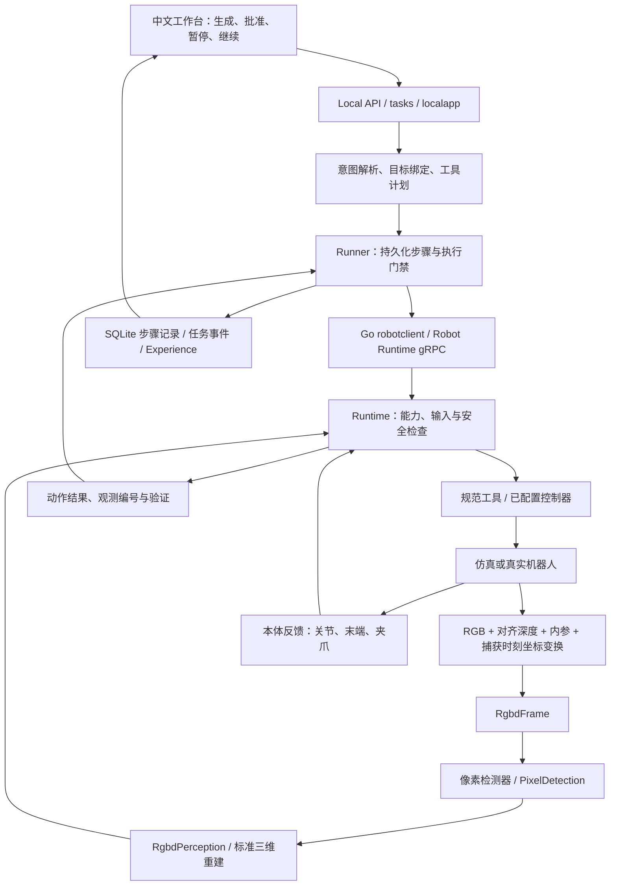

# 单机器人 RGB-D 闭环：代码、数据与恢复

本指南帮助新开发者理解单机器人工作台如何从一句话到真实观测依据、工具执行、动作后验证与中断恢复。首版面向受限工位，保留统一机器人接口以便后续扩展。用户流程及实机上线条件见 [单机器人 V1](../production/single-robot-v1.md)。

本文对应 2026-09-08 的升级，已验证 RGB-D 软件仿真的任务、暂停重启继续、未知动作阻断及历史图像回读，证据见文末。模块存在、接口可调用、仿真成功和真实设备上线是不同层次的证据。

## 先沿这一条链读代码



| 入口 | 职责 |
| --- | --- |
| [`web/app.js`](../../web/app.js)、[`console_ui.js`](../../web/console_ui.js) | API 调用、任务历史、中文步骤、恢复权限、感知来源和诊断；不生成授权或补造证据 |
| [`console/server.go`](../../console/server.go)、[`console/recovery.go`](../../console/recovery.go) | Local HTTP / WebSocket 边界，恢复请求转交执行器 |
| [`tasks/`](../../tasks)、[`internal/localapp/app.go`](../../internal/localapp/app.go) | 任务审批、版本、队列、暂停请求、重启状态与显式继续 |
| [`edge/agent/runner.go`](../../edge/agent/runner.go) | 目标绑定、规范计划、逐工具执行、步骤持久化、恢复绑定检查 |
| [`edge/robotclient/`](../../edge/robotclient) | 真实 gRPC Info、Observe、工具结果与严格合同校验 |
| [`rgbd.py`](../../robot/gateway/tangying_robot_gateway/rgbd.py) | 传感器帧校验、像素反投影、检测器接口和标准重建 |
| [`rgbd_perception.py`](../../sim/mujoco/tangying_sim/rgbd_perception.py) | 参考工作台的颜色/几何识别与关系判断 |
| [`ros_rgbd.py`](../../robot/gateway/tangying_robot_gateway/ros_rgbd.py) | ROS 消息同步、单位/编码/坐标转换，以及接入 `PluginBackend` 的工厂辅助函数 |

Local 的持久化步骤检查与 Runtime 的安全/journal 检查各自负责本层，不能以其中一层的成功代替另一层验证。Fleet/Harness 是保留的扩展路线；不要把它的全部恢复和资源协调语义默认套到本地任务。

## RGB-D 输入和重建合同

`RgbdFrame` 是感知模块的输入。检测器和重建代码不接收模拟器对象位置注册表，也不通过厂商运动 SDK 查询环境物体。

| 字段 | 约定 |
| --- | --- |
| `robot_id`、`source_id`、`frame_id` | 报告机器人、真实观测源和相机光学坐标系标识 |
| `captured_at_unix_ms`、`sequence` | 原始采集时间及递增安全整数；不能用转发时间给旧图像续期 |
| `rgb` | `uint8`、`H×W×3` 彩色数组 |
| `depth_m` | 与 RGB 对齐、同分辨率的浮点深度，单位米 |
| `intrinsics` | 校正后的针孔相机 `3×3` 内参矩阵，焦距、主点和有限值经过校验 |
| `world_from_camera` | 捕获时刻相机光学坐标到世界坐标的 `4×4` 刚体变换 |
| `transform_revision` | 本次变换所对应的标定版本 |

光学坐标约定为右、下、前。对像素 `(u, v)` 和有效深度 `z`，先计算 `[(u-cx)z/fx, (v-cy)z/fy, z]`，再应用 `world_from_camera`。缺失、非有限或超量程深度不生成有效点；不能从历史物体位置或模拟器真值补回来。

`PixelDetection` 返回实体标识、类别、布尔像素掩码、置信度和属性。掩码必须与输入图像对齐。通用 `RgbdPerception` 将有效掩码中的三维点归约为实体位置，并按上限抽取点集；默认最多 2048 点，合同允许的上限是 4096。这里的点集是有界单帧观测，不是稠密地图或已实现的 SLAM。

输出遵守 `scene.reconstruction.v1`，包含 `robotId`、`observationId`、`sourceId/sourceType/sourceFrameId`、`observedAtUnixMs/sequence`、`transformRevision`、实体和点集；`frameId` 固定为 `world`，`units` 固定为 `m`。实体 pose 顺序是 `[x, y, z, qw, qx, qy, qz]`。通用实现目前给出单位四元数，不代表已经估计任意物体的完整六自由度朝向。

`robot.profile.v1` 负责声明机械结构、关节单位、末端、传感器来源、标定和工具子集。Profile、重建和运行时身份必须一致。世界坐标重建不能再叠加机器人本体位置偏移；需要局部坐标的控制器，应在适配器中执行经过标定的转换。详细约束和 schema 导出命令见 [异构适配器指南](robot-adapters.md)。

## 参考检测器能做什么

`TabletopRgbdPerception` 只认识红色杯子、蓝色瓶子和三个已配置容器。它结合颜色掩码、深度几何、观察到的支撑平面与工位物体尺寸估计中心。尺寸和工作范围是交付配置，不是通用识别能力；其中的固定置信度也不是经实机数据校准后的概率。

多个相近候选、缺少足够有效像素或支撑平面不可用时，应缺失或拒绝目标，而不是选用隐藏对象真值。物体到容器的 `inside` 关系来自观测几何；持物判断还可结合机器人末端、夹爪自身状态。这不违背环境仅来自 RGB-D 的要求，因为本体反馈不等于读取环境物体位置。

更换检测器时实现 `Callable[[RgbdFrame], list[PixelDetection]]`，替换像素识别模块，保留帧校验、标准三维输出和 Runtime 边界。增加训练模型、完整物体姿态估计或多个相机融合时，分别记录模型、标定、时间对齐与验证证据，不要把参考检测器更名为通用模型。

## 自然语言怎样变成工具闭环

已支持的描述先解析成明确的动作、物品、起点/终点和约束，再从当前观测唯一绑定对象。否定、条件、含糊目标或当前能力未支持的描述不能被静默删改后执行。可选大模型不负责填写审批标识、deadline、租约或安全参数。

参考搬运计划的七个工具是：

1. `observe_scene`：获取现场观测。
2. `resolve_targets`：确认本次物品和目标。
3. `plan_grasp`：规划受限工位的拿取动作。
4. `manipulation.pick`：执行拿取。
5. `verify_grasp`：重新检查抓取结果。
6. `manipulation.place`：执行放置。
7. `verify_placement`：重新检查最终结果。

两个顺序目标会产生两组工具。模拟器仍负责执行动力学与碰撞；RGB-D 路线的环境目标和动作后判断不得以模拟状态替代。真实机器人需要实现对应控制器、轨迹/策略、反馈和停止，而不是把参考工具成功响应直接搬过去。

工具返回成功后，Runner 先持久化完成记录，再采集、保存执行后的遥测，并发布 `TOOL_ACTIVITY` 的 `CONFIRMED`。`evidenceIds` 仅引用保存成功的采集 ID；工具回执自己的观测编号单独放在 `receiptObservationId`，不能混用。没有保存成功的采集不补造证据。Local UI 因此将 `CONFIRMED` 显示为“执行完成”，确有归档记录时附“已保存执行后观测”；这不等同于 Harness 后置条件证明。拿稳、放好等结果由相应验证工具判断，任务最终成功也不能让 UI 将缺失的步骤证据自动变成“已验证”。

## 暂停、进程中断与显式继续

安全暂停的边界是工具：已发送的当前工具完成并保存结果后，才停止后续工具并进入 `PAUSED`。请求被接受与机器人已暂停不是同一时刻。取消、程序终止及网页暂停均不承担实体急停的硬实时职责。

恢复依赖持久化步骤记录：

| 记录情况 | 继续时的处理 |
| --- | --- |
| 物理步骤已完成 | 保留完成记录，核对新目标绑定与已完成动作参数，不重新执行该物理步骤 |
| 只读观察或验证步骤 | 使用新的恢复观察标识重新执行，以得到当前现场状态 |
| 已拿取但尚未放置 | 重观测并重新验证抓取，防止物体在暂停期间丢失后直接放置 |
| 后续放置已完成 | 不再用过时的“仍然拿住物体”条件拒绝已经完成的放置，按当前执行阶段验证 |
| 物理步骤 `STARTED`，没有可信完成记录 | 返回 `PHYSICAL_OUTCOME_UNKNOWN`，不能重放，也不能通过同一任务的新 revision 绕过 |

Local Agent 重启会把中断执行标为需要恢复，不会自动派发。用户显式继续后仍须通过服务端检查；前端 `canResume` 只是当前状态说明，不是可复用的执行授权。操作员不能用删除数据库或 Runtime journal 的方式修复不确定结果。

运行时本地故障对账与急停复位属于另一层，参见 [Sim2Real](../sim2real/README.md) 和 [异常运维](../production/operations-and-failures.md)。当前 Local 未提供一个浏览器“强制跳过物理核对”的接口。

## Local API 和前端追溯

以下路径由当前 Local Console 提供，不需要通过 Fleet 或 MCP 才能使用：

| API | 用途 |
| --- | --- |
| `GET /v1/runtime` | 机器人身份、能力及运行状态 |
| `GET /v1/telemetry` | 标准重建、感知来源及实际图像可用性 |
| `GET /v1/scene/frame?adapter=mujoco`、`GET /v1/scene/depth?adapter=mujoco` | 当前相机彩色 PNG 与同帧深度预览 PNG |
| `GET /v1/world` | Local 投影的世界版本、来源与观测关联 |
| `POST /v1/tasks`、`GET /v1/tasks`、`GET /v1/tasks/{id}` | 创建任务、持久化历史及任务事件快照 |
| `POST /v1/tasks/{id}/approve`、`POST /v1/tasks/{id}/cancel` | 显式审批与取消 |
| `GET /v1/tasks/{id}/recovery` | 当前恢复权限、原因、已完成及待核对步骤 |
| `POST /v1/tasks/{id}/pause`、`POST /v1/tasks/{id}/resume` | 请求工具边界暂停或显式继续 |
| `GET /v1/tasks/{id}/experience`、`GET /v1/tasks/{id}/revisions` | 用户说明、步骤、能力活动、专业证据与任务版本 |
| `GET /v1/tasks/{id}/events/ws` | 实时任务事件；历史仍由任务快照补全 |
| `GET /v1/tasks/{id}/observations?limit=100&before={recordIndex}` | 历史采集元数据分页；首请求省略 `before` |
| `GET /v1/tasks/{id}/observations/{evidenceId}` | 该次采集元数据及保存的 telemetry snapshot JSON |
| `GET /v1/tasks/{id}/observations/{evidenceId}/rgb`、`/depth` | 该次历史采集的彩色图和深度预览 |

恢复 GET 和成功的 pause/resume POST 返回同一种视图：`taskId`、`state`、`canPause`、`canResume`、`pauseRequested`、`requiresReconciliation`、`reasonCode`、中文 `reason`、`completedStepIds`、`uncertainStepIds`。它不是完整任务对象。物理结果未知时返回 HTTP 409，错误码为 `PHYSICAL_OUTCOME_UNKNOWN`；其他拒绝按接口返回原因处理，不能自动重试物理请求。

前端依据 `robotState.perception` 中的 `mode/source_id/camera/observed_at_unix_ms` 及标准 `reconstruction` 展示来源，不从“运行的是 MuJoCo”或默认 World source type 推断 RGB-D。`robotState` 元数据是可读说明，标准 reconstruction 才是跨语言校验的观测合同。

主视图提供“彩色画面”“深度图”和“观测点云”。遥测 `colorFrameAvailable/depthFrameAvailable` 由服务端校验真实图像、格式和采集新鲜度后给出，不根据来源名称猜测。图像 API 带 `X-Observed-At`、`X-Frame-Age-Ms` 和 `Cache-Control: no-store`；缺失、损坏或过期图像会拒绝，前端解码后才标记有效，并在数据过期时清空。

RGB、深度预览和重建由同次 `RgbdFrame` 生成。深度 PNG 使用 0.02–5 米的固定暖近冷远色阶，无效或超范围深度为黑色。它是 RGB8 显示图，不是可供二次重建的 16 位毫米深度数据；重建始终使用原始 `depth_m`。

点云只读取标准 `reconstruction.points` 和同次 `reconstruction.entities`，核对机器人/传感器/标定、世界坐标、米制单位、新鲜度和有限点值。前端不加载默认桌面、推车或相机模型，也不从完整模拟场景补出未观测区域。点云颜色只是显示辅助，空白处保持未知。默认按本次已观测实体聚焦；名称默认隐藏，开启后限制数量并避让，不从隐藏场景边界设置视角。旧仿真图明确显示“仿真调试画面（非机器人感知）”；单独的开发语义诊断不作为机器人感知画面。

定位问题时先选任务，再关联以下信息：

- task ID、task revision、aggregate version：用户意图及其变更版本。
- step ID、command ID：具体规范工具调用及其持久化执行记录。
- observation ID、source ID、采集时间、transform revision：哪一帧、哪一个传感器及哪份标定支撑判断。
- World revision 与事件序号：投影和事件的读取位置，不将二者当作同一种游标。

历史重新打开会读取任务与证据，不批准或重放。HTTP 快照用于补全断线期间事件，WebSocket 重放按序号去重；任务切换及并发响应有选择/请求代际检查。专业诊断采用字段白名单，不显示原始动作块或凭据。

工作台“回看当时的观测”将同一个历史记录 ID 的彩色图和深度图并排显示。工具卡按任务版本与执行步骤关联“回看当时观测”；不同 revision 的同名步骤不会混用。Local 目标如果没有 Harness 级证据，前端仅在其对应 `verify_placement` 的 `CONFIRMED` 事件、采集 ID、任务版本及归档执行步骤全部一致时显示“动作观测可回看”，不补造 Harness 证明。命令关联也必须同时匹配采集、步骤与版本，避免缓存帧复用于多个步骤时串联错误命令。`evidence.capture.v1` 的 `captureId` 是原始 Observation ID，工具事件的 `evidenceIds` 可关联它；URL 中使用的 `id` 则是 64 位十六进制记录键，不能直接将可能含 `/` 的原始观测编号拼成路径。

列表只包含来源、采集/保存时间、步骤、哈希及大小等元数据。读取历史图像不应用当前帧的新鲜度限制；UI 始终标注历史采集时间，不将历史图称为 LIVE。历史图存在只证明保存了这次采集，动作是否成功仍由工具与验证证据决定。

内容保留预算当前为最多 512 条保留内容的采集记录、256 MiB 原始内容；旧内容清理后，元数据与哈希继续保留。`expired: true` 时详细 JSON 省略 snapshot，图像端点返回 HTTP 410；该次未保存某类图像或跨任务访问返回 404。UI 清空已过期历史图，不请求实时图像作为替代。生产部署需要另外明确保留期限、备份和访问范围；哈希是内容一致性证据，不是现场真实性认证。完整字段、存储与校验说明见 [观测证据指南](observation-evidence.md)。

统一 MCP 桥目前连接 Fleet HTTP API，详情见 [MCP 指南](../../robot/mcp/README.md)；不要将其中的任务工具误写成上述 Local 恢复 API 的通用客户端。

## 启动与开发检查

通用开发依赖与长期 Local 服务入口见 [快速上手](getting-started.md)。已有 Local 服务时，前端可独立预览：

```bash
CONSOLE_BACKEND_URL=http://127.0.0.1:8787 \
  CONSOLE_PREVIEW_PORT=18130 node scripts/preview-console.cjs
```

打开 `http://127.0.0.1:18130/#workspace`。预览只加载当前 Web 源码并代理同一后端；它不重建后端、不启用 RGB-D、不重置场景，也不切换正在运行的机器人。

在已完成依赖安装的开发机上，使用明确的 RGB-D 入口：

```bash
make rgbd-start
make sim-status
# 需要重建服务并重置参考仿真工位时，先停止当前任务，再执行：
make rgbd-restart
```

管理脚本按所选模式启动 Runtime，并为该本地模拟端点显式配置 `--robot-safety-profile simulation`。已经运行旧真值模式时，脚本拒绝静默切换；使用 `rgbd-restart` 才会重启和切换。重启 Runtime 会重置模拟物体，不能将它用于掩盖任务失败或未确认的物理结果；任务历史仍保存在数据目录中。

需要独立端口调试时，可手动分两个终端运行：

```bash
.venv/bin/python -m tangying_sim.server --listen 127.0.0.1:50051 \
  --seed 7 --perception rgbd
bin/local-agent --dev-insecure --listen 127.0.0.1:8787 \
  --robot 127.0.0.1:50051 --robot-safety-profile simulation \
  --data-dir artifacts/rgbd-local-development
```

手动命令只用于 loopback 软件仿真，不应用于真实设备或覆盖已有服务。不用旧 `make sim-start` 的成功结果代替 RGB-D 检查；运行时仍须核对 profile、来源、标准重建及动作后证据。真实 ROS 输入与运行工厂由 [ROS 2 RGB-D 指南](ros2-rgbd.md)说明。

已存在的定向测试入口如下。这些是复现命令，不是本轮执行结果声明：

```bash
.venv/bin/python -m pytest -q robot/gateway/tests/test_rgbd.py
.venv/bin/python -m pytest -q robot/gateway/tests/test_ros_rgbd.py \
  robot/gateway/tests/test_ros_rgbd_entrypoint.py
go test ./edge/agent ./internal/localapp ./console
node --test web/*_test.mjs
go test ./web/...
```

集成验收还必须实际执行一次支持的中文任务，核对每个物理步骤使用的感知、最终观测关系和事件证据，并覆盖无深度、过期帧、视野外物体、相机断连、安全暂停、进程重启、恢复时抓取丢失和未知物理结果等负向路径。检测器假输入测试、真实 ROS transport 测试和实际相机测试分别记录，不能相互替代。

## 本轮证据登记

2026-09-08 的软件仿真验收结果如下；完整回归汇总见 [V1 状态页](../production/v1-release-status.md)。

| 场景 | 实际结果与证据 |
| --- | --- |
| 拿取后暂停、仅重启 Local Agent、继续原任务 | `task-ee64bd90bc06c0815c2ff637` 在 revision 1 完成两目标；Runtime 未重启，拿取/放置各调用 2 次，完成动作未重放；最终红杯位于右侧盒、蓝瓶位于前方托盘 |
| 采集追溯与历史图像 | 上述任务 17 个关联 capture、20 条存储观测；同次历史彩色 PNG、深度 PNG 与标准 snapshot 可回读；结果存于 `artifacts/acceptance/rgbd-v1-2026-09-08/recovery-run-1/` |
| 物理动作进行中终止 Agent | `task-e2c52a114e397872b1670852` 在拿取中被终止；重启后 resume 返回 409 `PHYSICAL_OUTCOME_UNKNOWN`，拿取仅派发 1 次，放置 0 次；证据存于同一验收根目录的 `crash-run-1/` |
| 浏览器从只读观察失败恢复 | 原任务 `task-a723b77c8e812f1d98d5ba2a` 显式继续后完成 14 个工具调用；浏览器可查看 RGB、深度、观测点云和保存的历史双 PNG |
| 视野中没有用户指定物体 | 绿色杯子任务 `task-8db2fd74468200b1082bf860` 被拒绝，物理调用为 0；没有从隐藏场景坐标补出目标 |

自动化集成脚本为 [`scripts/run_rgbd_acceptance.py`](../../scripts/run_rgbd_acceptance.py)，本轮运行的命令是：

```bash
.venv/bin/python scripts/run_rgbd_acceptance.py \
  --output artifacts/acceptance/rgbd-v1-2026-09-08/recovery-run-1
.venv/bin/python scripts/run_rgbd_acceptance.py --scenario unknown-outcome \
  --output artifacts/acceptance/rgbd-v1-2026-09-08/crash-run-1
```

脚本要求输出目录尚不存在；复跑时更换新的目录名，保留已有证据。目录内的 `summary.json`、任务/恢复快照、日志和历史 PNG 分别记录结果，不能只依据一张截图判断成功。

更早的基线曾用模拟真值完成两目标、14 工具，用来验证既有编排链；该基线不计作 RGB-D 感知验收。新参考控制器仍有理想抓取附着（attachment）和仿真底盘/逆运动学调整。RGB-D 环境感知通过不意味着这套控制实现能直接迁移至实机。真实相机、控制器、实体急停、接触和掉落行为、现场连续运行均尚需实际设备验收。发布定位与交付条件见 [单机器人 V1](../production/single-robot-v1.md)。
