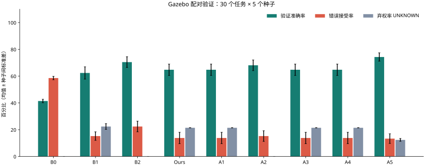

# 物理接地验证框架：Gazebo 接触实验与配对回放报告


> 发布说明：本文的原始实验记录、模型响应、传感器数据和本地回滚备份不随 Git 分发；表格与结论性图表保留。标为“本地证据”的路径需在自行复现实验或取得原始归档后查看。历史统计不代表当前版本重新实测。

本次完成 **150 个 Gazebo 任务实例、210 条物理动作轨迹、九组 1,890 条评估、1,470 次真实模型调用**。主实验是共享轨迹的配对验证与恢复策略回放，不是九套独立机器人在线执行。

结论有明确边界：相较 B0，GVF 将错误接受率由 **58.57% 降至 13.81%**（双侧配对 t，p=0.00003336），准确率由 **41.43% 升至 64.76%**。相较 B1，准确率提高 2.38 个百分点（p=0.0341），错误接受率差异未达 0.05（p=0.0705）。**A5 带合约的 LLM 总准确率 74.29%，高于 GVF；不能宣称 GVF 全面优于 LLM。**

逐动作原始数据（本地证据：`artifacts/grounded-verification/validated-run/trials.jsonl`） · 九组结果（本地证据：`artifacts/grounded-verification/validated-run/results.jsonl`） · 完整统计（本地证据：`artifacts/grounded-verification/validated-run/summary.json`） · 证据完整性核对（本地证据：`artifacts/grounded-verification/validated-run/integrity-check.json`） · [最小使用说明](../development/single-robot-loop.md#物理接地验证-gvf可选)

## 1. 实验目的与假设

检验动作后多传感器与时序合约是否减少工具伪成功，是否以更多 UNKNOWN 和额外延迟为代价；检验移除时序、置信度、失败分类和中文模板的影响。实验不预设必须获得显著提升。

## 2. 实验设置

引擎：Gazebo Harmonic / DART contact physics。复用仓库五房间几何与移动底盘，新增有质量、摩擦和关节 PID 的双指实验夹具及顶部 RGB-D 相机。固定种子 [1729, 2718, 31415, 16180, 57721]，30 个任务模板，210 个已执行动作轨迹。抓放使用实验夹具，尚不是 XLeRobot 的端到端移动抓取。
每个动作都保存 RGB/depth 原始字节、关节反馈、接触力、里程计、独立 oracle、工具回执、时间戳与 SHA-256 引用。验证器只读取 RGB-D 派生量和传感器反馈；oracle 只用于离线计分。注入故障仍返回 SUCCESS。
B0 信任回执；B2 只用末帧几何；Ours 使用 GCL；A1 移除时序；A2 去掉置信度阈值并把 UNKNOWN 强制判为失败；A3 隐藏失败分类；A4 只传 JSON。B1 从未经合约裁决的数值观测自验证；A5 读取相同观测及合约后替代验证器。两者只用于离线计分，不能向生产硬件下指令。原始图像不出边缘，故这里是数值观测版 LLM 对照，不是多模态视觉基线。
本次缺失实验组：无。真实模型结果保存在 llm-cache；没有响应的组留空。
**研究范围：这是同一批物理轨迹的配对离线验证与恢复策略回放。恢复候选确实执行并保存，但各组没有独立在线运行；任务成功率、恢复步骤和端到端成本是该回放策略的估计，不能当作九组自主机器人实测。**
准确率以独立仿真物理真值为分母，UNKNOWN 计为未答对，同时单列弃权率与错误接受率。不会把缺证据自动标为真值 UNKNOWN 来提高得分。失败归因按注入目标计分；注入未生效或发生复合失败仍保留，不筛除不利样本。
先按种子求均值，再报告均值 ± 样本标准差。使用双侧配对 t 检验；五个种子统计功效有限；差值恒定时不伪造 p 值，多重比较未校正，属于探索性统计。

## 3. 一条命令复现

```bash
bash scripts/run_grounded_experiments.sh --jobs 3 --llm-config artifacts/local-agent/local.env --output artifacts/grounded-verification/reproduce
```

完整九组需要有效的私有模型配置（AGENT_BASE_URL、AGENT_MODEL、AGENT_API_KEY）；密钥不会写入报告或传给 Gazebo。移除 --llm-config 可运行无模型子集，但不构成完整九组比较。只重放已保存证据：`.venv/bin/python scripts/grounded_experiment.py --replay --output <运行目录>`。完整配置见 `config.json`，逐动作原始数据见 `trials.jsonl`，逐组结果见 `results.jsonl`，聚合见 `summary.json`。

## 4. 结果

| 组 | 任务成功率估计 % | 验证准确率 % | 错误接受率 % | UNKNOWN % | 归因准确率 % | 恢复成功率估计 % |
|---|---:|---:|---:|---:|---:|---:|
| B0 | 38.00 ± 1.83 | 41.43 ± 1.30 | 58.57 ± 1.30 | 0.00 ± 0.00 | 0.00 ± 0.00 | 0.00 ± 0.00 |
| B1 | 58.00 ± 2.98 | 62.38 ± 4.58 | 15.24 ± 3.19 | 22.38 ± 2.13 | 46.96 ± 5.67 | 34.93 ± 3.18 |
| B2 | 53.33 ± 2.36 | 70.48 ± 3.98 | 22.38 ± 3.98 | 0.00 ± 0.00 | 0.00 ± 0.00 | 22.73 ± 3.32 |
| Ours | 60.00 ± 2.36 | 64.76 ± 4.26 | 13.81 ± 4.26 | 21.43 ± 0.00 | 100.00 ± 0.00 | 34.93 ± 3.18 |
| A1 | 60.00 ± 2.36 | 64.76 ± 4.26 | 13.81 ± 4.26 | 21.43 ± 0.00 | 100.00 ± 0.00 | 34.93 ± 3.18 |
| A2 | 60.00 ± 2.36 | 68.10 ± 3.98 | 15.24 ± 3.98 | 0.00 ± 0.00 | 95.65 ± 0.00 | 34.93 ± 3.18 |
| A3 | 38.00 ± 1.83 | 64.76 ± 4.26 | 13.81 ± 4.26 | 21.43 ± 0.00 | 0.00 ± 0.00 | 0.00 ± 0.00 |
| A4 | 60.00 ± 2.36 | 64.76 ± 4.26 | 13.81 ± 4.26 | 21.43 ± 0.00 | 100.00 ± 0.00 | 34.93 ± 3.18 |
| A5 | 59.33 ± 2.79 | 74.29 ± 3.10 | 13.33 ± 3.61 | 12.38 ± 1.06 | 53.04 ± 3.64 | 34.10 ± 4.12 |

| 组 | 重复失败率估计 % | 平均恢复步骤估计 | 验证器 ms | 端到端 ms 估计 | 每动作人工升级次数估计 | LLM 诊断 % | LLM tokens |
|---|---:|---:|---:|---:|---:|---|---:|
| B0 | 未测 | 0.00 ± 0.00 | 0.00 ± 0.00 | 9425.59 ± 928.84 | 0.00 ± 0.00 | 未测 | 0.00 ± 0.00 |
| B1 | 37.47 ± 12.56 | 0.85 ± 0.09 | 851.77 ± 66.49 | 16088.58 ± 2288.98 | 0.26 ± 0.04 | 46.96 ± 5.67 | 3063.85 ± 6.59 |
| B2 | 48.43 ± 15.23 | 0.70 ± 0.09 | 0.00 ± 0.00 | 14790.67 ± 2278.04 | 0.23 ± 0.05 | 未测 | 0.00 ± 0.00 |
| Ours | 38.35 ± 12.80 | 0.96 ± 0.09 | 4.97 ± 1.18 | 16177.57 ± 2235.33 | 0.24 ± 0.06 | 90.43 ± 1.94 | 3175.15 ± 19.01 |
| A1 | 38.35 ± 12.80 | 0.96 ± 0.09 | 2.79 ± 0.26 | 16192.14 ± 2308.36 | 0.24 ± 0.06 | 96.52 ± 3.64 | 3066.63 ± 19.01 |
| A2 | 38.35 ± 12.80 | 0.94 ± 0.09 | 4.06 ± 0.35 | 16154.74 ± 2264.21 | 0.23 ± 0.05 | 86.96 ± 0.00 | 3174.37 ± 19.01 |
| A3 | 未测 | 0.29 ± 0.00 | 4.06 ± 0.38 | 11237.11 ± 983.91 | 0.45 ± 0.05 | 34.78 ± 3.07 | 3172.94 ± 19.10 |
| A4 | 38.35 ± 12.80 | 0.96 ± 0.09 | 4.03 ± 0.37 | 16173.06 ± 2256.04 | 0.24 ± 0.06 | 86.96 ± 0.00 | 2939.77 ± 17.30 |
| A5 | 38.99 ± 12.89 | 0.86 ± 0.10 | 878.93 ± 82.66 | 16101.74 ± 2238.06 | 0.25 ± 0.05 | 53.04 ± 3.64 | 3296.50 ± 6.59 |

共同物理轨迹的实际任务成功率：**38.00 ± 1.83%**。各组读取相同轨迹，此实测值对所有组相同；表中的任务成功率是恢复策略回放估计。
重复失败率的分母为实际选用的硬件重试次数；无重试时标为未测。诊断准确率以注入故障动作为分母；tokens 为每动作模型调用的均值 ± 种子间标准差。人工升级列是策略请求估计，实际无人参与手工恢复。遮挡恢复包含实验端移走遮挡板，缺失反馈恢复包含解除故障注入，不是机器人自主修复传感器。
验证器延迟包含本地证据哈希检查、合约解释和报告渲染，不包含传感器采集；B1/A5 的验证器延迟是实测模型请求时间。端到端列按物理执行、观察、裁决、模型诊断和选用恢复候选的耗时相加，是策略回放估计。共享 CPU 主机上的三路 Gazebo 并发及测试负载会影响墙钟耗时。
模型配置与实际响应模型见 llm-config.json 和 llm-cache。非思考模式、temperature=0、JSON 输出；每条响应保存模型提供的 usage。无效 JSON 记录 protocol_error 并按弃权计，不算正确诊断。
实际模型调用总 tokens：4596735；协议异常：0。


混淆矩阵：行是真值 VERIFIED/FALSIFIED/UNKNOWN，列是预测 VERIFIED/FALSIFIED/UNKNOWN。

- B0：`[[87, 0, 0], [123, 0, 0], [0, 0, 0]]`
- B1：`[[62, 0, 25], [32, 69, 22], [0, 0, 0]]`
- B2：`[[72, 15, 0], [47, 76, 0], [0, 0, 0]]`
- Ours：`[[50, 0, 37], [29, 86, 8], [0, 0, 0]]`
- A1：`[[50, 0, 37], [29, 86, 8], [0, 0, 0]]`
- A2：`[[52, 35, 0], [32, 91, 0], [0, 0, 0]]`
- A3：`[[50, 0, 37], [29, 86, 8], [0, 0, 0]]`
- A4：`[[50, 0, 37], [29, 86, 8], [0, 0, 0]]`
- A5：`[[70, 0, 17], [28, 86, 9], [0, 0, 0]]`

## 5. 配对统计与分析

| 比较 Ours − 对照 | 指标 | 均值差 | 双侧 p |
|---|---|---:|---:|
| B0 | correct | 0.2333 | 0.000433408 |
| B0 | false_success | -0.4476 | 3.33602e-05 |
| B0 | task_success | 0.2200 | 7.90051e-05 |
| B0 | llm_tokens | 3175.1524 | 3.08506e-10 |
| B1 | correct | 0.0238 | 0.0341094 |
| B1 | false_success | -0.0143 | 0.070484 |
| B1 | task_success | 0.0200 | 0.070484 |
| B1 | llm_diagnosis_accuracy | 0.4348 | 9.34927e-05 |
| B1 | llm_tokens | 111.3000 | 0.000148274 |
| B2 | correct | -0.0571 | 0.000608185 |
| B2 | false_success | -0.0857 | 0.000124726 |
| B2 | task_success | 0.0667 | 不适用（差值无方差或不足两个种子） |
| B2 | llm_tokens | 3175.1524 | 3.08506e-10 |
| A1 | correct | 0.0000 | 不适用（差值无方差或不足两个种子） |
| A1 | false_success | 0.0000 | 不适用（差值无方差或不足两个种子） |
| A1 | task_success | 0.0000 | 不适用（差值无方差或不足两个种子） |
| A1 | llm_diagnosis_accuracy | -0.0609 | 0.00463584 |
| A1 | llm_tokens | 108.5238 | 6.66156e-60 |
| A2 | correct | -0.0333 | 0.00463584 |
| A2 | false_success | -0.0143 | 0.070484 |
| A2 | task_success | 0.0000 | 不适用（差值无方差或不足两个种子） |
| A2 | llm_diagnosis_accuracy | 0.0348 | 0.0161301 |
| A2 | llm_tokens | 0.7857 | 不适用（差值无方差或不足两个种子） |
| A3 | correct | 0.0000 | 不适用（差值无方差或不足两个种子） |
| A3 | false_success | 0.0000 | 不适用（差值无方差或不足两个种子） |
| A3 | task_success | 0.2200 | 7.90051e-05 |
| A3 | llm_diagnosis_accuracy | 0.5565 | 4.3561e-06 |
| A3 | llm_tokens | 2.2095 | 2.29746e-06 |
| A4 | correct | 0.0000 | 不适用（差值无方差或不足两个种子） |
| A4 | false_success | 0.0000 | 不适用（差值无方差或不足两个种子） |
| A4 | task_success | 0.0000 | 不适用（差值无方差或不足两个种子） |
| A4 | llm_diagnosis_accuracy | 0.0348 | 0.0161301 |
| A4 | llm_tokens | 235.3857 | 8.87956e-10 |
| A5 | correct | -0.0952 | 0.00022492 |
| A5 | false_success | 0.0048 | 0.373901 |
| A5 | task_success | 0.0067 | 0.373901 |
| A5 | llm_diagnosis_accuracy | 0.3739 | 7.24426e-05 |
| A5 | llm_tokens | -121.3524 | 0.000107998 |

Ours 的错误接受率为 13.81 ± 4.26% ，B0 为 58.57 ± 1.30% 。准确率与 UNKNOWN 必须一起读：拒绝下结论可能降低总准确率，但能阻止证据不足的继续动作。不能仅凭一个综合分数宣称全面优于所有基线。
本批 Ours 准确率 64.76 ± 4.26%，B2 70.48 ± 3.98%，A5 74.29 ± 3.10%。弃权必须计入代价，不能把 UNKNOWN 从准确率分母删去。
B1/A5 与 Ours 的准确率、错误接受率需分别比较；模型只接收数值观测，结论不能外推到所有多模态模型。A4 与 Ours 的物理结论相同，诊断准确率及 token 差异反映本模型对 JSON 与中文模板的阅读表现。

A1 相对 Ours 的总正确判定数变化：0。如果为零，则这批样本没有证明时序算子的增益；滑落也可能被末帧力与几何直接识别。
Ours 的 29 次错误接受必须保留并追因；相同传感器输入上的形式化检查不能消除底层定位系统偏差。

## 6. 失败案例与原始证据

### 1729/task-02：grasp_miss
工具返回 SUCCESS；物理真值 FALSIFIED；验证器 FALSIFIED/GRASP_MISS。
原始目录：采集帧（本地证据：`artifacts/grounded-verification/validated-run/seeds/1729/raw/1729/000014-evidence`）；报告：`gvf-d72277339c4b95e037c18da34f8581afcb2ecbba3133b4ff8e69174e2cf1ca57`；证据：`['evidence://edge/008515e9d78f3b24be356864447603820b476e67dc71cb6e71d5f5ef97c226e2', 'evidence://edge/02e33250b3f2433224d63964a0cf14d1dc40aade08426a1f977ce2d2c87c65a8']`。

### 1729/task-03：grasp_slip
工具返回 SUCCESS；物理真值 FALSIFIED；验证器 FALSIFIED/GRASP_SLIP。
原始目录：采集帧（本地证据：`artifacts/grounded-verification/validated-run/seeds/1729/raw/1729/000029-evidence`）；报告：`gvf-ea39f9446e2e6dd3d21732e018d024e33e5213a5b267c289b1f299fe085ee674`；证据：`['evidence://edge/07a1039b957ed1cb1449560ed640f380b0da6d4fb1ac133ac1e4536980f5e6a8', 'evidence://edge/0c0e3d3520594d75f69aeab205a80565c844c35a2c1359d4eb1dc8cd7258d92d']`。

### 1729/task-04：wrong_object
工具返回 SUCCESS；物理真值 FALSIFIED；验证器 FALSIFIED/WRONG_OBJECT。
原始目录：采集帧（本地证据：`artifacts/grounded-verification/validated-run/seeds/1729/raw/1729/000044-evidence`）；报告：`gvf-2c0da234a6aa14e952a098dc4550d685f8ae7c6c22610061271f698560eabdd6`；证据：`['evidence://edge/07fa169319e6104583b804aa3e626ffaed5d01b7ddc7f69e11e8e146137f3a97', 'evidence://edge/0b65ccf235bd7f2e6a7408c3bb80c9eb36d36d45ad3d5a2129000b6fe23818d1']`。

### 1729/task-05：occluded
工具返回 SUCCESS；物理真值 VERIFIED；验证器 UNKNOWN/PERCEPTION_OCCLUDED。
原始目录：采集帧（本地证据：`artifacts/grounded-verification/validated-run/seeds/1729/raw/1729/000059-evidence`）；报告：`gvf-0905fbd0c768fff6defcbb624ac4ccd99d6d46fc55e138dd50bf3aa10481a1ed`；证据：`['evidence://edge/01f632d157d970166b252f69a835a893f93dddea2a6a950a0a8ba2bbccc7df5c', 'evidence://edge/1d4a5d0343dab4fb8d2cef9418473e631a0e664d630d752f6a1f1257f140819f']`。

### 1729/task-06：missing_force
工具返回 SUCCESS；物理真值 VERIFIED；验证器 UNKNOWN/EVIDENCE_INSUFFICIENT。
原始目录：采集帧（本地证据：`artifacts/grounded-verification/validated-run/seeds/1729/raw/1729/000069-evidence`）；报告：`gvf-a497e071654d6cd4bb91a198b19e4da11086cedd239760a8bfcbc830b3ceb1dc`；证据：`['evidence://edge/15995de5f0f7309a61a34d1c382ae4e83b6ae1f71d88a5144c31046417cf9835', 'evidence://edge/21c0a58c70e985f35d3570af67a4d42fa3b7cf0a9fec9399bbb2c676e5e60b16']`。

### 1729/task-14：place_outside
工具返回 SUCCESS；物理真值 FALSIFIED；验证器 FALSIFIED/PLACE_UNSTABLE。
原始目录：采集帧（本地证据：`artifacts/grounded-verification/validated-run/seeds/1729/raw/1729/000158-evidence`）；报告：`gvf-2a68c3f4c69b6830f331526835bc67f5618a712de71eeb6acb2d34d3960b49af`；证据：`['evidence://edge/0e941bff7ce7c2df4489e91ec630eae6005f20f060c2b9a3b63ccdbe04924d21', 'evidence://edge/101e318044d357c424f526d6aebd1f4b3d58df50f9aa4684fe6935d4edd869ee']`。

### 1729/task-15：container_full
工具返回 SUCCESS；物理真值 FALSIFIED；验证器 FALSIFIED/CONTAINER_FULL。
原始目录：采集帧（本地证据：`artifacts/grounded-verification/validated-run/seeds/1729/raw/1729/000169-evidence`）；报告：`gvf-d0cfb35e89267ac537a433dc5ddfef812b83bcd2bdb3609a716a48cdc1cf8e42`；证据：`['evidence://edge/0b419887b701b606cd3b345c0f8efb9f92cc1d7934b455a7c8ea66e93997db3b', 'evidence://edge/10ad0f8467b3f5f58d83f5b78d0424c8058d7b3d43059f4cb639282b3619a3db']`。

### 1729/task-16：missing_depth
工具返回 SUCCESS；物理真值 VERIFIED；验证器 UNKNOWN/EVIDENCE_INSUFFICIENT。
原始目录：采集帧（本地证据：`artifacts/grounded-verification/validated-run/seeds/1729/raw/1729/000180-evidence`）；报告：`gvf-8056d32ade228f69fe10aa317c612c6111fa8c38197b731bfb3a01a92d670646`；证据：`['evidence://edge/18307101dbbc0e82c5b75815a9a4adb21416ee56f9f057c9dc013be59be3e706', 'evidence://edge/1a68a159cbc23f8fbd09cec6d19f12d3d2474957defe70f882d1d3fb41f473bf']`。

### 1729/task-27：none
工具返回 SUCCESS；物理真值 FALSIFIED；验证器 VERIFIED/NONE。
原始目录：采集帧（本地证据：`artifacts/grounded-verification/validated-run/seeds/1729/raw/1729/001048-evidence`）；报告：`gvf-b0d37ed6ec6c41a899196d3d0a4fb936522408345552b1be9af5ed1ae1da9c7d`；证据：`['evidence://edge/0a8390d5c1da2a8cd125b91fbff705389a7dafdb8149175ec8a0e52f82d140c5', 'evidence://edge/0e4e5b1d1d3ac1bf4f56d1e1312980cb22abb2a6fcb2f5eee4addca34c4df81c']`。

## 7. 消融分析

- A1：移除时序后的判定变化见上文。本批故障以持续失效为主，不能因实现了时序算子就声称实验已证明其收益。
- A2：UNKNOWN 被强制变成失败后，遮挡与缺传感器会被当作明确失败，不能据此安全重试。
- A3：保留只读观察恢复；没有失败类型时不选择专门硬件重试。差异依赖固定策略，不是分类器直接提高执行器能力。
- A4：物理验证相同；LLM 诊断和 token 消耗的实测差异见表，不能从物理准确率推断模板收益。
- A5：只统计实际模型调用及缓存响应；缺少配置时保持未运行。

## 8. 局限性

1. 接触夹具是隔离的实验执行器，不等价于生产 XLeRobot 的真实末端抓取；跨房间步骤与夹具操作可以组成任务，但不是同一本体携物穿门验收。
2. 颜色分割使用已知物体和固定相机标定，不具备开放世界识别。置信度是保守工程评分，尚未做概率校准；0.95 不等于已测得 95% 正确率。
3. 同批轨迹回放不能替代独立在线恢复对照；未实现抓取落到任意位置的重规划，放置失败与满容器交给上层。
4. 模型字段只在实际调用时填写；缺失时不能证明优于 LLM。LLM 诊断与 token 汇总以实际调用为分母，缺 usage 时不猜测。
5. Gazebo 软件渲染和进程调度会使墙钟延迟、接触结果有小幅波动。固定种子、源文件哈希、原始证据回放可重现统计输入，不能承诺跨机器物理仿真逐字节相同。
6. 长距离跨房间的基准控制器使用轮式里程计，可能穿越不了障碍但继续积累轮速位移。独立世界坐标真值能揭示这种错误；生产入口因此只开放有深度保护的有界短程动作，尚未完成跨房间导航认证。
7. LLM 对照接收按采样顺序排列的数值观测、置信度和证据引用，未输入图像字节及完整时钟清单；不能代表多模态模型或独立时钟一致性检查能力。请求的 seed 是否被服务实现由供应商决定；实际响应缓存才是精确回放依据。
8. GCL 是有限轨迹的可执行合约检查器，不是完整 LTL 模型检查器或物理正确性的数学证明。其他硬件动作的未知合约保持拒绝或 UNKNOWN。

## 9. 结论与下一步

本次实现了独立于 LLM 的物理证据裁决、持久化报告、确定性中文渲染和未知结果阻断。能用真实 Gazebo 接触与相机证据区分命令成功和物理完成。本报告提供单一模型的数值观测对照；是否改善具体指标应以本表及配对检验为准。真实移动抓取和独立在线恢复收益仍需补充实验，不能由本报告推出。
下一步：扩大模型与故障分布；校准多传感器置信度；为 XLeRobot 采集夹爪反馈并现场标定合约阈值；独立运行每组闭环策略。

## 10. 本次实测的解释与工程验收

### 支持与不支持的假设

- **多传感器验证减少伪成功：支持。** B0 错误接受 123/210；B2 为 47/210；GVF 为 29/210。GVF 相对 B2 的错误接受率也显著降低（p=0.0001247），但因为 45/210 次弃权，总准确率低于 B2（70.48%）。UNKNOWN 是可见的安全代价，不能从分母删除。
- **时序约束提升本批准确率：未得到支持。** A1 与 Ours 的三值判定完全相同。当前滑落故障在末帧已明显失效；单元测试验证了时序逻辑，物理实验尚未充分覆盖“一帧偶然成功后失效”的区分性分布。
- **失败分类帮助恢复：仅在给定回放策略下支持。** Ours 回放任务成功率 60%，A3 为 38%；分类缺失时不选择专门的硬件重试。这并非执行器能力提高，也不是九组独立在线对照。
- **中文模板帮助这个模型诊断：获得有限支持。** 注入故障上的 Ours 诊断准确率 90.43%，A4 JSON 为 86.96%（差值 3.48 个百分点，探索性 p=0.0161）；中文模板每动作多用约 235 tokens。若把无故障动作也纳入，JSON 的诊断准确率更高：84.76% 对 82.38%。不能把条件收益泛化成所有输入上的优势。
- **独立验证优于所有 LLM：不支持。** A5 总准确率高 9.52 个百分点（p=0.0002249）；错误接受率与 Ours 差异不显著（p=0.3739）。工程上保留确定性的裁决边界，不等于实验已证明其统计上全面更准。

### 剩余错误的具体来源

GVF 的 29 次错误接受全部来自未注入故障的导航动作：轮式里程计达到目标，但独立世界位姿没有达到。基准控制器没有全局避障路径规划，轮式位移也不能证明机身真实平移。多帧重复同一种有偏测量依然会得到错误结论。正常 Gazebo Runtime 只开放带深度障碍保护、最大 0.75 米的有界动作；跨房间自主导航及融合定位的一致性验证仍未完成。这个限制是本报告的主要负面发现。

### 已修复且回归覆盖的问题

1. 原五房间 SDF 的轮轴随旋转关节坐标系发生偏转；改为显式模型坐标系轮轴，避免轮子沿错误轴旋转。修复前实验保留为诊断批，不计入本报告。
2. Gazebo world reset 后接触传感器发布器丢失；每个种子使用独立 Gazebo 进程，保留真实接触证据。
3. 正常运行时驱动锁重入导致死锁；后端调用不再重复获取节点驱动锁。
4. 捕获帧与位姿时间不一致；使用捕获时冻结位姿并核对里程计新鲜度。
5. 无合约服务 RPC 绕过写入屏障；GVF 模式拒绝此类变更服务，急停和只读查询保留。
6. 未知动作被后续观察覆盖、逻辑时钟重启复用、阻断报告沿用旧动作身份；改为持久化原始效果屏障、事务分配时钟和当前命令独立报告。
7. 动作超时或适配器异常可能已产生运动；停止后保存 UNKNOWN 与回执，重启仍禁止直接重试。
8. 既有演示受私有模型配置影响、故障测试依赖残留地图；演示显式使用确定性规划器，测试自行准备所需地图状态。

### 正常运行时验收

实际调用正常 `RobotRuntimeService` 的 GetRuntimeInfo、Observe、ExecuteSkill、verify_arrival、EmergencyStop，并用生产 Go 解析器读取真实 Python 报告。导航 0.25 米后，独立世界位姿误差 **0.01308 米**，小于 0.05 米阈值；导航及再观察均 VERIFIED，急停锁存，无合约服务调用返回 GVF_CONTRACT_REQUIRED。详见验收结果（本地证据：`artifacts/grounded-verification/runtime-final/acceptance.json`）、事件（本地证据：`artifacts/grounded-verification/runtime-final/events.json`）、Go 模型投影（本地证据：`artifacts/grounded-verification/runtime-final/go-projection.json`）。这是运行时与报告边界验收，不是已完成携物跨房间的证明。

一键失败演示已实跑：固定模板输出（本地证据：`artifacts/grounded-verification/final-demo/demo-report.txt`）明确记录工具 SUCCESS、物理 FALSIFIED / GRASP_MISS；真实模型请求与完整报告同目录保存。

### 测试与复现记录

- 广泛 Python 回归：**2,007 通过、33 跳过**。跳过项及环境要求见完整日志（本地证据：`artifacts/grounded-verification/validation/python.log`）；RoboCasa 独立环境与端到端外部栈未在该命令中运行。
- 全量 Go 测试、`make build`、新增 GVF 专项、真实运行时边界测试与定向 Ruff 均通过；日志见验证记录（本地证据：`artifacts/grounded-verification/validation`）。
- 完整性复核：**6,259 个唯一证据哈希、1,470 个模型响应哈希通过**。物理数据约 1.9 GB；原始文件保留在工作区，不依赖报告中的文字结论。
- 实际服务返回模型为 `deepseek-flash`，请求配置名为 `deepseek-v4-flash`，本批 usage 合计 **4,596,735 tokens**；初期调试与最终冒烟调用不计入主表。API 密钥未保存到报告、请求缓存或机器人容器。
- `config.json` 是物理采集时的快照，其中 missing_groups 反映当时尚未追加模型评估；最终九组状态以 `analysis-config.json` 与 `summary.json` 为准。采集源码在 source_snapshot，最终计分源码在 analysis_snapshot；两者均有 SHA-256。
- 最后两个子进程的物理输出完整，但外层 shell 因运行中更新文件而失败；使用 `--merge-only` 核对全部五种子的 30 个任务与源码哈希后恢复汇总，未重新执行或补造轨迹。后续独立冒烟验证了最终并行入口。

### 改动与回滚

逐文件新增理由、改动前后哈希、原始文件备份与仅包含本次改动的补丁见变更清单（本地证据：`artifacts/grounded-verification/change-set/文件清单.md`）。默认回滚脚本仅核对；显式 `--apply` 才还原，并要求所有当前文件仍匹配交付哈希，避免覆盖后续修改。实验数据不会随代码回滚删除。
