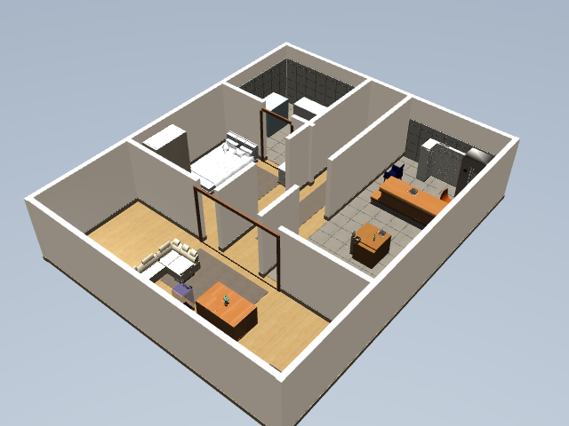
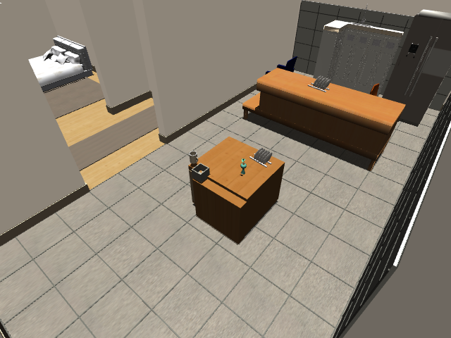

# 装修家庭场景与完整任务验收

> 当前 `make home-furnished` 默认启动 **Gazebo AWS Small House**，操作见 [默认引擎指南](gazebo-default.md)。本文图片、`ceramic-mug` / `kitchen-tray` 任务及历史成功率属于 MuJoCo 装修布局；复现本文请先 `export SIM_STACK_ENGINE=mujoco`。两个后端的家具布局、物品和抓取能力不能混用验收。


当前家庭演示使用同一台 XLeRobot 移动机械臂，在客厅、走廊、厨房、卧室和卫生间之间运行。场景以暖木、米灰瓷砖、浅墙面和柔和光照为主，配有家具网格、生活用品与独立碰撞体。操作工位使用日常杯具和收纳盘，不再靠红、蓝等颜色编码区分任务物体。

这是一套人工搭建的家庭测试布局，并非真实房屋扫描。OS 仍只调用注册的标定、建图、导航、观测和机械臂服务；资源包的选择和 MuJoCo 配置由驱动处理。





以上为已注册外部相机的原始画面，仅用于说明场景外观。机器人建图和执行任务使用机载相机。

## 可复现启动

```bash
.venv/bin/pip install -e '.[visual]'
make build
bash scripts/furnished-home-demo.sh start --sim-port 50161 --agent-port 8897
```

入口会检查并准备固定版本的资源，随后启动 RGB-D 服务。资源存在时不用重复下载。默认运行目录如下，均不提交到 Git：

| 内容 | 目录 |
| --- | --- |
| 家具资源包 | `artifacts/sim-assets/furnished-home` |
| 原始开源模型 | `artifacts/sim-assets/aws-small-house` |
| 任务、证据、日志及进程身份 | `artifacts/sim-stack/furnished-home` |
| 保存的地图版本 | `artifacts/maps/furnished-home` |
| 机器人标定 | `artifacts/calibration/furnished-home` |

可通过 `TANGYING_MAP_ROOT`、`TANGYING_SIM_CALIBRATION_DIR` 和 `SIM_STACK_ARTIFACTS_DIR` 指定隔离的数据目录。监管脚本会保存地图、标定和资源包配置；从新终端重启时继续使用同一目录。改变运行中的配置需要 `restart`。

```bash
bash scripts/sim-stack.sh status --artifacts-dir artifacts/sim-stack/furnished-home
bash scripts/sim-stack.sh logs --artifacts-dir artifacts/sim-stack/furnished-home
bash scripts/sim-stack.sh restart --artifacts-dir artifacts/sim-stack/furnished-home
bash scripts/sim-stack.sh stop --artifacts-dir artifacts/sim-stack/furnished-home
```

`restart` 会重新初始化当前机器人场景。先完成或停止正在运行的任务/扫描。需要清空演示数据时，先通过上面的 `stop` 停止已记录的进程，再把运行目录、地图目录和标定目录移入备份目录，使用同一启动命令创建空目录；不要删除资源包，也不要在运行中删除任务数据库或活动地图。

## 从空数据开始

1. 打开 `http://127.0.0.1:8897/#calibration`，执行机器人注册的整机标定服务；也可使用自己的算法，手动录入完整标定文档并保存。保存后立即应用并生成版本。
2. 打开 SLAM 页面，开始巡检扫描。机器人通过真实执行的底盘动作在房间间移动，机载 RGB-D 进行配准、闭环与融合；相机没采到的空间仍然未知。
3. 扫描完成后，选择新地图查看彩色点云、保存的房间标注和轨迹，并确认导航地图已启用。
4. 在工作台提交家庭任务，确认识别到的动作计划后执行。每个动作完成后都需要新的观测验证。

也可用现有注册服务脚本建图：

```bash
.venv/bin/python scripts/build_sim_map.py \
  --base-url http://127.0.0.1:8897 \
  --name 现代家庭地图 \
  --output artifacts/acceptance/furnished-home/map-run-1
```

## 自然语言任务

```text
从客厅出发，去厨房拿杯子，放进收纳盘，然后回到客厅
从客厅出发，巡检卧室和卫生间，最后回到客厅
从客厅出发，去厨房确认一下环境
```

位于厨房工位时也可以说“把杯子放进收纳盘”。不支持的物品、容器或家电操作必须明确失败或要求补充信息，不得丢弃操作部分后只执行导航并报告成功。盘子、花瓶等陈设并不自动等于已支持的抓取对象；实际能力以感知和注册动作服务为准。

工作台的“家庭全景”“房间总览”和“操作区”是供人查看的额外相机；建图和操作继续使用机载相机。外部视角不会向机器人注入隐藏的物体位置。

完整自然语言验收脚本会保存逐步执行回执、每步原始 RGB/深度图和 SHA-256，不会自动重置场景或重试物理操作：

```bash
.venv/bin/python scripts/run_home_task_suite.py \
  --base-url http://127.0.0.1:8897 \
  --output artifacts/acceptance/furnished-household-fresh \
  --scenario patrol --scenario inspect-kitchen --scenario mug-transfer \
  --timeout 600
```

杯子收纳只能在杯子尚未放入盘子的初始场景运行一次；重复试验需要完成当前任务后显式重启机器人场景。测试输出目录必须是新目录，失败记录不会被覆盖。

## 已保存地图的展示

- “实测 RGB”显示地图保存的颜色；没有 RGB 的数据会明确提示，不能用辅助色冒充真实颜色。
- “高度辅助色”用于区分地面与立面，改变的是显示效果，原始数据不变。
- 点击已保存的房间标签会稳定聚焦到该区域。三维、俯视和全图可切换，采集轨迹可以开关。
- 可以点击已采集点添加本机浏览标记，查看坐标、邻域样本并重新聚焦。浏览标记按地图 ID 和版本隔离，只存在本机浏览器，不是机器人可执行的导航目标。
- 地图上的方向标记和分页帧列表可打开[关键帧检查弹窗](slam-keyframe-inspection.md)，查看保存的 RGB/深度预览、优化前后位姿、配准与回环质量，以及版本信息。
- 历史地图不会混入当前场景家具坐标或实时物体位置。家具、材质、UV 或场景几何改变后，旧地图保留用于查看，但不能当成新场景的活动地图。

## 资源来源与真实感边界

家具源自 [AWS RoboMaker Small House](https://github.com/aws-robotics/aws-robomaker-small-house-world)，固定提交 `ff9631ca6d1db9c1ba656498151464b5ab74aafe`，许可为 MIT-0。准备脚本保留原始文件、纹理与生成文件的 SHA-256，复制许可文件，只转换模型素材，不运行上游 Gazebo 插件。程序化装修与操作工位由本仓库生成。

需要真实室内扫描时，可考察 [Replica](https://github.com/facebookresearch/Replica-Dataset)；需要重建家具、碰撞和关节资产时，可考察 [ReplicaCAD](https://aihabitat.org/datasets/replica_cad/)；大规模厨房操作任务可使用 [RoboCasa](https://github.com/robocasa/robocasa)。这些不是当前四房间演示已集成的资源，许可和物理建模需按各自项目核对。

模型与材质更接近家庭，只改善训练和测试输入的一部分。当前参考物体检测仍是受限工位的 RGB-D 几何检测，不是训练好的全屋视觉模型。陶瓷杯的可见模型有空腔与把手，抓取碰撞仍使用保守的实心圆柱近似；当前只验收单杯收纳，盘碟和花瓶是陈设。MuJoCo 的透明物体深度、材质反射、摩擦、接触、相机噪声与实机存在差异；本次验收不等于已经训练出可直接部署的家庭策略。迁移需要实测相机/机器人标定、物理参数校准、遮挡与光照变化测试，以及实机数据验证。
