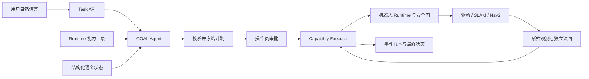

# 一句话到机器人执行：沿一条真实任务看完整闭环

本文是阅读当前系统的入口。示例来自 2026-09-28 的 **Local Agent + Gazebo `home_furnished` + XLeRobot** 实验，任务 `task-62e0c7e11385ae4d11c76461` 最终 `SUCCEEDED`。模型为当次配置的 `deepseek-flash`；这里解释已保存的轨迹，不承诺再次运行会生成逐字相同的计划。原始任务文件留在实验机，入库的[报告](../experiments/2026-09-28-complex-model-led-goals.md)和[带 SHA-256 的清单](../experiments/2026-09-28-complex-model-led-goals.json)记录其位置和结论。

> 请重新按已注册的家庭巡检路线完成 SLAM 建图，保存并启用新地图，核对新地图上的卧室语义地点可导航，然后前往卧室确认到位并报告新地图版本和定位状态。

## 先分清三个决策者

| 层 | 决定什么 | 不能替谁做什么 |
| --- | --- | --- |
| GOAL Agent | 根据原句、能力目录和允许读取的语义状态选择工具、参数与跨能力顺序 | 不能批准任务、制造不存在的能力或地点、发送关节/轮速命令、宣称物理完成 |
| Task 与 Capability Executor | 校验并冻结计划，记录审批、步骤身份、回执、操作状态和完成证据 | 不能以模型提案或一次 `ok=true` 代替执行后核验 |
| 机器人 Runtime / 适配器 | 在安全准入下运行 SLAM、导航与传感器融合等本机算法，提供状态与核验服务 | 不能用过期观测证明到位；目标级编排由 Agent 决定 |

这条用户目标没有预写的五步 workflow。模型提出五项能力及顺序；`mapping.build` 内的巡检算法和 `robot.task` 内的导航子技能是**单项工具的受约束实现**。能否执行仍取决于该机器人实际注册的目录和现场证据。[统一能力目标指南](unified-capability-goals.md)列出契约、错误与配置。

## 阶段 1：接收原句，取得能力目录

工作台「安排任务」与 `POST /v1/tasks` 调用同一 Task 服务。请求体是 `{"request":"上面的完整原句","adapter":"gazebo"}`；`request` 保留原句，Task 服务优先交给已配置的 GOAL Planner。创建草案**不会启动运动**。直接调用接口需遵守 [Local API 的会话规则](../production/api-reference.md#3-local-brain-http-api)。[HTTP 入口](../../console/server.go)、[Task 创建](../../tasks/service.go)和[GOAL Planner](../../internal/capabilityagent/planner.go)是这段代码的入口。

Planner 从 Runtime 获取该机器人的 Service Catalog。能力声明输入 Schema、`READ`/物理运动/制品写入等效果、资源、长操作状态/取消接口及独立完成核验契约。不受支持、不可用或缺少写操作核验契约的服务不能获得执行资格。目录带机器人身份，计划保存其指纹；执行前还会重新比对。[能力契约](../../core/capability/capability.go)

当配置了 GOAL 模型，**所有自然语言目标都由模型决定能力与顺序**；只有未配置 GOAL 模型时才使用保守的完整句式离线语法。旧导航/抓放解析器仍用于 `robot.task` 的复合子请求，而不是接管本例的跨能力顺序。模型路由可按 GOAL、INTENT、PLANNING、RECOVERY、SYSTEM 阶段独立配置。

## 阶段 2：逐轮读取结构化状态，由模型提出计划

规划期 Harness 每轮只允许选一个声明了 `planningFields` 的只读服务，或调用 `propose_capability_plan` 提交**完整**计划。最多 10 次模型决策、6 次只读查询、3 次无效提案；多工具输出会拒绝并把原因送回下一轮。此阶段不执行物理写工具。[逐轮语义读取规范](../development/2026-09-28-model-led-goal-semantic-views-spec.md)

这次保存的 `planningTrace` 如下：

| 轮次 | 模型选择 / Harness 结果 | 进入模型上下文的事实 |
| --- | --- | --- |
| 1 | 一轮选多个工具，`MODEL_DECISION_REJECTED` | 无 |
| 2 | `calibration.get`，`READ_OK` | 标定 revision |
| 3 | 再次多工具输出，被拒绝 | 无 |
| 4 | `mapping.inventory`，`READ_OK` | 旧在用地图 ID、revision，可用地图数量 14 |
| 5 | `semantic.locations`，`READ_OK` | 地点列表中有 `bedroom` |
| 6 | `propose_capability_plan`，`FROZEN_FOR_APPROVAL` | 提交下表五项调用 |

传感器侧的数据路径是：**IMU / 里程计 / RGB-D → 机器人侧融合、SLAM 与定位 → 带时间和地图版本的结构化状态 → `planningFields` 投影 → 模型**。原始图像、IMU 样本、点云和栅格不进入这次模型规划上下文。投影有字段、递归原始信号键、密集数组和 8 KiB 大小检查；无 `planningFields` 的只读服务不向规划模型开放。底层执行器仍可用原始测量做 SLAM、避障和物理核验。Gazebo 当前把新鲜 IMU 的横滚/俯仰与里程计航向组合；它**不是完整 EKF 惯导**。[融合代码](../../robot/ros2_ws/src/tangying_navigation/tangying_navigation/gazebo_runtime_node.py)

## 阶段 3：校验、冻结、等待审批

模型最终提出的五个调用是：

| 顺序 | 能力 | 此步的目的 |
| --- | --- | --- |
| 1 | `mapping.build(mode=survey, name=家庭巡检新地图)` | 沿机器人已注册的家庭路线重新采集、保存并启用地图 |
| 2 | `mapping.status()` | 在执行期读回建图状态和在用地图 |
| 3 | `semantic.resolve(name=卧室)` | 在**新地图**上确认卧室有唯一、可导航的语义目标 |
| 4 | `robot.task(request=前往卧室)` | 进入导航闭环，到位后单独核验 |
| 5 | `navigation.status()` | 最终读回定位状态、地图身份和位姿 |

冻结前，代码再次校验能力目录、参数 Schema、机器人身份、调用数以及原句中明确的家庭路线目标。`robot.task` 的子请求被解析为 `home_route`，`routeRooms=[bedroom]` 与文字目标一起保存；模型不能用漏掉卧室的计划取得批准。草案的 `source=llm`、`state=READY`、`approved=false`，并包含目录指纹和逐轮 `planningTrace`。若无法完整表达原句，应返回澄清/拒绝，不应截取其中能执行的半句。[冻结规则](../../internal/capabilityagent/planner.go)

操作员在工作台核对机器人、工具、参数及目标后批准。批准来源和时间进入 `TASK_APPROVED` 事件；本例批准计划与草案一致，然后才入队。[审批与入队](../../console/server.go)

## 阶段 4：按冻结计划逐步执行和核验

Executor 为每项调用分配 `rev-1-cap-01` 至 `rev-1-cap-05`，执行前重新检查机器人绑定、目录指纹及参数。每步记录 `CAPABILITY_CALL`；非复合服务还有持久 `CAPABILITY_RECEIPT`，长操作用固定 `operationId` 查询终态。写操作不能仅凭调用返回成功标记完成，还需按 Provider 的 verification 契约重新读回。[执行器](../../internal/capabilityagent/executor.go)

1. **重新建图。** `mapping.build` 调用 Runtime 的巡检实现。机器人侧在新鲜传感器与安全准入下移动，执行 RGB-D 采集、配准和回环，并保存、启用地图。操作 ID 为 `2c72804716ad482284956634e932a964`；这次实走 23.496 米，采集 233 帧，完成 220 次配准和 2 次回环。地图 `scan-2c72804716ad` 的 revision 为 `ea419bbf785ac6c19834243c0d1d00463758c73654ad9dd6cedbca87caf31f5f`。Executor 看到 `completed` 后还从 `mapping.status` 核对在用地图 ID、revision 和标定版本，才记录 `CAPABILITY_VERIFIED`。[Runtime 服务目录](../../robot/gateway/tangying_robot_gateway/robot_workflow.py)
2. **重新核对地图和卧室。** 第二步 `mapping.status` 读回刚启用的地图；第三步 `semantic.resolve("卧室")` 在同一地图版本中解析唯一目标。返回 `navigationReady=true`、`frameId=world`、目标位姿与实测区域。地点不存在、匹配不唯一或自由空间不足时应失败；模型生成的坐标不能冒充地图认证目标。[语义地点实现](../../robot/gateway/tangying_robot_gateway/robot_workflow.py)
3. **前往卧室。** `robot.task` 调用已冻结的 `home_route` 子意图。子执行器完成现场观察、导航前摆位、`navigation.navigate` 与 `verify_arrival`。动作前 Runtime 检查急停、期限与传感器新鲜度；短暂未就绪只在有界时间内重查，不能把旧相机帧改时间戳充作新证据。本例 `verify_arrival` 的独立步骤为 `rev-1-cap-04-verify_arrival_00`，留下观测 ID 和 `CONFIRMED` 事件。[子执行装配](../../cmd/local-agent/main.go)、[Gazebo 到位核验](../../robot/gateway/tangying_robot_gateway/gazebo_backend.py)
4. **读回最终状态。** `navigation.status` 返回新地图 ID/revision、`localizationState=localized`、`ready=true` 和地图位姿；最终平面位置约 `(-2.0518, 3.3425)`，距目标 `(-2.05, 3.35)` 约 0.0077 米。Gazebo 当前 `verify_arrival` 还要求位置误差不超过 0.08 米、航向误差不超过 0.15 弧度。`navigation.status` 不返回底层栅格。[结构化定位摘要](../../robot/gateway/tangying_robot_gateway/robot_workflow.py)

最终 5/5 项能力有 `CAPABILITY_VERIFIED`，卧室有一次独立到位确认。任务经历 `READY → OBSERVING → PLANNING → EXECUTING → VERIFYING → SUCCEEDED`；原始任务保存了 71 条事件。**`planningTrace` 说明模型为何这么计划，`CAPABILITY_RECEIPT` 说明命令/操作回执，`CAPABILITY_VERIFIED` 与子步骤观测说明为何判为完成**，三者不能互相代替。

本例早于融合来源字段的最后一次传播修复，保存的最终 `navigation.status` 有 `poseSource=registered_localization`，没有 `poseFusionSource`。随后独立的 `case08` 在真实 Gazebo 重启后读到 `poseFusionSource=imu_roll_pitch_odom_yaw`；不要把后一次字段误写成本例的原始事件。[两例及限制](../experiments/2026-09-28-complex-model-led-goals.md)

## 阶段 5：失败时如何停下并回溯

- **创建前**：工具不存在、Schema 错误、目标丢失或模型连续无法提交合法计划时，不生成可批准的运动任务。
- **执行中**：过期 RGB-D、IMU/关节反馈未就绪、地点不可导航或到位核验失败会保留具体步骤与错误；不能把 `ok=true` 或“地图已保存”当成整项任务完成。
- **结果未知**：有副作用的调用失去回执或操作身份时不能盲目重发。长操作取消要核对拥有者、请求停止并读回终态；停止不明保留可恢复失败，供操作员对账。[恢复契约](unified-capability-goals.md#故障与恢复)

排查顺序：先从工作台任务详情或 `GET /v1/tasks/{id}` 查看 `state` 和 `plan.capabilities.planningTrace`，再按 `rev-…-cap-…` 查 `CAPABILITY_CALL → CAPABILITY_RECEIPT/PROGRESS → CAPABILITY_VERIFIED/FAILED`，最后追子步骤的 `TOOL_ACTIVITY` 和 `evidenceIds`。这样能区分**模型计划问题、Runtime 接纳问题、传感器问题、物理动作问题、完成核验问题**。

## 在本机怎么走一遍

1. 按 [Gazebo 默认引擎指南](gazebo-default.md)完成依赖和 Docker 启动，运行 `make home-furnished`，打开 `http://127.0.0.1:8897/`。确认机器人 Runtime 的目录包含 `mapping.build`、`semantic.resolve`、`navigation.status`。
2. 在工作台开发诊断配置支持工具调用的 GOAL 模型，或按[统一目标指南](unified-capability-goals.md#模型调用点)设置 `AGENT_GOAL_*`。没有 GOAL 模型时，本页这类条件复杂句可能被保守离线语法拒绝；不要把确定性固定句式的成功当作模型编排结果。
3. 将本页顶部原句输入「安排任务」。先检查草案 `source=llm`、机器人、目标覆盖、工具顺序和 `planningTrace`；**批准后会运动**，只在仿真或已经完成现场放行的区域审批。
4. 在「任务记录」或任务详情跟踪各步事件和地图版本。检查独立到位 `CONFIRMED`、五项能力的 `CAPABILITY_VERIFIED`、最终 `SUCCEEDED`；计划工具列表可能随当前地图/模型输出变化，应检查目标与证据，而非要求和这次样本逐项相同。

这个样本证明指定 Gazebo 场景的一次完整闭环，不构成实体 XLeRobot、Orin/GPU 性能或数百至数千台机群认证。云端 Fleet 多了一层派单、Worker 认领和租约；机器人侧仍执行同样的能力及物理安全契约。接实机时从[实机与异构接入指南](hardware-agent-integration.md)逐项验证。
