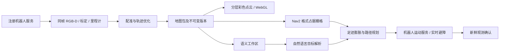

# 机器人服务、标定与建图工作流

Agent OS 按机器人注册的能力工作。底盘品牌、机械臂型号、仿真器和硬件连接方式由机器人服务负责；工作台、任务规划和执行闭环不根据 `simulation` 或 `adapter == mujoco` 选择动作实现。

## 启动和使用

```bash
make home-furnished
# 打开 http://127.0.0.1:8897/
```

1. 在工作台点击「整机标定 → 去处理」。页面直接进入整机标定。
2. 选择「使用机器人标定服务」，或选择「自行标定并录入」。后者支持电机表格、相机内外参、整机几何、安全限值与完整 JSON；用户可用自己的算法生成结果再导入。
3. 「校验并保存」将结果交给机器人服务验证、持久化并应用。保存必须带读取时的版本；有并发修改时需重新读取并合并。编辑中的内容不会被后台刷新覆盖。
4. 进入「SLAM 建图」，选择自动巡检或手动移动。手动移动有距离、角度上限，停止后可以继续采集或保存；取消结束本次会话。
5. 完成后生成稠密点云、轨迹、导航栅格和语义工作区。新地图出现在当前标签中并自动加载；启用的导航地图有明确版本。选择旧地图用于查看，只有显式激活才用于导航。
6. 回工作台输入「从客厅出发，去厨房拿陶瓷杯，放进收纳盘，然后回到客厅」。检查任务理解并批准后，执行器从当前地图和服务发布的工作区获取目标，逐步导航、观察、抓取、放置和返回。

命令行也调用同一服务，不另建世界、不直接指定仿真器关节位置：

```bash
.venv/bin/python scripts/build_sim_map.py \
  --base-url http://127.0.0.1:8897 \
  --name '家庭一楼' --output artifacts/acceptance/my-survey
.venv/bin/python scripts/run_home_mobile_manipulation_acceptance.py \
  --base-url http://127.0.0.1:8897 \
  --output artifacts/acceptance/my-household --timeout 240
```

产物默认存放在 `artifacts/maps/<mapId>/`，可以通过 `TANGYING_MAP_ROOT` 配置。机器人服务和本地工作台必须指向同一个产物目录，远程部署应由机器人服务同步完整、校验通过的地图包。标定由机器人服务持有，参考驱动默认保存到 `artifacts/calibration/<robotId>/calibration.json`。

## 注册契约

`RobotRuntime.ListServices` 返回服务名称、说明、参数 JSON Schema、可用性和是否修改状态。`CallService` 只接受指定机器人 ID、服务名称、唯一 `requestId` 和参数。工作台使用 `/v1/robot/services` 的 GET/POST 转发这些操作，不加载驱动实现。

| 服务 | 作用 |
| --- | --- |
| `calibration.get` | 当前文档、版本、会话和可用标定方式 |
| `calibration.run` | 调用驱动注册的标定算法 |
| `calibration.save` | 校验并原子保存、应用用户算法结果 |
| `mapping.start/status` | 启动或读取扫描会话 |
| `mapping.move/stop_motion` | 有界扫描运动、停止当前运动 |
| `mapping.finish/cancel` | 保存已采集成果或取消会话 |
| `mapping.activate` | 验证并启用特定地图包 |
| `navigation.map` | 当前导航栅格、地图版本和新鲜定位 |

服务描述与调用校验使用同一个注册表。重复的修改请求只返回原回执；同一编号搭配不同参数会被拒绝。后台采集和运动拥有独立的预约令牌，不能释放其他任务或标定持有的预约。运动进入原有 `ExecuteSkill` 安全入口，取消事件在接纳命令时共享，避免取消早于命令登记时丢失。

增加机器人驱动时，可以向 `RobotRuntimeService(..., services=...)` 注入 `RegisteredService`；复用 `RobotWorkflow` 则需提供标定读取/执行/保存、带同帧位姿的 RGB-D 采集、受控运动、原子预约/释放、扫描路线和语义标注回调。硬件标定格式、算法、IK、驱动限位及实时避障由该提供者负责。普通应用无需知道它运行在哪里。

参考驱动会把相机内外参用于后续 RGB-D 观测。它的运动接口直接使用模型中的已标定关节角，因此录入的舵机原始步数、几何与安全参数会随文档保存，不能据此改变模型的执行器结构或扩大控制器限值。接入硬件时，提供者必须实现相应的编码器转换、几何标定与控制器配置应用，并报告结果；文档保存成功本身不能代表这些硬件操作已经完成。

## 地图与导航



参考建图实现 `planar-rgbd-icp-posegraph-v1` 使用实际采集的米制深度、相机到基座外参、同帧底盘位姿，执行平面 ICP、里程计约束、闭环匹配和稀疏位姿图优化。它限定平整室内底盘运动；坡道、楼层变换和更复杂环境应注册 RTAB-Map 等其他提供者。算法名称、假设、采集 ID、时间、里程计、优化位姿及配准/闭环质量保存在校验覆盖的 `slam-session.json` 中。

导航栅格与显示点云分开生成：显示使用 LOD 去重；占据判定使用测量点，未知保持未知。栅格范围包含机器人实际走过的位置；扩大的通行包络必须有驱动的已执行路径认证，不能仅凭当前位置猜测未观察区域为空。栅格保存为标准 trinary `map.yaml + map.pgm`。规划和激活共用相同的阈值、图片绑定、尺寸及坐标校验。

激活要求机器人 ID、标定版本、地图哈希和定位坐标系版本一致。恢复上次地图必须匹配保存的精确版本。里程计原点在重启后不稳定的提供者需提供新坐标系版本，并在旧地图上重新定位；不能把新鲜位姿时间当作旧变换仍然有效的证明。标定变化会撤销不匹配的已启用地图。

自然语言只引用服务提供的唯一名称/别名和工作区，不由模型生成坐标。语义对象是寻找物品的计划线索，到达工作区后仍需新鲜感知确认。底盘在已知自由空间中规划，未知单元和地图边界不可穿越；机械臂可达范围只是候选条件，实际抓放还需驱动的 IK、碰撞约束和观测验收。

## 参考环境与扩展

参考家庭场景提供客厅、走廊、厨房、卧室和浴室，门洞和停靠点需满足整机足迹。MuJoCo 驱动在复制的物理状态上检查运动扫掠，点云始终来自渲染的传感器深度，不从场景网格复制几何。

需要更丰富的家庭视觉资产时，可使用 `scripts/prepare_home_world.py` 准备固定版本的 AWS Small House；原模型、纹理、许可证和来源清单保留在 `artifacts/sim-assets/`，Gazebo 启动器通过 `TANGYING_GAZEBO_WORLD` 选择生成的 Harmonic 世界。该资产不是 Agent OS 的运行模式。RTAB-Map/Nav2 的部署、传感器桥接与定位配置见[家庭场景操作](home-scene-operations.md)。

## 续建建图：在已有地图上补齐未覆盖区域

`mapping.start` 接受可选的 **`baseMapId`**：给出时，本次扫描在**该地图的坐标系**里继续，产物是**两次勘测的并集**——机器人不必重走已扫过的区域，可以从任意位置开始，包括基础地图从未见过的区域。

```jsonc
mapping.start { "name": "续建右侧", "mode": "manual", "baseMapId": "scan-6f2feb8d93b2" }
mapping.move  { "action": "forward", "distanceM": 0.5 }
mapping.finish
```

**为什么可以从任意位置开始**：锚点（`mapFromWorld`）是**驱动世界坐标系**上的刚体变换，而该坐标系跨会话共享——运行时用 `worldFrameRevision` 钉住它并在加载时校验。因此新点云直接落在基础地图的正确位置，**既不需要重叠视野，也不需要重走**。

### 产物是两次勘测的并集——点云和"能不能走"都是

续建不只是把点云拼起来。**占据栅格也会与基础地图已发布的导航产物求并**：自由与占用都取并集，只有两边都不知道的格子才是未知。

这条不是锦上添花：一次勘测的自由空间有一部分来自**它自己经过净空校验的行驶轨迹**（前向相机看不到脚下），所以只按合并点云重建栅格，会把老地图靠轨迹证据标出的走廊、门洞和停靠点重新变回未知——**点云一个点没少，规划器却找不到通路**，实测会直接报 `NO_KNOWN_PATH`。

**验收续建的正确问法不是"地图变大了没有"，而是"这张地图还能不能把机器人送到每个已注册工作区"。**

### 三个实测得到的操作约束

1. **`mapping.move` 的上下界是 `.01–.5`**（`distanceM` 与 `angleRad` 相同）。**转 90° 需要 3 步 0.5**，不是一步。传 `0.52` 会被拒绝，而**拒绝之后机器人仍朝原方向**——照着旧航向开就会走错。
2. **手动移动是严格串行的**：上一次移动未结束时再次调用会返回 **409**。脚本里应当重试而不是当作失败。
3. **有界步进就是有界步进**：手动步进只按请求的距离和航向走，**不会**被家庭路线分解器改道。巡检（`mode: "survey"`）的目标仍然走授权路线。这条区分由请求自带，运行时无法从几何上猜——详见 CHANGELOG 的「第四步」。

### 安全层会挡下会碰撞的移动

实测：在客厅位姿 (0, −1.25) 直接右转，扫描进入 `failed`，消息为

```
reference driver model predicts contact during bounded base pulse
```

**这是安全层正常工作**，不是缺陷：驱动模型预测该动作会碰撞，于是拒绝执行。**续建扫描同样受这条约束**——它不会为了让测绘完成而允许一次会撞的移动。规划路线时需要先离开墙角再转向，或使用 `mode: "survey"` 按注册路线走。

**净空是 0.40 m，不是底盘半径 0.30 m**：`NavigationController.CLEARANCE_RADIUS_M = 0.40` 决定底盘中心到任何障碍的实际最小距离，规划路线时要按这个数留量，而不是按 `footprintRadiusM`。

**安全层拦住一步不会毁掉整段扫描**：会话进入 `failed` 后 `mapping.finish` **仍然可用**，可以把已经采到的证据存成地图。所以脚本应当在失败处停止推进并直接保存，而不是丢弃。

### 一个可用的补扫配方

下面这条路径是实测跑通的：它从客厅出发，穿过走廊门洞进入厨房，再横穿厨房右侧从未覆盖的区域。

```jsonc
// 正北 4.5 m 到门洞高度，再东进 1.5 m 穿门，南下到厨房南侧，然后一路向东到东墙前
["forward", 0.5] × 9, ["right", 0.5] × 3, ["backward", 0.5] × 2,
["right", 0.5] × 4, ["right", 0.3]
```

要点：**先到门洞高度再东进**（门洞在 y ∈ [2.6, 4.1]，机器人中心应在 y ∈ [3.0, 3.7]）；**厨房操作台与岛台在 y ≥ 3.25 处形成净空禁区**，所以要**先南下到 y ≈ 2.3 再向东**，不能在 y ≈ 3.3 处直接东进；东墙内侧在 x = 4.42，所以**向东最远停在 x ≈ 3.8**。

### 仍未完成

- **跨会话回环**：目前接缝只靠锚点对齐，没有联合优化。
- **接缝的真实几何精度未经端到端验证**：单元测试覆盖坐标转换的正确性，不覆盖两次勘测合并后的实际误差。
- **贴墙地面仍靠占据栅格补齐**：前向相机看不到正下方，靠墙约 0.4 m 内的地面由轨迹净空证据标成自由，而不是由点云覆盖。

## 自动探索建图：让机器人自己去找没扫到的地方

固定巡检路线走的是**注册航点**，它不可能知道房间里有什么，所以总会漏。`mapping.start { mode: "explore" }` 让机器人自己判断下一个未知区域在哪里：

```jsonc
mapping.start { "mode": "explore", "name": "家庭地图", "maxTravelM": 45, "maxLegs": 4 }
mapping.status                       // 每步都会报告探明比例、当前目标与停止原因
```

整段流程是自动的：`mapping.start` 之后不需要再发移动指令，它会自己分段发布地图，最后启动新地图。

### 它是怎么选点的

- **frontier**：已知自由空间里与未知空间相邻的格子。墙不是 frontier。
- **代价优先，信息量决胜**：先按行驶代价排序，只在代价接近的候选之间比"能看见多少未知"。反过来做（信息量除以距离）会让机器人在房间里来回横扫，永远走不到远端。
- **滚动时域**：每走一步就重新观测、重新规划。地图是驱动自己改变的。
- **不切角**：取前视点时要求直线可达，否则机器人会切掉路线本来要保留的净空，然后被安全层拒绝。

### 实测：什么会让它变慢或变差

| 现象 | 原因 | 处理 |
| --- | --- | --- |
| 机器人对着自己的位置反复选点 | 前向相机看不到脚下，机器人周围永远有一圈"看不见的未知" | 运行时会标出"已证明看不见的空间"，地图里仍是未知，但不会被当作目标 |
| 一步都走不动就报"探索完成" | 相机近界（约 0.5 m）与轨迹净空（0.4 m）之间有一条未测带，机器人像站在孤岛上 | 自身足迹会并入可行区域；地图扫完与"到不了"现在是两种停止原因 |
| 地图墙面变成斜线 | 原地转圈是深度 ICP 信息最少的运动，长时间积累偏航误差 | 默认关闭定期环视；覆盖靠开过去，不靠停下来看 |
| 一直在算、看着像卡住 | frontier 连通域标记是纯 Python 洪泛，几千个格子时每次规划要几秒 | 改用编译实现并限制每次评估的连通域数量 |

### 现在的实际能力与边界

- 一次自动流程能探明大部分公共区域，并如实报告停止原因（`complete` / `no_reachable_frontier` / `travel_budget` / `frame_budget`）。
- **它产出的是"勘测图"，不是"导航级地图"**：长时间探索的位姿精度低于按注册路线走的巡检，局部可能有十几厘米的偏差。
- 因此**推荐用法是先用巡检建立导航级底图，再用探索补扫**：`mapping.start { mode: "explore", baseMapId: "<底图>" }`。探索会继承底图的坐标系、点云和**导航栅格**，只在未知区域新增证据，底图已探明的区域保持原样。

