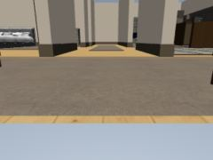

# SLAM 关键帧检查

在「SLAM 地图 → 已保存地图」中选定一张地图，开启「显示关键帧与朝向」。浅青色点和箭头对应优化后的底盘位置与朝向，金色点表示至少参与一次已接受的回环。点击地图上的点，或右侧分页关键帧列表，打开只读详情。拖动旋转不会触发点选；也可以在弹窗中逐帧前后浏览，或选择「在地图中定位」。

详情提供采集时间、观测 ID、传感器来源、相机坐标系、原始里程计与最终优化后的平面位姿、平移/旋转修正量、采集点数、有效深度比例、自身遮罩像素数以及配准记录。配准记录包含相邻帧/回环、接受状态、RMSE 和内点率。没有通过 ICP 门限的记录没有伪造的 RMSE；详情显示未保存。展开「完整元数据与版本标识」可检查相机原始内参、基座到相机外参、自身遮罩模型版本、地图内容哈希和标定版本。

## 已采集示例

来自「现代家庭关键帧地图」的首个关键帧（`scan-6f2feb8d93b2 / kf-0000`），下图直接复制已保存预览，来源身份与 SHA-256 记录在 `docs/images/furnished-home/captures.json`。

| RGB 采集缩略图 | 深度预览 |
| --- | --- |
|  |  |

## 图像与预算

新采集地图保存每个接受关键帧的真实 RGB 和深度预览，图像来自同一次 `RGBDFrame` 采集，不读取回放时的摄像头，也不根据场景模型重新渲染。RGB 缩略图最长为 240×180、JPEG quality 78。深度以最近邻取样缩小，再编码为 PNG 固定量程显示：0.02–5 m，近暖远冷，无效/超量程像素为黑色。深度预览仍包含原始采集中的机器人自身像素，SLAM 使用的自身遮罩数量单独记录。点云积分使用 0.15–5 m 的有效深度并剔除自身遮罩，两者用途和量程不同。

这些文件用于视觉诊断，不能替代原始浮点深度或完整传感器 bag。原始分辨率、内参和统计来自未缩小的采集帧；弹窗图像明确标为缩略图。图像经过 JPEG 有损压缩/深度预览量化，不能从显示图像恢复原始 RGB-D 数据。

每次扫描最多接受 400 个关键帧。全部压缩图像总预算为 8 MiB，每帧 RGB+深度图不超过 128 KiB，单个 JSON 图像包不超过 12 MiB。达到图像预算后继续保留帧身份、位姿和配准元数据，图像状态记为 `budget_exhausted`。图像均内嵌在一个有界 artifact 中，不产生无限制的逐帧文件。前端只在首次打开关键帧详情时加载该图像包，只解码当前帧图像，关闭/换帧/切换地图释放 Blob URL。

## 保存格式与身份校验

地图 `manifest.json` 声明两个可选 artifact：

- `slam_session` → `slam-session.json`：保留兼容的 `slam.session.v1`，新增 `keyframeMetadataVersion: 1`、`frameId: map`、`keyframeSelection`、每帧 `frameId/index/baseZ`、相机元数据、深度统计、`previewStatus` 和 `registrationAttempts`。`observations[].odometry` 与 `optimizedPose` 均为 `[x m, y m, yaw rad]`。优化完成后重新生成修正量，避免显示过期的中间位姿。
- `slam_keyframes` → `slam-keyframes.json`：`slam.keyframes.v1`，含 `mapId/robotId/frameId/calibrationRevision`、明确的预览编码与预算，以及以 `frameId/observationId/stamp` 关联的图像。每张图像带压缩字节数、实际像素尺寸、MIME、SHA-256 和 base64 内容。

两个文件均在地图发布前写入，并纳入 manifest 文件字节数和 SHA-256 校验。控制台通过原有只读 `/v1/maps/{id}/artifact/{role}` 访问，两个 SLAM role 额外检查预算、清单哈希、路径和可选 `sha256` 请求固定值。前端再次验证 artifact 字节数和哈希，再验证地图/标定/帧身份。图像解码前校验图像哈希、JPEG/PNG 头和真实像素尺寸；只使用 `blob:` URL，兼容控制台 CSP。

切换地图会关闭详情、取消旧请求，并丢弃过期的异步结果；切换帧也有独立的请求代次检查。关键帧显示不会激活地图、修改标定、添加导航目标或注入实时世界状态。

## 历史地图与当前算法边界

旧地图只显示其已经保存的 `slam_session.observations/registrations/loopClosures`。缺少源、点数或图像时显示「未保存」，不会借用新地图、当前相机或场景真值补齐。旧记录若没有高度，标记仅投影到 z=0，并在详情说明；其 x/y/yaw 保持保存值。没有 SLAM session 的导入地图仍可浏览点云，但没有关键帧诊断。

当前参考算法是有界平面 RGB-D ICP+位姿图：正常室内水平底盘、度量 RGB-D、同次采集里程计；关键帧平移阈值 0.10 m 或旋转阈值 0.16 rad。显示的箭头是底盘 yaw，完整相机外参在详情中；这些信息并不表示任意六自由度 SLAM、已估计协方差、特征匹配图或真值轨迹。外部 SLAM 服务若要提供不同模型的诊断，应增加有版本的 artifact 契约，而不能把缺失指标写成零。
