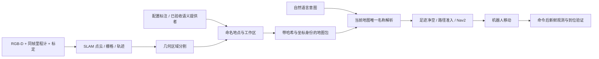

# SLAM 地图、语义地点与自然语言导航

2026-09-27 统一目标入口已升级：标定、自动 SLAM 与导航可通过同一 Task API 下发，自动建图使用 mapping.build；完整契约、审批/恢复、云边委托、逐阶段模型配置和旧入口迁移见[统一目标指南](unified-capability-goals.md)，实测范围见[本轮报告](../experiments/2026-09-27-capability-goal-closure.md)。原手动服务步骤继续用于明确调试操作。

适用：注册 `RobotWorkflow` 的机器人驱动。Gazebo 参考实现使用同源 XLeRobot 四房间家庭；Agent 根据服务目录执行任务，驱动负责传感器、地图坐标、路径和运动控制。

## 从测量到任务



SLAM 建立几何结构。当前功能不会仅根据房间形状猜测“厨房”：房间功能、别名与工作区停靠姿态由驱动的 `semantic_workspaces(mapFromWorld)` 回调提供。自动分割只添加 `region-N` / `区域N`，可作为几何目的地；分区面积是估计，未被扫描的区域保持未知。旋转栅格和超过 250,000 格的地图暂不生成自动分区，显式地点仍可校验。

地点分为 `room`、`work_area`、`region`。房间种子被障碍阻挡时，最多在原点 0.25 m 内寻找安全目标；这不是跨房间搜索。工作区停靠姿态不自动平移，平移可能改变机械臂可达性。当前家庭的 `kitchen` 与 `kitchen_work_area` 使用同一个经配置的厨房操作停靠位姿，两个标签不代表两个不同的物理站位。工作区底盘净空检查也不等于 IK 或抓放认证。

## 建图与定位阶段

先按 [Gazebo 启动指南](gazebo-default.md) 准备资源、启动 `mapping` 模式并完成标定，然后运行：

```bash
.venv/bin/python scripts/build_sim_map.py --base-url http://127.0.0.1:8897 \
  --mode survey --name '家庭语义地图' --timeout 1800 \
  --output artifacts/gazebo-semantic-map-acceptance
```

也可在控制台“SLAM 建图”中手动移动、继续采集和保存。地图保存后自动激活，包含原始关键帧、点云、轨迹、占据栅格、`slam-session.json` 和 `semantics.json`。这些文件与标定和地图身份一起校验。不要在保存目录直接改标签；改变地点配置后重新生成地图版本。

网关保存地图与 ROS RTAB-Map 数据库是两套产物：前者提供地图目录、语义地点和任务准入；后者供 Nav2 的定位链路使用。同一次传感器扫描可以同时构建两者，不能用其中一个文件的存在证明另一个已建图。定位数据库还必须匹配场景资源与相机 profile。

建图完成、机器人停稳且没有任务后，按 [Gazebo 指南的定位阶段命令](gazebo-default.md#地图与自然语言任务) 保留原运行目录重启为 `localization`。这个阶段切换会重新创建仿真场景，必须在任务验收前完成并记录；任务之间不复位。保存地图的 world 变换与当前驱动坐标身份必须匹配，真实设备重启后需重新定位，不能套用仿真的稳定世界坐标假设。

## 查看与解析地点

控制台的通用服务接口 `POST /v1/robot/services` 使用当前控制台会话鉴权。通过控制台服务调用入口或项目 `console_session` helper 获取凭据，不把 token 放进文档和日志。

```json
{"name":"semantic.locations","requestId":"unique-read-1","parameters":{}}
```

返回 `activeMap`、`frameId: map` 和全部 `locations`。检查 `navigationReady`、`blockers`、`kind`、`annotationSource` 与 `geometrySource`；阻塞地点仍显示，但不下发运动。`navigationReady` 表示目标自身足迹净空通过，不保证从当前位置有完整路径；连通性和沿途障碍在导航准入与执行时继续检查。

```json
{"name":"semantic.resolve","requestId":"unique-read-2","parameters":{"name":"厨房工作区"}}
```

返回唯一地点、地图内停靠姿态，以及由保存的 `mapFromWorld` **逆变换**得到的 world `goalPose` 和精确地图修订。未激活地图、未知名称、歧义或不满足净空时拒绝解析。地图激活先校验文件摘要、设备、标定和坐标版本，再恢复地点，不能回退为场景全知坐标。

Runtime 在观察中发布 `semantic.navigation.v1`：可用 `goals` / `aliases`、`blockedLocations`、`goalSource: saved_slam_semantics`。家庭驱动的 `routeEdges` 是显式配置连接，标记 `topologySource: commissioned_connections`；它不是从 SLAM 自动推断的房间连接。实际路径还必须通过实测自由栅格和 Nav2。

## 输入任务与验收

支持完整单目标意图，例如“去厨房”“返回客厅”“前往厨房工作区”“移动到实验台工作区”或 `go to loading bay`。自定义名称必须存在于当前机器人语义目录。中文引号使用 `“实验台工作区”`；含其他动作、条件或否定的请求仍须被完整解析，不能只执行其中的移动部分。原多房间巡检和家庭拿放任务继续使用既有解析器。

在控制台检查任务理解并批准执行。计划引用地点名称；模型不生成运动坐标。Grounding 保留当前地图的路线内别名，LLM 输出的地点名在工具调用前转换为已认证目标坐标；未认证的名称不能借别名扩展到其他地点。模型若提供数值位姿，也必须与 Grounding 已认证的路线目标一致；不同位置或航向在物理执行前拒绝，不能以“地图上可以走”代替用户意图授权。导航后必须通过 `verify_arrival`，回执中的原始图像、定位、地图修订和命令身份必须相互对应。占据、未知和越界均不可通过；物体记忆只是线索，操作前还需现场重新观察。

```bash
.venv/bin/python scripts/run_home_task_suite.py --base-url http://127.0.0.1:8897 \
  --adapter gazebo --scenario semantic-destinations --scenario patrol \
  --timeout 600 --output artifacts/gazebo-semantic-task-acceptance
```

输出目录必须是新目录。套件依次下发“前往厨房工作区”“返回客厅”和卧室/卫生间/客厅巡检，核对实际站位、地图绑定和原始图像摘要，不自动重试物理操作、不传送或复位场景。

## 接入异构机器人

地图语义模块不依赖 Gazebo、MuJoCo 或机器人 CAD。驱动提供自身 RGB-D/里程计配对、标定、扫描方式、语义标注、足迹和运动准入；Runtime 暴露注册服务和能力。不同底盘与机械臂必须使用对应控制器，缺少导航能力就不宣称可移动，缺少机械臂就不宣称可操作工作区。

几何分区、显式名称与语义物体记忆为确定性模块，不调用模型。视觉语义 provider 若调用模型，须由该 provider 明确配置模型/服务地址、时间配对与输出验收；当前升级不引入未经认证的视觉功能识别模型。自然语言模型配置仍使用现有云/边缘 Harness 与模型路由。规格及修改边界见 [升级规范](../development/2026-09-27-gazebo-slam-semantic-navigation-spec.md)，实测证据见 [本轮报告](../experiments/2026-09-27-gazebo-slam-semantic-navigation.md)。
