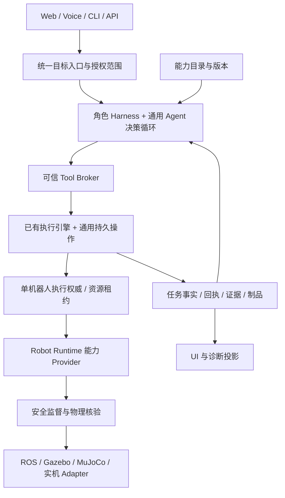

# ADR：统一能力驱动的机器人 Agent

日期：2026-09-27。审计基线：`126db7d6487c7a463d7d192eec673d7460cdb7f6`。

状态：**目标架构与分阶段迁移规范**。本轮落实完整工具输入 Schema 的传递、业务参数隔离和一个建图参数契约修复；统一自然语言目标入口、通用长任务和新能力 Manifest 尚未实现。验证与现状证据见[审计报告](../../development/2026-09-27-agent-capability-architecture-review.md)。本文保留供后续逐阶段核对，不覆盖历史升级规范。

## 1. 决策与范围

SLAM、定位、标定、地图管理、语义地图编辑、导航、操作、诊断、任务取消，都应由后端能力接口提供，Agent 按机器人能力与授权调用。页面负责输入、确认和展示；CLI、语音、API 可以完成同样的工作。关闭页面不应结束后台任务。

保留已有 Runtime/Adapter、安全监督、任务版本、资源 fencing、物理结果核验、云边部署和模型路由。将固定业务意图扩展为通用目标入口，让服务目录与可执行工具目录形成一个可验证的能力契约；复用现有执行权威，不在 Agent 内建立第二套物理任务引擎。

产品应接受开放的自然语言输入，随后明确给出可执行计划、澄清问题、缺失能力、约束冲突或不可完成的原因。**语言理解范围可以扩展，已验证的物理能力仍是有限集合**。模型不能把不存在的工具、地点、标定、地图或机器人结构写成真实事实。

## 2. 当前架构判断

| 层 | 当前证据 | 判断与目标 |
| --- | --- | --- |
| 硬件/仿真隔离 | `proto/robot/v1/robot.proto`、`edge/runtime/`、`robot/gateway/`、RobotProfile/Adapter | 基础合理。Agent 按能力、身份和坐标版本执行，具体仿真后端留在 Provider |
| Runtime 服务 | `ListServices/CallService`；`robot_workflow.py` 提供标定、建图、地图启用等 | 能力已经属于后端服务；不是只有页面能做。问题在于主 Agent 未统一使用 |
| 主自然语言入口 | `agent/agent.go` 输出 `manipulation.Intent`；模型工具限定抓放、取物和路线 | 不能靠换大模型自动获得标定或建图编排。保留旧意图作为兼容的复合工具，增加通用目标执行路线 |
| 建图入口 | `console/mapping_request.go` 的 `/v1/mapping/request`，关键词筛选后调用 `mapping.ensure` | 独立入口不是通用任务图。应迁移为统一目标的兼容入口；不继续扩大关键词分支 |
| 通用决策循环 | `internal/actionloop`、`internal/recoveryexec`、`internal/agentharness` | 已有边界、审批和记录；Edge 当前主要接在恢复执行，Server 提供系统分析/草案。可复用，但不能声称已覆盖全部主任务 |
| 参数契约 | Runtime 的 Struct Schema → 恢复工具参数名 → 模型端 string 属性 | 本轮修复完整 Schema 丢失。强类型、required、enum、范围与嵌套结构保留；仍需执行端验证 |
| 副作用与完成 | `ServiceDefinition.mutates_world`，循环以新鲜观测约束物理调用 | 需要更精确的效果分类与完成证明。新相机帧不能单独证明地图合格或标定已生效 |
| 目录一致性 | Runtime services、Python RobotTool、Go 主意图工具、恢复工具与 Fleet 工具 | 有不同职责的目录，但缺少统一投影与契约门禁，已发现 `build_map` 的 `mapId`/handler 不一致 |

结论：分层基础可以继续使用；业务入口和能力消费路径尚未达到“每个功能都能由主 Agent 编排”。优先补齐这条链路，避免为每个新增功能增加一套页面控制流程。

## 3. 从 dsh 和 Pi 借鉴什么

参考资料检索于 2026-09-27：DeepSeek Harness `master=477b4f420553e8a52c2fbccc464d7561b239c443`，Pi `main=2b0a123de98318c2ff8069661721ce0c3794c34e`。下表的机器人方案是本项目的设计推导，不是这两个项目已提供的机器人功能。

| 来源 | 经核对的机制 | 本项目采用方式 |
| --- | --- | --- |
| [dsh 架构](https://github.com/deepseek-ai/deepseek-harness/blob/477b4f420553e8a52c2fbccc464d7561b239c443/docs/architecture.md) | 服务定义、Provider、Consumer；Profile 配置组合；持久会话事件与实时事件分离 | 为不同机器人/部署组合能力包；把展示做成事件投影；执行事实持续入已有任务日志 |
| [dsh 工具流水线](https://github.com/deepseek-ai/deepseek-harness/blob/477b4f420553e8a52c2fbccc464d7561b239c443/docs/tool-execution-pipeline.md)及[注册源码](https://github.com/deepseek-ai/deepseek-harness/blob/477b4f420553e8a52c2fbccc464d7561b239c443/packages/core/tools/src/index.ts) | 调用前/执行中/执行后扩展点；拒绝优先的 guards；规范结果与展示分离 | 可插拔指标、上下文和渲染；固定可信执行器执行身份、权限、资源、版本、安全和证据检查 |
| [Pi Agent](https://github.com/earendil-works/pi/blob/2b0a123de98318c2ff8069661721ce0c3794c34e/packages/agent/README.md) | 通用模型/工具循环、事件流、上下文投影、工具执行 hooks | 共享一个决策内核，通过 Harness 提供工具集、上下文、预算与模型配置 |
| [Pi 扩展](https://github.com/earendil-works/pi/blob/2b0a123de98318c2ff8069661721ce0c3794c34e/packages/coding-agent/docs/extensions.md) | 注册工具/模型 Provider、动态启用工具、结构化结果、非交互运行 | 新能力通过契约注册；工具发现与权限分离；大结果保留制品引用，UI 不承担流程权威 |

机器人侧的调整：物理动作不能随会话 fork 回滚，插件卸载不能撤销已经发生的移动，超时不等于硬件停止，第三方工具不能通过回调绕开最终执行检查。模型、UI、观测和普通能力可以替换；实体安全和写入权威必须由可信部署约束。dsh 的[当前状态说明](https://github.com/deepseek-ai/deepseek-harness/blob/477b4f420553e8a52c2fbccc464d7561b239c443/SAFETY.md)也不能作为本系统生产或实体安全认证。

## 4. 目标结构

这里的 Broker 与通用操作是拟扩展的职责，不代表已有同名组件。云端 Task Service、Edge 执行器和 Runtime 继续保持各自权威。原子工具实施一个可约束的操作；复合工具在同一个执行器中编排原子步骤，并将子调用完整记录，不能隐藏物理写入。

### 4.1 通用内核与角色 Harness

内核负责模型请求、结构化工具选择、有限轮次、事件和上下文；不硬编码“厨房”“双臂”或特定模型。Harness 负责工具作用域、机器人绑定、模型路由、预算、策略与上下文投影。执行器负责持久状态、取消、恢复、幂等、资源与结果核验。

| 项目 | Edge Harness | Server Harness |
| --- | --- | --- |
| 目标 | 一台机器人的用户任务、准备工作和恢复 | 系统目标、机器人选择、分解与跨机器人协调 |
| 工具 | 所属机器人的受授权读/写/物理能力、云端咨询 | Fleet 查询、系统分析、任务提案；后续受授权的 Edge 目标委托 |
| 模型 | Orin NX 等设备适配的量化模型；明确资源预算 | GPU 服务大模型、复杂规划/视觉分析；仍有延迟与费用预算 |
| 实际执行 | 所属 Edge/Runtime；独占底盘/机械臂等资源 | 通过版本化任务委托给 Edge，不获取第二个直接驱动通道 |
| 离线/失败 | 可用本地能力继续；依赖云能力则解释阻塞 | 根据 Edge 回执对账；不因网络超时重复动作 |

每个需要模型的调用点使用稳定 `callSite` 配置：Provider、endpoint、model、超时、token/图像预算、输出格式、fallback、上下文策略和配置 revision。现有 Intent/Planning/Recovery/System 路由作为迁移基础；新增语义标注等调用点必须单独配置。运行日志记录实际使用的路由和版本，不记录密钥。量化模型的精度/内存/延迟需要 Orin 实测；更大模型不会提升工具权限。SLAM 优化器、标定求解器和安全判定保持确定性，不为“全部 Agent 化”而强制添加 LLM。

### 4.2 统一能力契约

能力目录由可信 Runtime/插件 Provider 注册，经过版本与契约检查；向模型、UI、SDK、MCP 输出不同投影。声明能力不等于允许执行：每次调用都取可用性、角色、身份、任务授权和资源约束的交集。模型按名字检索能力，不能自己安装新驱动或扩大作用域。

拟增加的 Manifest 字段如下，**不是当前 proto 已有字段**：

| 字段 | 要求 |
| --- | --- |
| `name / version / catalogRevision / provider` | 稳定能力身份；执行时绑定准确版本 |
| `inputSchema / outputSchema` | 完整类型与约束；统一的受支持 JSON Schema 子集，未知关键词拒绝注册；模型侧投影不悄悄放宽原约束 |
| `effects` | `READ`、`ARTIFACT_WRITE`、`CONFIG_CHANGE`、`PHYSICAL_MOTION`、`SAFETY_STOP` 可组合；旧 `mutates_world` 继续保守兼容 |
| `resources / robotConstraints` | 底盘、左/右臂、标定/地图激活等资源；按 RobotProfile 解析，不能写死所有机器人都双臂 |
| `preconditions` | 定位、地图、标定、传感器新鲜度、碰撞约束与人工准备；可机读，也有用户解释 |
| `authorization / approval` | 身份、任务作用域及授权 revision；已获准的操作范围内执行，扩大范围才请求新授权 |
| `execution` | 同步或长操作、超时预算、取消语义、重试类别与稳定幂等身份 |
| `completion` | 独立核验的后置条件及证据类型；运行成功、制品成功、激活成功分别表示 |
| `presentation` | 名称、摘要和纯渲染提示；无权修改权威执行结果 |

插件契约至少包含定义、实现、调用方投影和契约测试。Python 关键字参数与导出的 JSON 名称必须一致或有明确的受测转换。MCP 仅是接入协议；MCP 和 UI 调用必须通过同一个 Broker。管理类工具也须保留审计与后端鉴权，不能因“没有物理移动”成为任意文件写入口。

### 4.3 通用目标与长任务

统一目标记录自然语言原文、机器人绑定、约束、授权边界、能力目录 revision、计划 revision 和后置条件。旧抓取/导航解析器作为快速路径或复合技能，不能成为新增能力的唯一输出类型。建图快捷入口和表单最终调用同一目标/操作服务，不在前端拆分子流程。

标定和建图属于持久长操作：启动返回 `operationId` 与状态，执行器在后台订阅进展；Agent 读取有界摘要，在需要决策或用户输入时唤醒，不能靠持续调用大模型轮询。目标状态与操作状态分别记录。

建议操作状态：`ACCEPTED → RUNNING → WAITING_INPUT / VERIFYING → SUCCEEDED`，另有 `FAILED / CANCEL_REQUESTED / CANCELLED / OUTCOME_UNKNOWN`。实际落地需映射或迁移现有状态枚举，不能靠文档增加 API 状态。`CANCEL_REQUESTED` 只表示请求；确认底盘停止、写入达到安全点后才进入 `CANCELLED`。

启动身份持久化后再发送；任务重试、网络重连和恢复查询使用同一个稳定 operation/command ID。资源在物理停止并核验后释放。页面、模型调用或 HTTP 连接取消与机器人操作取消是不同事件。进程重启先查 Runtime 日志/回执、验证资源与证据；结果未知进入对账，禁止盲目重发动作。需要人工放置标定板等步骤进入 `WAITING_INPUT`，机器人能力本身不能完成的人工动作由 Agent 明确指导并等待确认。

### 4.4 三种完成证明

- 物理动作：动作后的可信观测、本体反馈、到达/持有/放置约束，绑定 command 与坐标版本。
- 计算制品：地图/标定产物身份、哈希、算法版本、输入数据来源、质量门禁与适用机器人；不能只看相机新帧。
- 配置激活：读取生效的地图/标定 revision，核对坐标树与消费者确认；旧地图下的定位、路线和目标引用须失效或重新绑定。

模型说“完成”是建议；执行器核验目标才提交完成事实。几何分区不能凭形状保证房间语义正确，名称必须保留观测/用户命名来源和置信度，歧义时澄清。

## 5. 典型目标：准备机器人并去厨房

输入：“检查标定，为家里建图，把厨房设为工作区，再去厨房。”

1. 绑定机器人，发现它的传感器、底盘、机械臂和地图能力。缺少移动能力时明确报告，不能编造导航执行。
2. 调用标定状态读工具；已有有效结果直接复用。若失效，确定需要内参/外参/手眼/里程计中的哪些流程，声明人工准备和可发生的运动，取得相应授权。
3. 标定通过采集、求解、质量检查得到有版本制品；是否激活单独记录。影响地图坐标的改动先让旧引用失效。
4. 查询已有地图；复用/建图/候选歧义由工具返回。现有 `mapping.ensure` 可以保留这一确定性判断；新建图作为长操作跟踪，不能以 `surveyStarted=true` 表示目标完成。
5. 完成建图后核验覆盖、定位质量、地图与标定绑定。未通过时说明需补扫的区域，且按同一任务作用域执行。
6. 语义工具建立区域/工作区绑定。无法确定“厨房”时让用户命名或根据可靠观测确认，不用模拟器真值补全。
7. 启用地图并确认新鲜定位；根据机器人足迹、运动学和工作区提出可达目标。目标不是模型猜出的坐标。
8. 通过导航工具到达，获取到达证据，统一目标进入成功；任一步阻塞都可在同一编号下诊断和恢复。

上述完整编排为目标验收用例，**本轮未执行这个自然语言闭环**。当前实际可用流程见[注册服务工作流](../../guides/robot-service-workflow.md)和[SLAM 语义导航](../../guides/slam-semantic-navigation.md)。

## 6. 异构机器人与规模扩展

复合任务以能力约束表达，例如“可移动 + 已定位 + 可观察 + 可抓取所需质量的物体”，Provider 将抽象资源与动作绑定到实际轮式/腿式底盘、单臂/双臂/无臂配置。绑定时记录 robot/profile/calibration/map/frame revision。坐标来源和变换版本不可省略；不同机器人共享地图必须有明确变换和适用范围。

数百/数千台机器人的系统任务由 Server 分解，按能力、位置与资源派给 Edge；Edge 执行具体闭环。共享空间、同一物体和地图写入使用现有协调机制扩展，云端模型不逐台接收每帧图像。上报按事件和制品摘要，按需取证；机群规模承诺必须经过负载与故障测试。本地/云端分别 Docker 部署，包配置保持同一契约；需要硬件/ROS 权限的 Provider 在机器人侧运行，云端无需相同的硬件权限。

## 7. 迁移顺序与验收门禁

| 阶段 | 交付 | 完成判据 |
| --- | --- | --- |
| P0：本轮基础修复 | 完整 Schema 传递、业务 `reason` 保留、无模型路径不忽略 Schema、`build_map.mapId` 契约修复 | 真实 Registry → Executor → Decider 数据链与假模型 HTTP 请求测试通过；不调用机器人 |
| P1：目录与执行契约 | 统一能力定义/投影，支持效果、版本、资源与证据；旧目录有明确转换 | Runtime 注册到 Agent 候选的集成测试；拒绝不支持的 Schema、越权工具和版本漂移；原子/复合调用完整入账 |
| P2：持久操作 | 服务长任务接入现有任务执行权威、watch/status/cancel/reconcile | 无 UI 可完成/取消建图与标定；重复请求只启动一次；断线重启不重复运动，停止未确认不释放资源 |
| P3：统一自然语言入口 | 通用目标计划；旧 Intent 与建图入口兼容；每个模型调用点可配置 | 一句话串联标定/建图/语义命名/导航；混合否定、歧义、缺能力、人工准备均有正确状态；前端不分支编排 |
| P4：云边与异构认证 | 能力包、云端委托、本地模型/云端咨询；设备与规模测试 | 同一任务在适用的 Gazebo/MuJoCo/实机能力契约下通过；不同结构不编造缺失能力；Orin/GPU 实测与机群压测留证 |

必须先具备能力契约和持久执行，再扩大模型可见工具集。一次性把全部 `CallService` 暴露给 LLM 会扩大动作面，却没有保证长任务、资源与完成判据正确。

验收覆盖：“检查地图但不要移动”、多张地图选哪张、没有底盘的机器人、标定板未放好、模型返回无效数值、地图激活后旧定位失效、两个 Agent 同时占用底盘、工具启动成功但地图质量失败、取消回执丢失、重启时运动结果未知、工具下线/升级、云端离线、制品过大与上下文截断。每个用例要记录明确判据、实际配置、证据和结果；不能仅以模型能选工具当作通过。

## 8. 本轮代码边界

`actionloop.Tool` 与 `recoveryexec.Tool` 新增可选 `InputSchema`，Runtime Schema 经注册与恢复执行器保留到模型请求；未提供 Schema 的旧工具继续用参数名转换。完整 Schema 工具不插入额外 `reason`，不改变 `additionalProperties` 等约束；业务 `reason` 原样传递。当前这类调用不会自动生成独立模型理由，不能在日志伪造该理由；后续统一决策封装应将元数据与业务参数明确分开。

`SingleToolDecider` 对完整 Schema 仅允许已明确的简单无参数对象自动调用；存在参数、引用或未知根约束时阻塞。此检查是保守的无模型快捷路径，不是 JSON Schema 验证器。注册/执行端的完整验证是 P1 的交付。

Python `build_map` handler 改为接收导出 Schema 中的 `mapId`，继续向 Runtime 发送 `mapId/maxTravelM/maxLegs`。本轮不改变 proto、任务数据库结构、主任务解析范围、服务效果分类和实机认证状态。
